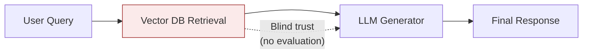
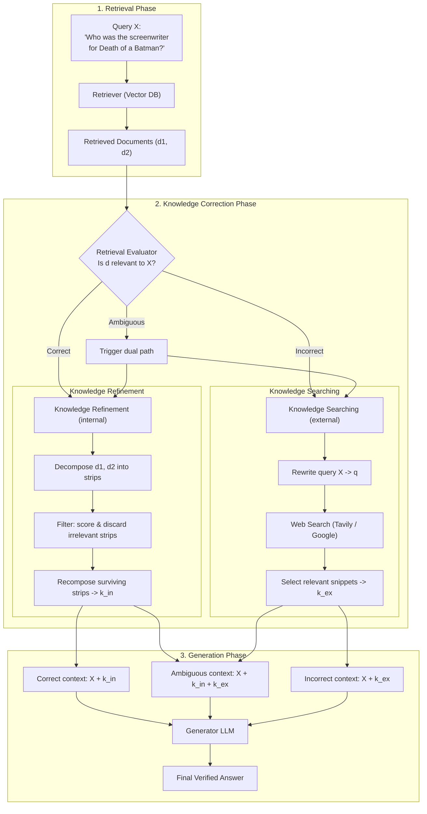
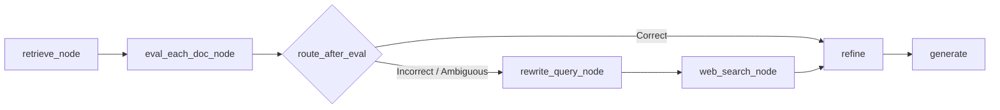

# Corrective RAG (CRAG)

> A complete, interview-ready reference on **Corrective Retrieval-Augmented Generation (CRAG)** — the technique that stops a RAG pipeline from blindly trusting whatever the retriever hands it.

<p align="left">
  
  
  
</p>

---

## Learning Summary

Traditional RAG has a blind spot: it feeds whatever the [retriever](../Retrievers) returns straight into the LLM, with no check on whether those chunks are actually relevant. **Corrective RAG (CRAG)** fixes this by inserting a **Knowledge Correction** stage between retrieval and generation — grading retrieved documents, refining the good ones, and falling back to web search when they're not good enough.

This note covers:
- Why traditional RAG silently fails, and the real business impact of that failure
- The full CRAG architecture: Retrieval → Knowledge Correction → Generation
- The three correction paths — **Correct**, **Incorrect**, and **Ambiguous** — and how each builds its final prompt
- A concrete LangGraph implementation you can map directly onto the theory

---

## Learning Objectives

By the end of this note, you will be able to:

- [x] Explain why traditional RAG hallucinates when retrieval quality is poor.
- [x] Describe CRAG's three-phase architecture: Retrieval, Knowledge Correction, Generation.
- [x] Differentiate the Correct / Incorrect / Ambiguous evaluator verdicts and their resulting prompts.
- [x] Explain Knowledge Refinement (strip-level filtering) and Knowledge Searching (web fallback).
- [x] Map a LangGraph node-and-edge implementation onto the CRAG architecture diagram.
- [x] Answer common interview questions about corrective and self-reflective RAG techniques.

---

## Prerequisites

> 💡 **Tip**: This note assumes you're already comfortable with the standard RAG pipeline — [Document Loaders](../Document%20loaders), [Text Splitters](../Text%20Splitter), [Vector Stores](../Vector%20Store), and [Retrievers](../Retrievers).

- Basic LangChain and a first look at LangGraph (nodes, edges, state)
- An LLM-as-judge / structured-output mental model (an LLM scoring or classifying text)
- Environment:

```bash
pip install langchain langgraph langchain-community faiss-cpu sentence-transformers tavily-python
```

---

## Table of Contents

- [Why Traditional RAG Fails](#why-traditional-rag-fails)
- [Business Impact of Traditional RAG Failures](#business-impact-of-traditional-rag-failures)
- [CRAG Architecture](#crag-architecture)
- [Breaking Down Every Stage](#breaking-down-every-stage)
- [Generator Input Formats by Trigger](#generator-input-formats-by-trigger)
- [RAG vs. CRAG](#rag-vs-crag)
- [LangGraph Implementation Walkthrough](#langgraph-implementation-walkthrough)
- [Real-World Use Cases](#real-world-use-cases)
- [Advantages](#advantages)
- [Disadvantages](#disadvantages)
- [Best Practices](#best-practices)
- [Common Mistakes](#common-mistakes)
- [Interview Questions](#interview-questions)
- [Cheat Sheet](#cheat-sheet)
- [Useful Links](#useful-links)
- [Summary](#summary)

---

## Why Traditional RAG Fails

> 📌 **Important**: Traditional RAG blindly trusts whatever the vector database returns and feeds it straight into the LLM's prompt — with no evaluation step in between.



### Key Failure Mode: Lack of Valid Retrievals & Parametric Fallback

When the vector database doesn't contain relevant documents for a query (or retrieves noisy, semantically distant, or outdated chunks):

1. **Irrelevant Context** — the top-k retrieved chunks don't contain the true answer.
2. **Parametric Knowledge Reliance** — denied accurate context, the LLM falls back on its pre-trained **parametric memory** (internal knowledge learned during training).
3. **Hallucination & Misalignment** — parametric knowledge is static, cutoff-bound, non-verifiable, and prone to hallucination when forced to synthesize answers alongside weak or misleading context.

---

## Business Impact of Traditional RAG Failures

> ⚠️ **Warning**: In enterprise scenarios, relying on unverified parametric knowledge or noisy context can cause real, expensive failures — not just wrong trivia answers.

| Business Sector | Traditional RAG Failure Scenario | Business Impact |
|---|---|---|
| **Financial Services & Banking** | Query asks for current interest rates or fee waivers. Vector DB has no recent doc. LLM uses parametric knowledge to state out-of-date rates. | Compliance violations, customer disputes, regulatory fines. |
| **Healthcare & Medical** | Query asks for specific drug interaction rules. Vector DB returns generic wellness articles. LLM hallucinates dosage guidance from internal training data. | Severe medical malpractice liability, patient safety hazards. |
| **E-Commerce & Customer Support** | Query asks about holiday return policy. Vector DB fails to match query keywords. LLM promises free 60-day returns based on parametric assumptions. | Financial loss from honoring unauthorized claims, customer churn. |
| **Legal & Enterprise Search** | Query asks about clause interpretation for a specific contract. Vector DB returns unrelated contracts. LLM invents standard legal definitions. | Breach of contract, legal liability, loss of privileged data integrity. |

---

## CRAG Architecture

CRAG introduces a formal **Knowledge Correction** stage between retrieval and generation.



---

## Breaking Down Every Stage

### A. Retrieval Phase

| Term | Meaning |
|---|---|
| **X (User Query)** | The input prompt entered by the user (e.g. *"Who was the screenwriter for Death of a Batman?"*) |
| **Retrieved Documents (d1, d2, ...)** | The raw top-k document chunks retrieved from the internal vector store (e.g. FAISS) |

### B. Knowledge Correction Phase

**Retrieval Evaluator**: a lightweight neural evaluator/model (e.g. a fine-tuned T5, or a structured-output LLM judge) that assesses how relevant retrieved chunks are to query X, producing a confidence score S(X, d).

| Verdict | Confidence | Meaning |
|---|---|---|
| **Correct** | S > θ_high | Internal docs are accurate and sufficient |
| **Ambiguous** | θ_low ≤ S ≤ θ_high | Mixed/weak signals — needs both internal refinement and web search |
| **Incorrect** | S < θ_low | Internal docs are irrelevant/wrong and must be discarded |

**1. Knowledge Refinement (internal path)**
- **Decompose** — splits raw document chunks (d1, d2) into fine-grained sentences/paragraphs called **strips**.
- **Filter** — evaluates each strip independently against query X; discards noisy or irrelevant sentences.
- **Recompose** — merges surviving relevant strips into clean internal context **k_in**.

**2. Knowledge Searching (external path)**
- **Rewrite** — rewrites the conversational query X into a search-engine-optimized keyword query `q`.
- **Web Search** — queries public search engines (Tavily, Google) to retrieve web pages.
- **Select** — filters raw web result pages and extracts key factual snippets into external knowledge **k_ex**.

### C. Generation Phase

| Term | Meaning |
|---|---|
| **X + k_in** | Prompt formula for a `Correct` verdict |
| **X + k_in + k_ex** | Prompt formula for an `Ambiguous` verdict |
| **X + k_ex** | Prompt formula for an `Incorrect` verdict (internal docs discarded) |
| **Generator** | The final LLM (e.g. Gemini) synthesizing the verified response |

---

## Generator Input Formats by Trigger

| Trigger | Generator Context Formula | Context Composition |
|---|---|---|
| **Correct** | `Prompt = X + k_in` | Original query + refined internal knowledge |
| **Incorrect** | `Prompt = X + k_ex` | Original query + external web knowledge *(internal docs discarded)* |
| **Ambiguous** | `Prompt = X + k_in + k_ex` | Original query + refined internal knowledge + external web knowledge |

> 🚀 **Best Practice**: Never mix in `k_in` for an `Incorrect` verdict — once the evaluator flags internal docs as irrelevant, keeping any of them in the prompt reintroduces the exact noise CRAG is designed to remove.

---

## RAG vs. CRAG

| Feature / Dimension | Traditional RAG | Corrective RAG (CRAG) |
|---|---|---|
| **Document Quality Assessment** | ❌ None (blind trust in top-k results) | ✅ Retrieval Evaluator checks relevance score S(q, d) |
| **Handling Out-of-Domain / Missing Info** | ❌ Falls back to static parametric knowledge | ✅ Automatically switches to external web search |
| **Noise Filtering** | ❌ Passes whole raw retrieved chunks to the LLM | ✅ Fine-grained Knowledge Refinement (strip-level filtering) |
| **Fallback Mechanism** | ❌ Weak / non-existent | ✅ Tri-fold action matrix (Correct, Incorrect, Ambiguous) |
| **Query Adaptation** | ❌ Static original user query | ✅ Query rewriter optimizes search terms for web retrieval |
| **Context Assembly** | ❌ Fixed single format | ✅ Tailored prompts per verdict (X+k_in, X+k_ex, X+k_in+k_ex) |
| **Hallucination Risk** | ⚠️ High when retrieval quality is poor | 🛡️ Very low — context is evaluated and corrected before generation |
| **Business Safety** | ⚠️ Risky in high-stakes domains | 🔒 Highly reliable for enterprise applications |

---

## LangGraph Implementation Walkthrough

A concrete implementation, mapped stage-by-stage onto the architecture above.

### Step 1 — PDF Ingestion & Indexing

```python
from langchain_community.document_loaders import PyPDFLoader
from langchain_text_splitters import RecursiveCharacterTextSplitter
from langchain_community.vectorstores import FAISS
from langchain_community.embeddings import HuggingFaceEmbeddings

docs = []
for f in ["book1.pdf", "book2.pdf", "book3.pdf"]:
    docs.extend(PyPDFLoader(f).load())

splitter = RecursiveCharacterTextSplitter(chunk_size=900, chunk_overlap=150)
chunks = splitter.split_documents(docs)

embeddings = HuggingFaceEmbeddings(model_name="sentence-transformers/all-MiniLM-L6-v2")
vectorstore = FAISS.from_documents(chunks, embeddings)
retriever = vectorstore.as_retriever(search_kwargs={"k": 4})
```

This builds an in-memory FAISS index over three source PDFs using a free, local embedding model — no API key required for embeddings.

### Step 2 — LangGraph State Definition

```python
from typing import TypedDict, List

class State(TypedDict):
    question: str
    docs: List[str]
    good_docs: List[str]
    verdict: str            # "CORRECT" | "INCORRECT" | "AMBIGUOUS"
    reason: str
    strips: List[str]
    kept_strips: List[str]
    refined_context: str
    web_docs: List[str]
    web_query: str
    answer: str
```

The `State` dict is the shared memory object every LangGraph node reads from and writes to as execution moves through the graph.

### Step 3 — Graph Execution Nodes

| Node | Responsibility |
|---|---|
| `retrieve_node` | Fetches the top-4 documents from FAISS |
| `eval_each_doc_node` | Scores each retrieved chunk with an LLM judge, producing a structured `DocEvalScore` and setting `verdict` (thresholds `UPPER_TH=0.7`, `LOWER_TH=0.3`) |
| `route_after_eval` (conditional edge) | Routes to `refine` if `CORRECT`; routes to `rewrite_query -> web_search -> refine` if `INCORRECT` or `AMBIGUOUS` |
| `rewrite_query_node` | Rewrites the question into 6–14 keyword search terms |
| `web_search_node` | Calls Tavily search (`max_results=5`) and formats snippets into `Document` objects |
| `refine` | Merges sources per verdict, decomposes into strips, filters via an LLM relevance judge, recomposes `refined_context` |
| `generate` | Invokes the LLM with the question + `refined_context`; returns *"I don't know."* if context is empty/insufficient |



> 💡 **Tip**: The explicit `"I don't know."` fallback in `generate` is what actually closes the hallucination loop — CRAG's evaluation stages are only half the fix if the generator will still confidently answer from empty context.

---

## Real-World Use Cases

- **Regulated financial chatbots** — must never state stale interest rates from parametric memory; CRAG forces a web-search fallback instead.
- **Clinical decision support** — drug-interaction queries route to verified external sources rather than letting the LLM guess from training data.
- **Customer support over policy documents** — return/refund policy questions get corrected against the live web/support KB instead of hallucinated terms.
- **Enterprise legal search** — contract clause lookups discard irrelevant retrieved contracts instead of blending them into a fabricated "standard" answer.

---

## Advantages

- Adds an explicit relevance-checking step that traditional RAG completely lacks.
- Automatically recovers from bad retrieval via web search, instead of silently hallucinating.
- Strip-level Knowledge Refinement removes noise even from otherwise-relevant documents.
- The three-way verdict (Correct/Incorrect/Ambiguous) tailors the final prompt instead of using one fixed format.

## Disadvantages

- Adds real latency and cost — an evaluator LLM call per document, plus a possible web search and rewrite step.
- Requires tuning two thresholds (θ_low, θ_high) that directly affect how often web search triggers.
- Adds infrastructure dependencies (a web search API like Tavily) beyond the base RAG stack.
- Evaluator quality becomes a new failure point — a miscalibrated judge can misroute Correct context as Incorrect (or vice versa).

---

## Best Practices

- Log every `verdict` and its `S(X, d)` score during development — threshold tuning is empirical, not guessable.
- Keep the Retrieval Evaluator lightweight (small fine-tuned model or fast structured LLM call) — it runs once per retrieved document, so its cost multiplies quickly.
- Never let `k_in` leak into an `Incorrect`-verdict prompt — discard flagged internal docs completely.
- Always implement an explicit "insufficient context" fallback in the generator, not just an implicit hope the LLM will admit uncertainty.
- Cache web search results for repeated/similar queries to control the added latency and API cost.

## Common Mistakes

- [ ] Skipping the Ambiguous path entirely and forcing every low-confidence case into a binary Correct/Incorrect decision.
- [ ] Using the same LLM and prompt for both the Retrieval Evaluator and the final Generator, coupling their failure modes.
- [ ] Setting `UPPER_TH` and `LOWER_TH` too close together, causing most queries to route through the (expensive) Ambiguous path.
- [ ] Forgetting to deduplicate strips/snippets when merging internal and external knowledge for the Ambiguous case.
- [ ] Not rewriting the query before web search — sending a full conversational question straight to a search API yields poor results.

---

## Interview Questions

<details>
<summary><b>Q1. What core problem does CRAG solve that traditional RAG doesn't?</b></summary>

<br>

Traditional RAG has no mechanism to evaluate whether retrieved documents are actually relevant — it passes them straight to the LLM. CRAG inserts a Retrieval Evaluator between retrieval and generation, scoring relevance and routing to different correction paths (refine internal docs, search the web, or both) before generation happens.
</details>

<details>
<summary><b>Q2. What are the three verdicts a CRAG Retrieval Evaluator can produce, and what does each trigger?</b></summary>

<br>

Correct (high confidence — refine and use internal documents), Incorrect (low confidence — discard internal documents and use web search instead), and Ambiguous (mixed confidence — use both refined internal knowledge and external web knowledge together).
</details>

<details>
<summary><b>Q3. What is "Knowledge Refinement" in CRAG?</b></summary>

<br>

The internal-path correction step: retrieved documents are decomposed into fine-grained sentence-level "strips," each strip is scored and filtered for relevance to the query, and the surviving strips are recomposed into a clean internal context (k_in).
</details>

<details>
<summary><b>Q4. Why does CRAG rewrite the query before performing a web search?</b></summary>

<br>

Because a natural, conversational user query is often poorly suited to a search engine. Rewriting it into concise keyword terms (Knowledge Searching's "Rewrite" step) produces better web search results than sending the raw question verbatim.
</details>

<details>
<summary><b>Q5. How does CRAG's prompt construction differ across the three verdicts?</b></summary>

<br>

Correct uses Query + refined internal knowledge (X + k_in). Incorrect discards internal knowledge entirely and uses Query + external web knowledge (X + k_ex). Ambiguous combines both (X + k_in + k_ex) since neither source alone was judged fully reliable.
</details>

<details>
<summary><b>Q6. What's a key operational trade-off CRAG introduces compared to plain RAG?</b></summary>

<br>

Added latency and cost: every retrieved document needs an evaluator pass, and Incorrect/Ambiguous verdicts trigger a query rewrite plus a live web search — all before generation even starts. This makes CRAG more accurate but slower and more expensive per query than vanilla RAG.
</details>

---

## Cheat Sheet

```bash
pip install langchain langgraph langchain-community faiss-cpu sentence-transformers tavily-python
```

| Concept | One-Line Summary |
|---|---|
| Retrieval Evaluator | Scores each retrieved doc's relevance to the query, S(X, d) |
| Correct verdict | S > θ_high → use refined internal knowledge (k_in) |
| Incorrect verdict | S < θ_low → discard internal docs, use web search (k_ex) |
| Ambiguous verdict | θ_low ≤ S ≤ θ_high → use both k_in and k_ex |
| Knowledge Refinement | Decompose → Filter → Recompose (strip-level internal cleanup) |
| Knowledge Searching | Rewrite query → Web search → Select relevant snippets |
| Generator fallback | Return "I don't know" when refined context is empty/insufficient |

> 📌 **Rule of thumb**: Good internal docs → refine them. Bad internal docs → replace them with web search. Unsure → do both and let the generator see everything relevant.

---

## Useful Links

- [CRAG Paper — "Corrective Retrieval Augmented Generation" (arXiv)](https://arxiv.org/abs/2401.15884)
- [LangGraph Documentation](https://langchain-ai.github.io/langgraph/)
- [Tavily Search API](https://docs.tavily.com/)
- [LangChain — Retrievers (previous stage)](../Retrievers)
- [Sentence-Transformers — all-MiniLM-L6-v2](https://huggingface.co/sentence-transformers/all-MiniLM-L6-v2)

---

## Summary

> CRAG's core idea is simple but powerful: **don't trust retrieval blindly — grade it, and correct course before generation.** A lightweight evaluator turns a fixed, single-path RAG pipeline into a three-way adaptive system that refines good context, replaces bad context with live web search, and blends both when it's genuinely unsure.

- Traditional RAG has no relevance check; CRAG adds a Retrieval Evaluator between retrieval and generation.
- Three verdicts — Correct, Incorrect, Ambiguous — each produce a differently composed generation prompt.
- Knowledge Refinement (strip-level filtering) cleans good internal docs; Knowledge Searching (rewrite + web search) replaces bad ones.
- The trade-off is latency/cost for accuracy — worth it for high-stakes, enterprise-grade RAG systems.

---

<p align="center"><i>Compiled as part of personal RAG / LangGraph study notes — July 2026.</i></p>
