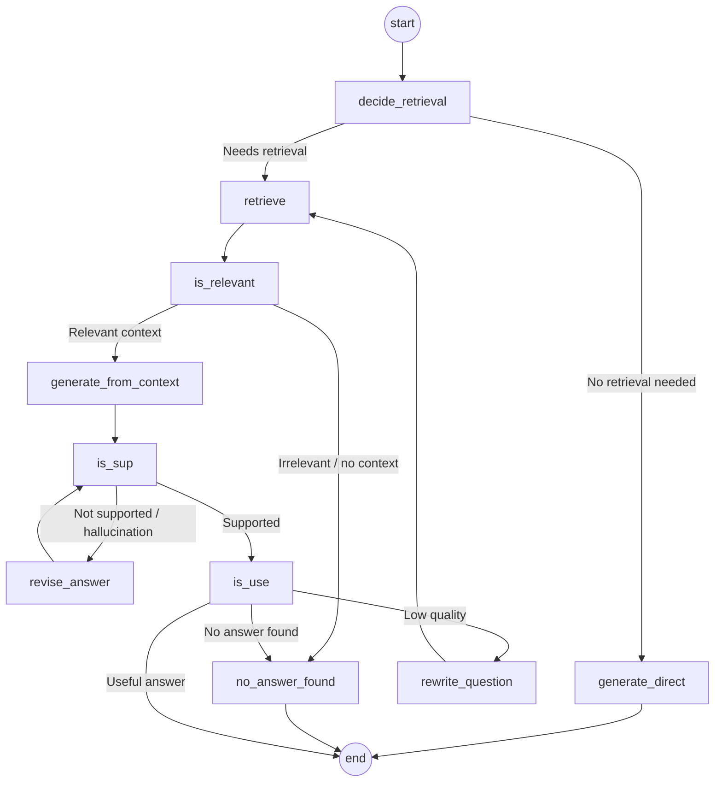

# Self-Reflective RAG (Self-RAG)

> A complete, interview-ready reference on **Self-RAG** — the RAG architecture where the LLM critiques its own retrieval, its own grounding, and its own answer before it ever reaches the user.

<p align="left">
  
  
  
</p>

---

## Learning Summary

Traditional RAG runs a fixed, linear pipeline — retrieve, then generate — no matter what the query is or how good the retrieved context turns out to be. **Self-RAG (Self-Reflective Retrieval-Augmented Generation)** replaces that rigid flow with a **stateful graph** where the LLM actively decides *whether* to retrieve, *grades* what comes back, *verifies* its own answer is grounded in that context, and *judges* whether the final answer is actually useful — looping back and correcting itself at every stage that fails.

This note covers:
- The three concrete failure modes of traditional RAG that Self-RAG is designed to fix
- The full Self-RAG state graph, including every reflection-token-driven decision point
- How the grounding-verification loop (`is_sup`) and utility-verification loop (`is_use`) actually prevent hallucination
- A working LangGraph + FAISS + Pydantic implementation walkthrough

---

## Learning Objectives

By the end of this note, you will be able to:

- [x] Name the three failure modes of traditional RAG and explain why each causes bad answers.
- [x] Draw the Self-RAG state graph from memory, including every node and reflection token.
- [x] Explain what `[Retrieve]`, `[IsRel]`, `[IsSup]`, and `[IsUse]` each decide.
- [x] Describe the grounding-verification loop and the re-retrieval loop, and how they differ.
- [x] Map a LangGraph `State` schema and node set onto the Self-RAG architecture.
- [x] Answer common interview questions comparing Self-RAG to traditional and Corrective RAG.

---

## Prerequisites

> 💡 **Tip**: Self-RAG builds directly on ideas from [Retrievers](../Retrievers) and [Corrective RAG (CRAG)](../CRAG) — CRAG corrects *retrieved context*; Self-RAG goes further and also verifies the *generated answer* itself.

- Comfort with the standard RAG pipeline (loaders, splitters, vector stores, retrievers)
- A first look at LangGraph (nodes, edges, conditional routing, shared state)
- Environment:

```bash
pip install langchain langgraph langchain-community faiss-cpu sentence-transformers pydantic
```

---

## Table of Contents

- [Overview](#overview)
- [Failures of Traditional RAG](#failures-of-traditional-rag)
- [Self-RAG Architecture and State Flow](#self-rag-architecture-and-state-flow)
- [State Node Breakdown and Reflection Tokens](#state-node-breakdown-and-reflection-tokens)
- [Traditional RAG vs. Self-RAG](#traditional-rag-vs-self-rag)
- [Implementation Walkthrough](#implementation-walkthrough)
- [Real-World Use Cases](#real-world-use-cases)
- [Advantages](#advantages)
- [Disadvantages](#disadvantages)
- [Best Practices](#best-practices)
- [Common Mistakes](#common-mistakes)
- [Interview Questions](#interview-questions)
- [Cheat Sheet](#cheat-sheet)
- [Useful Links](#useful-links)
- [Summary](#summary)

---

## Overview

> 📌 **Important**: Self-RAG isn't just "RAG with extra steps" — it's a fundamentally different execution model. Traditional RAG is a straight-line pipeline; Self-RAG is a **stateful graph with reflection loops** that can branch, retry, and terminate early.

**Self-RAG (Self-Reflective Retrieval-Augmented Generation)** is an advanced RAG architecture where the LLM actively judges and critiques its own retrieval process, evidence quality, and generated answers instead of blindly trusting retrieved documents.

---

## Failures of Traditional RAG

Standard RAG follows a static, rigid pipeline:


This rigid flow introduces three major failure modes:

| Failure Mode | Problem in Traditional RAG | Impact |
|---|---|---|
| **1. Unnecessary Retrieval** | Always retrieves documents, even for simple greetings, common knowledge, or math problems (e.g. *"Hi"*, *"What is 2 + 2?"*). | High latency, unnecessary vector database cost, context window cluttered with noise. |
| **2. Forced Answer on Retrieved Content** | Forces the LLM to construct an answer based *only* on retrieved chunks, blindly trusting them even when noisy, irrelevant, or contradictory. | Misleading or wrong answers caused by poor retrieval quality ("garbage in, garbage out"). |
| **3. Unverified / Ungrounded Answers** | Never checks whether the generated response is actually supported by the context, or whether it answers the user's original question. | Hallucinations, unverified assertions, incomplete responses reaching the user. |

---

## Self-RAG Architecture and State Flow

Self-RAG models the system as a dynamic state machine (typically built with **LangGraph**), incorporating continuous reflection loops for self-correction.



Two loops matter most here:

- **Grounding loop** (`is_sup` → `revise_answer` → `is_sup`): keeps rewriting the answer until every claim is actually supported by the retrieved context.
- **Re-retrieval loop** (`is_use` → `rewrite_question` → `retrieve`): if the grounded answer still isn't useful, the query itself gets rewritten and retrieval runs again.

---

## State Node Breakdown and Reflection Tokens

| State / Node | Reflection Token | Action & Logic |
|---|---|---|
| `decide_retrieval` | `[Retrieve]` | Evaluates if the query requires external context. Routes to `generate_direct` if parametric memory suffices, or `retrieve` if domain knowledge is needed. |
| `generate_direct` | — | Generates a response directly from the LLM's internal parametric knowledge, without any retrieval. |
| `retrieve` | — | Queries the vector database/retriever to fetch top candidate document chunks. |
| `is_relevant` | `[IsRel]` | Grades fetched document chunks. Routes to `no_answer_found` if irrelevant; to `generate_from_context` if relevant. |
| `generate_from_context` | — | Generates an initial candidate answer strictly from verified relevant context chunks. |
| `is_sup` | `[IsSup]` | Fact-checks whether generated statements are fully supported by context. Triggers `revise_answer` if hallucinated; proceeds to `is_use` once accepted. |
| `revise_answer` | — | Refines and rewrites the generated answer to eliminate ungrounded or hallucinated claims. |
| `is_use` | `[IsUse]` | Assesses the overall utility and quality of the final response. Terminates if helpful; routes to `rewrite_question` if poor. |
| `rewrite_question` | — | Re-phrases the original user query to improve retrieval performance on retry. |
| `no_answer_found` | — | Fallback node that gracefully informs the user when no valid context/answer can be established. |

> 🚀 **Best Practice**: Treat the four reflection tokens (`[Retrieve]`, `[IsRel]`, `[IsSup]`, `[IsUse]`) as four independent, swappable classifiers — you can upgrade any one of them (bigger judge model, better prompt) without touching the rest of the graph.

---

## Traditional RAG vs. Self-RAG

| Feature | Traditional RAG | Self-RAG Architecture |
|---|---|---|
| **Execution Pattern** | Linear pipeline | Stateful graph with reflection loops |
| **Retrieval Trigger** | Unconditional (every query) | Conditional (`decide_retrieval`) |
| **Context Quality Control** | None (blind ingestion) | Document grading (`is_relevant`) |
| **Hallucination Prevention** | None | Iterative grounding verification (`is_sup` → `revise_answer`) |
| **Query Transformation** | Static | Dynamic re-retrieval (`is_use` → `rewrite_question`) |

> ⚠️ **Warning**: Self-RAG and [Corrective RAG (CRAG)](../CRAG) solve overlapping but distinct problems. CRAG focuses on **correcting retrieved context** (refine internal docs or fall back to web search). Self-RAG focuses on **verifying the whole pipeline** — including whether retrieval was needed at all, and whether the final generated answer is grounded and useful. The two techniques can be combined.

---

## Implementation Walkthrough

A concrete implementation using **LangChain**, **LangGraph**, **FAISS**, and **Pydantic**.

### A. Document Loading and Vector Storage

```python
from langchain_community.document_loaders import PyPDFLoader
from langchain_text_splitters import RecursiveCharacterTextSplitter
from langchain_community.vectorstores import FAISS
from langchain_community.embeddings import HuggingFaceEmbeddings

files = ["Company_Policies.pdf", "Company_Profile.pdf", "Product_and_Pricing.pdf"]
docs = [d for f in files for d in PyPDFLoader(f).load()]

splitter = RecursiveCharacterTextSplitter(chunk_size=600, chunk_overlap=150)
chunks = splitter.split_documents(docs)

embeddings = HuggingFaceEmbeddings(model_name="sentence-transformers/all-MiniLM-L6-v2")
vector_store = FAISS.from_documents(chunks, embeddings)
retriever = vector_store.as_retriever(search_kwargs={"k": 4})
```

Internal company PDFs are chunked and embedded with a free, local embedding model into an in-memory FAISS index.

### B. LLM and Structured Output

The implementation uses `ChatGroq` (`llama-3.3-70b-versatile`) or `ChatGoogleGenerativeAI` (`gemini-2.5-flash`), with `with_structured_output(...)` enforced on every decision node so each reflection token returns a strict, parseable schema instead of free-form text.

### C. Graph State Schema

```python
from typing import TypedDict, List, Literal
from langchain_core.documents import Document

class State(TypedDict):
    question: str
    retrieval_query: str
    rewrite_tries: int
    need_retrieval: bool
    docs: List[Document]
    relevant_docs: List[Document]
    context: str
    answer: str
    issup: Literal["fully_supported", "partially_supported", "no_support"]
    evidence: List[str]
    retries: int
    isuse: Literal["useful", "not_useful"]
    use_reason: str
```

This `State` dict is the shared memory every node in the graph reads from and writes to as execution branches and loops.

### D. Step-by-Step Node and Decision Flow

1. **`decide_retrieval`** `[Retrieve]` — evaluates whether answering requires company documentation. `False` → `generate_direct`. `True` → `retrieve`.
2. **`generate_direct`** — answers directly from parametric memory for general/conversational prompts.
3. **`retrieve`** — calls `retriever.invoke(query)` to fetch top chunks from FAISS.
4. **`is_relevant`** `[IsRel]` — grades chunks at a topic level, filtering out noise. No relevant chunks → `no_answer_found`. Relevant chunks → `generate_from_context`.
5. **`generate_from_context`** — builds a combined `context` block from `relevant_docs` and generates a candidate answer.
6. **`is_sup`** `[IsSup]` — checks whether every statement in `answer` is explicitly supported by `context`, returning `fully_supported`, `partially_supported`, or `no_support`. Supported (or retries exhausted) → `is_use`. Ungrounded → `revise_answer`.
7. **`revise_answer`** — strips ungrounded/qualitative claims, rewriting the answer strictly from direct facts in the context; increments `retries` and loops back to `is_sup`.
8. **`is_use`** `[IsUse]` — checks whether the grounded answer actually answers the original question. `useful` → `END`. `not_useful` → `rewrite_question`.
9. **`rewrite_question`** — rewrites the prompt into a higher-signal search query, resets document state, and loops back to `retrieve`.

```python
answer_prompt = "Answer the question using ONLY the provided context. If unsupported, say so."

def is_sup(state: State) -> State:
    verdict = grounding_judge.invoke({"answer": state["answer"], "context": state["context"]})
    state["issup"] = verdict.label  # "fully_supported" | "partially_supported" | "no_support"
    return state
```

> 💡 **Tip**: `retries` and `rewrite_tries` counters are essential — without a hard cap, a stubborn hallucination or an unanswerable question can loop indefinitely between `is_sup`/`revise_answer` or `is_use`/`rewrite_question`.

---

## Real-World Use Cases

- **Internal company assistants** — greetings and general questions skip retrieval entirely (`decide_retrieval`), saving cost on every trivial query.
- **Compliance-sensitive support bots** — the grounding loop (`is_sup`) blocks any answer not directly traceable to a policy document.
- **Research and technical Q&A tools** — the re-retrieval loop (`is_use` → `rewrite_question`) automatically improves recall for poorly-phrased first attempts.
- **Long-running agents** — reflection tokens double as structured logging, making it easy to audit *why* a particular answer was accepted or rejected.

---

## Advantages

- Skips retrieval entirely for queries that don't need it, cutting latency and cost.
- Explicit relevance grading (`is_relevant`) prevents noisy or off-topic chunks from ever reaching generation.
- The grounding loop (`is_sup`) directly targets hallucination by verifying claims against context before the answer is accepted.
- The utility loop (`is_use`) catches "technically grounded but doesn't answer the question" failures that grounding checks alone would miss.

## Disadvantages

- Every additional reflection node is another LLM call — latency and cost compound quickly on complex queries.
- Loops need careful retry caps; a miscalibrated judge can cause excessive looping without those caps.
- Requires structured-output-capable models and reliable JSON schema enforcement across every decision node.
- More moving parts than traditional or even Corrective RAG — harder to debug and monitor in production.

---

## Best Practices

- Cap every loop (`revise_answer`, `rewrite_question`) with an explicit retry counter and a graceful fallback to `no_answer_found`.
- Keep reflection-token judges small and fast where possible — they run far more often than the main generator.
- Log every reflection token's verdict (`[Retrieve]`, `[IsRel]`, `[IsSup]`, `[IsUse]`) for debugging and offline evaluation.
- Use `with_structured_output` (or equivalent strict schema enforcement) on every decision node — free-form judge output is a reliability risk.
- Test `decide_retrieval` explicitly with both trivial queries ("Hi") and domain queries to confirm the routing logic actually saves calls where expected.

## Common Mistakes

- [ ] Omitting retry caps on the `is_sup` or `is_use` loops, risking infinite looping on unanswerable questions.
- [ ] Letting `generate_from_context` run even when `relevant_docs` is empty, instead of routing straight to `no_answer_found`.
- [ ] Using the same prompt/model for `is_sup` and `is_use` despite them checking fundamentally different things (grounding vs. usefulness).
- [ ] Not resetting document state in `rewrite_question` before looping back to `retrieve`, causing stale context to leak into the retry.
- [ ] Treating Self-RAG as a drop-in replacement for evaluation — reflection tokens improve pipeline behavior, but you still need offline metrics to know if it's actually working.

---

## Interview Questions

<details>
<summary><b>Q1. What are the three failure modes of traditional RAG that Self-RAG addresses?</b></summary>

<br>

Unnecessary retrieval (retrieving even for trivial queries), forced answers on retrieved content (blindly trusting noisy/irrelevant chunks), and unverified/ungrounded answers (never checking if the response is actually supported by context or answers the question).
</details>

<details>
<summary><b>Q2. What do the four reflection tokens in Self-RAG represent?</b></summary>

<br>

`[Retrieve]` decides whether retrieval is needed at all. `[IsRel]` grades whether retrieved documents are relevant. `[IsSup]` checks whether the generated answer is grounded in the retrieved context. `[IsUse]` judges whether the final answer is actually useful to the user.
</details>

<details>
<summary><b>Q3. Explain the difference between the grounding loop and the re-retrieval loop.</b></summary>

<br>

The grounding loop (`is_sup` → `revise_answer` → `is_sup`) rewrites the *answer* until its claims are supported by the existing context — it doesn't change the retrieved documents. The re-retrieval loop (`is_use` → `rewrite_question` → `retrieve`) rewrites the *query* and fetches new documents entirely, used when the grounded answer still isn't useful.
</details>

<details>
<summary><b>Q4. How does Self-RAG avoid wasting retrieval calls on simple queries?</b></summary>

<br>

The `decide_retrieval` node, tagged with the `[Retrieve]` reflection token, first evaluates whether the query needs external context at all. If the LLM's parametric knowledge is sufficient (e.g. a greeting or general knowledge question), it routes straight to `generate_direct`, skipping the retriever entirely.
</details>

<details>
<summary><b>Q5. How does Self-RAG differ from Corrective RAG (CRAG)?</b></summary>

<br>

CRAG focuses on correcting the *retrieved context* itself — grading documents and falling back to web search when they're insufficient. Self-RAG goes further, wrapping the entire pipeline in reflection: deciding whether to retrieve at all, grading relevance, verifying the generated answer is grounded, and verifying the answer is actually useful — with loops at each of those stages.
</details>

<details>
<summary><b>Q6. Why is a retry cap essential in the Self-RAG graph?</b></summary>

<br>

Without one, an unanswerable question or a persistently miscalibrated judge could cause the grounding loop or the re-retrieval loop to cycle indefinitely. A `retries` / `rewrite_tries` counter with a hard limit, paired with a graceful `no_answer_found` fallback, guarantees the graph always terminates.
</details>

---

## Cheat Sheet

```bash
pip install langchain langgraph langchain-community faiss-cpu sentence-transformers pydantic
```

| Reflection Token | Node | Decides |
|---|---|---|
| `[Retrieve]` | `decide_retrieval` | Whether retrieval is needed at all |
| `[IsRel]` | `is_relevant` | Whether retrieved chunks are relevant |
| `[IsSup]` | `is_sup` | Whether the answer is grounded in context |
| `[IsUse]` | `is_use` | Whether the final answer is actually useful |

| Loop | Path | Purpose |
|---|---|---|
| Grounding loop | `is_sup` → `revise_answer` → `is_sup` | Rewrite the answer until claims are supported |
| Re-retrieval loop | `is_use` → `rewrite_question` → `retrieve` | Rewrite the query and search again |

> 📌 **Rule of thumb**: Trivial query → skip retrieval. Irrelevant docs → `no_answer_found`. Ungrounded answer → revise. Grounded but unhelpful → rewrite the question and retry.

---

## Useful Links

- [Self-RAG Paper — "Self-RAG: Learning to Retrieve, Generate, and Critique through Self-Reflection" (arXiv)](https://arxiv.org/abs/2310.11511)
- [LangGraph Documentation](https://langchain-ai.github.io/langgraph/)
- [LangChain — Structured Output](https://python.langchain.com/docs/how_to/structured_output/)
- [Corrective RAG (CRAG) — related technique](../CRAG)
- [LangChain — Retrievers (previous stage)](../Retrievers)

---

## Summary

> Self-RAG turns a passive, one-shot RAG pipeline into an autonomous, self-correcting agentic workflow by combining **state-based routing** (the LangGraph pattern) with **self-reflection tokens** (`[Retrieve]`, `[IsRel]`, `[IsSup]`, `[IsUse]`).

- Traditional RAG always retrieves, never grades context, and never checks its own output — Self-RAG questions all three.
- Two loops do the heavy lifting: the grounding loop fixes hallucinated answers, and the re-retrieval loop fixes unhelpful ones.
- The trade-off is latency and complexity for far higher reliability — best suited to high-stakes or long-running agentic systems.

---

<p align="center"><i>Compiled as part of personal RAG / LangGraph study notes — July 2026.</i></p>
