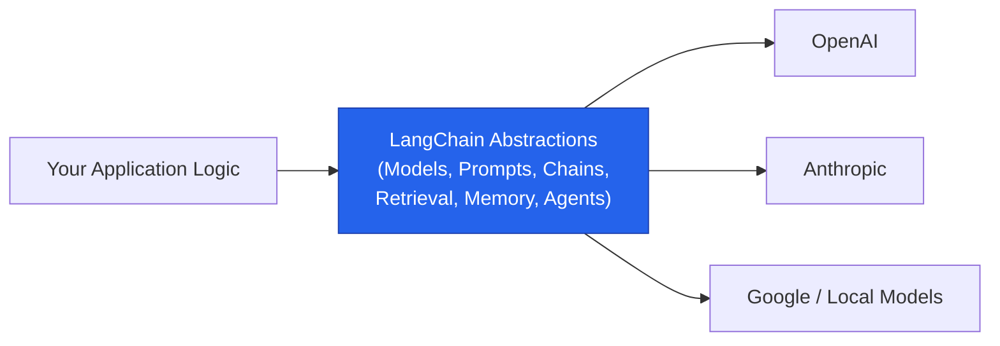
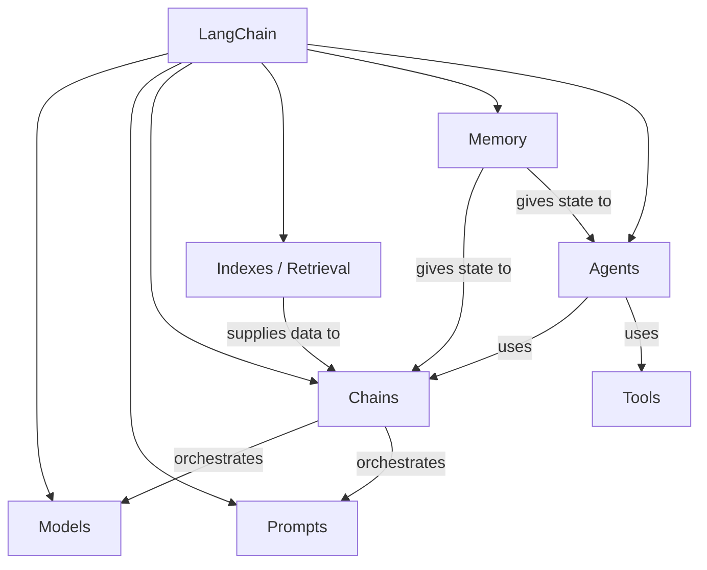
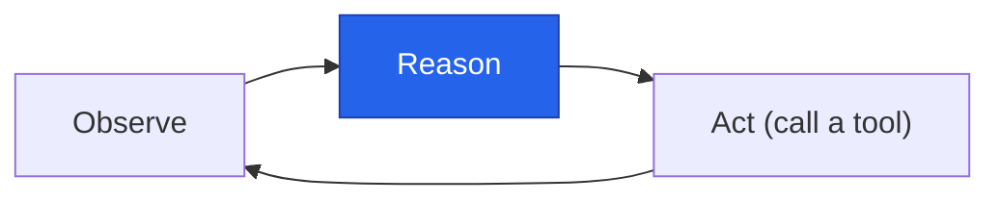
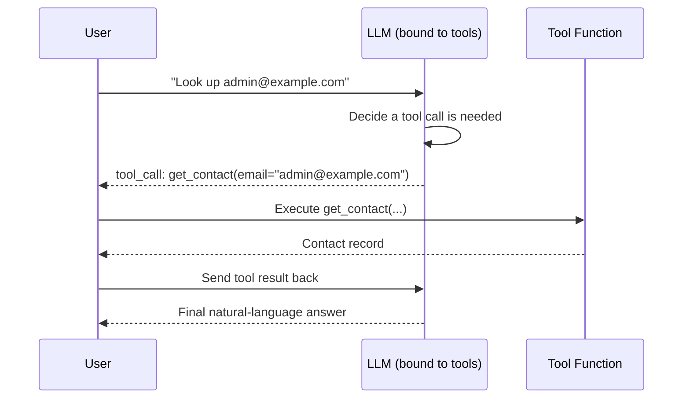

# LangChain Fundamentals

> A complete, interview-ready reference on **LangChain** — what it is, why it exists, its core components, and the modern (LCEL / LangGraph-based) way to use each one.

<p align="left">
  
  
  
</p>

---

## Learning Summary

**LangChain** is an open-source Python (and JS) framework for building applications powered by large language models. Its core value is a set of standardized, swappable building blocks — models, prompts, chains, retrieval, memory, and agents — so that switching an LLM provider, a vector store, or an agent strategy doesn't mean rewriting your application.

This note covers:
- What LangChain is and the concrete problems it solves
- The classic six components — **Models, Prompts, Chains, Indexes, Memory, Agents** — and how each has evolved
- **LCEL and Runnables**, the composition model that replaced legacy `Chain` classes
- **Structured outputs and output parsers**, and why `with_structured_output` is now preferred
- **Tools and tool calling**, the foundation of every modern LangChain agent

> ⚠️ **Warning**: LangChain moves fast. Several APIs referenced here as "legacy" (`LLMChain`, `ConversationBufferMemory`, the classic `AgentExecutor`) still work but are being superseded by LCEL, LangGraph persistence, and `create_agent`. This note calls out both the legacy and current approach explicitly.

---

## Learning Objectives

By the end of this note, you will be able to:

- [x] Explain what LangChain is and why a standardization layer over raw LLM APIs is useful.
- [x] Name the six classic LangChain components and what each is responsible for.
- [x] Explain how LCEL and the `Runnable` interface replaced the legacy `Chain` class hierarchy.
- [x] Use `with_structured_output` and the `@tool` / `bind_tools` pattern for structured outputs and tool calling.
- [x] Explain how modern agents (`create_agent`) relate to the older `AgentExecutor` pattern and LangGraph.
- [x] Answer common interview questions about LangChain's architecture and evolution.

---

## Prerequisites

> 💡 **Tip**: No prior LangChain experience is required, but comfort with Python and a basic idea of how LLM APIs work (prompt in, text out) will make this much easier to follow.

```bash
pip install langchain langchain-core langchain-openai langgraph
```

---

## Table of Contents

- [What Is LangChain](#what-is-langchain)
- [Why Do We Need LangChain](#why-do-we-need-langchain)
- [LangChain Components Overview](#langchain-components-overview)
- [Models](#models)
- [Prompts](#prompts)
- [Chains](#chains)
- [Indexes](#indexes)
- [Memory](#memory)
- [Agents](#agents)
- [LCEL and Runnables](#lcel-and-runnables)
- [Structured Outputs](#structured-outputs)
- [Output Parsers](#output-parsers)
- [Tools and Tool Calling](#tools-and-tool-calling)
- [Real-World Use Cases](#real-world-use-cases)
- [Advantages](#advantages)
- [Disadvantages](#disadvantages)
- [Best Practices](#best-practices)
- [Common Mistakes](#common-mistakes)
- [Interview Questions](#interview-questions)
- [Cheat Sheet](#cheat-sheet)
- [Useful Links](#useful-links)
- [Summary](#summary)

---

## What Is LangChain

> 📌 **Important**: LangChain itself does not train or host models. It's an orchestration and abstraction layer that sits on top of model providers (OpenAI, Anthropic, Google, local models via Ollama, etc.).

**LangChain** is an open-source framework that simplifies building applications powered by large language models. It provides a unified interface across dozens of LLM providers and packages up the recurring pieces of an LLM application — prompting, chaining calls together, retrieving external data, remembering conversation state, and giving models the ability to call tools — as composable, swappable components.



Created by Harrison Chase in late 2022, LangChain has grown into one of the most widely used frameworks for LLM application development, with a large ecosystem including **LangGraph** (stateful agent orchestration), **LangSmith** (tracing and evaluation), and hundreds of third-party integrations.

---

## Why Do We Need LangChain

Without a framework, every LLM application ends up re-solving the same handful of problems from scratch:

| Problem | Without LangChain | With LangChain |
|---|---|---|
| **Provider lock-in** | Hardcoded calls to one provider's SDK and request format | A standard `ChatModel` interface — swap OpenAI for Anthropic by changing one line |
| **Prompt management** | Prompts as scattered, hardcoded strings | Reusable, versionable `PromptTemplate` objects |
| **Multi-step logic** | Manually wiring together prompt → call → parse → next call | Declarative composition via LCEL (`prompt \| model \| parser`) |
| **External data (RAG)** | Custom code per document type, per vector database | Standard loaders, splitters, vector store, and retriever interfaces |
| **Conversation state** | Ad hoc dictionaries or session variables | Structured memory / LangGraph persistence |
| **Tool-using agents** | Custom function-calling glue code per provider | A standard `@tool` + `bind_tools` + agent-loop abstraction |

> 🚀 **Best Practice**: The value of LangChain grows with the complexity of your application. A single prompt-in/text-out call barely needs it; a RAG pipeline, a multi-step agent, or a system that must support multiple LLM providers benefits enormously.

---

## LangChain Components Overview

Classic LangChain teaching material (and most tutorials, including many still being published) organizes the framework around six components:



| Component | Responsibility |
|---|---|
| **Models** | Standardized interface to LLMs and chat models across providers |
| **Prompts** | Reusable, parameterized templates for constructing model inputs |
| **Chains** | Composing multiple steps (prompt, model, parser, more calls) into one pipeline |
| **Indexes** | Loading, splitting, embedding, and retrieving external data (the "R" in RAG) |
| **Memory** | Retaining conversation or task state across multiple calls |
| **Agents** | Using an LLM as a reasoning engine to decide which tools/actions to take |

Each is covered in detail below, including how the underlying implementation has shifted since LangChain's early releases.

---

## Models

At the center of every LangChain application is the model itself — LangChain provides a standardized interface (`ChatModel`) for interacting with LLMs from many different providers (OpenAI, Anthropic, Google, Cohere, Hugging Face, local models via Ollama, and more).

```python
from langchain_openai import ChatOpenAI
from langchain_anthropic import ChatAnthropic

# Same interface, different providers
gpt = ChatOpenAI(model="gpt-4o-mini")
claude = ChatAnthropic(model="claude-sonnet-4-6")

response = claude.invoke("Explain LangChain in one sentence.")
print(response.content)
```

Because every chat model implements the same `Runnable` interface, switching providers is a one-line change — the rest of your chain, prompt, and parsing logic stays identical.

---

## Prompts

Instead of hardcoding prompt strings, LangChain's `PromptTemplate` (and `ChatPromptTemplate` for multi-turn/chat models) lets you define a template with placeholders and fill them in at runtime.

```python
from langchain_core.prompts import ChatPromptTemplate

prompt = ChatPromptTemplate.from_messages([
    ("system", "You are a helpful assistant that explains concepts simply."),
    ("human", "Explain {topic} to a {audience}."),
])

formatted = prompt.invoke({"topic": "vector embeddings", "audience": "beginner"})
```

> 💡 **Tip**: Treat prompt templates like reusable functions — parameterize anything that varies per call (topic, audience, tone, examples) rather than writing a new string for every use case.

---

## Chains

**Chains** connect multiple steps — a prompt, a model call, a parser, possibly another model call — into a single, reusable pipeline.

> ⚠️ **Warning**: The original `Chain` class hierarchy (`LLMChain`, `SimpleSequentialChain`, `ConversationChain`, etc.) is now considered legacy. The modern, recommended way to build chains is **LCEL** (LangChain Expression Language), covered in the next section.

```python
# Legacy style (still works, but discouraged for new code)
from langchain.chains import LLMChain
chain = LLMChain(llm=gpt, prompt=prompt)

# Modern style (LCEL)
chain = prompt | gpt
```

Both produce the same result conceptually — LCEL is simply the declarative, composable successor.

---

## Indexes

"Indexes" is the classic LangChain term for everything involved in connecting an LLM to external data — what today is usually just called the **retrieval** stack:


| Stage | Purpose |
|---|---|
| **Document Loaders** | Load raw sources (PDFs, web pages, CSVs, databases) into standard `Document` objects |
| **Text Splitters** | Break large documents into retrieval-sized chunks |
| **Embedding Models** | Convert chunks into numerical vectors |
| **Vector Store** | Store and index those vectors for fast similarity search |
| **Retriever** | The interface that actually fetches relevant chunks for a given query |

```python
from langchain_community.vectorstores import FAISS
from langchain_openai import OpenAIEmbeddings

vectorstore = FAISS.from_documents(chunks, OpenAIEmbeddings())
retriever = vectorstore.as_retriever(search_kwargs={"k": 4})
```

> 📌 **Important**: "Indexes" as a single module name has largely disappeared from current documentation — it's been split into the more specific Document Loaders, Text Splitters, Vector Stores, and Retrievers abstractions, but the underlying purpose (connecting an LLM to your own data) is unchanged.

---

## Memory

**Memory** lets an application remember previous interactions instead of treating every call as stateless.

> ⚠️ **Warning**: Legacy memory classes (`ConversationBufferMemory`, `ConversationSummaryMemory`, etc.) are being phased out in favor of **LangGraph's built-in persistence** (checkpointers that automatically save and restore graph state, including conversation history) for any application with real state-management needs.

```python
# Modern approach: persist state via a LangGraph checkpointer
from langgraph.checkpoint.memory import MemorySaver
from langgraph.graph import StateGraph

checkpointer = MemorySaver()
graph = StateGraph(...).compile(checkpointer=checkpointer)

# Each invocation with the same thread_id automatically resumes prior state
graph.invoke(inputs, config={"configurable": {"thread_id": "user-123"}})
```

LangChain supports both **short-term** (conversation-level) and **long-term** (episodic — facts remembered across sessions) memory, typically backed by simple in-memory stores for short-term and a database or vector store for long-term.

---

## Agents

**Agents** use an LLM as a reasoning engine to decide *which action to take next*, rather than following a fixed sequence like a chain.



| | Chains | Agents |
|---|---|---|
| **Execution** | Static — predefined sequence of steps | Dynamic — LLM decides the next step at runtime |
| **Analogy** | A production line | An assistant that plans, executes, and rethinks |
| **Best for** | Well-defined, repeatable workflows | Open-ended tasks requiring judgment and tool use |

> ⚠️ **Warning**: The older `AgentExecutor` pattern (an LLM plus a toolset, with LangChain manually handling the reasoning loop) is still widely used but considered less modular. The current recommended approach is `create_agent`, which builds on **LangGraph's** runtime underneath, giving you durable execution, streaming, and persistence for free.

```python
from langchain.agents import create_agent

agent = create_agent(model=claude, tools=[get_contact, web_search], system_prompt="You are a helpful CRM assistant.")
result = agent.invoke({"messages": [("user", "Look up admin@example.com")]})
```

---

## LCEL and Runnables

**LCEL (LangChain Expression Language)** is the declarative pipe-based syntax for composing chains, and the `Runnable` interface is what every LangChain component (models, prompts, parsers, retrievers, tools) implements to make that composition possible.


```python
chain = prompt | claude | (lambda msg: msg.content.upper())
result = chain.invoke({"topic": "LCEL", "audience": "developer"})
```

Every `Runnable` exposes the same core methods, regardless of what it wraps:

| Method | Purpose |
|---|---|
| `.invoke(input)` | Run once, synchronously, and return the result |
| `.batch([inputs])` | Run over multiple inputs, in parallel where possible |
| `.stream(input)` | Stream results incrementally as they're produced |
| `\| ` (pipe) | Compose this `Runnable` with another into a new pipeline |

> 🚀 **Best Practice**: Prefer LCEL over the legacy `Chain` classes for all new code — it's more composable, supports streaming and batching out of the box, and is what current LangChain documentation, tutorials, and `create_agent` are built around.

---

## Structured Outputs

Getting a model to return data in a specific shape (a Pydantic model, a JSON schema) rather than free-form text is one of the most common LangChain needs.

```python
from pydantic import BaseModel, Field

class CodeReview(BaseModel):
    issues: list[str] = Field(description="List of code issues found")
    severity: str = Field(description="low, medium, or high")

structured_llm = claude.with_structured_output(CodeReview)
result = structured_llm.invoke("Review this code: for i in range(len(items)): print(items[i])")

print(result.issues, result.severity)
```

> 💡 **Tip**: Pydantic field `description`s aren't just documentation — the model reads them as instructions for what each field should contain. Write them like guidance, not labels.

---

## Output Parsers

Before `with_structured_output` became the standard, LangChain used **output parsers** — components that ask the model to format its response in a specific way (usually JSON) and then parse that text back into a structured object.

```python
from langchain_core.output_parsers import PydanticOutputParser

parser = PydanticOutputParser(pydantic_object=CodeReview)
chain = prompt | claude | parser
```

| | Output Parsers | `with_structured_output` |
|---|---|---|
| **Mechanism** | Ask the model to emit formatted text, then parse it | Uses the provider's native structured-output / tool-calling API |
| **Reliability** | Depends on the model reliably following formatting instructions | Enforced by the provider's API — generally more reliable |
| **Status** | Still useful for models/providers without native structured output | Preferred approach for providers that support it |

> ⚠️ **Warning**: `with_structured_output` and manually bound tools can interact in surprising ways on some providers — check your provider's LangChain integration notes before combining `bind_tools` and `with_structured_output` on the same model instance.

---

## Tools and Tool Calling

A **tool** is a function the model can choose to invoke — giving it the ability to look things up, take actions, or query external systems instead of only generating text.

```python
from langchain_core.tools import tool

@tool
def get_contact(email: str) -> dict:
    """Fetch a CRM contact by email address.

    Use this when the user wants to look up, retrieve, or find
    information about a specific contact using their email.
    """
    return db.query("SELECT * FROM contacts WHERE email = ?", email)

llm_with_tools = claude.bind_tools([get_contact])
response = llm_with_tools.invoke("Look up admin@example.com")
```

> 📌 **Important**: The `@tool` decorator reads your function's docstring and type hints to generate the schema the model sees. Write docstrings as instructions the model will actually read and act on — not just human-facing documentation.

**How tool calling works, step by step:**

1. Define a tool (with the `@tool` decorator, or a `BaseTool` subclass for more control).
2. Bind it to a model with `.bind_tools([...])`.
3. Invoke the model — it decides whether to call the tool, and with what arguments, based on the query.
4. Your application executes the tool call and (typically) feeds the result back to the model for a final answer.



---

## Real-World Use Cases

- **Conversational assistants** — chains + memory maintain context across a multi-turn conversation.
- **Enterprise knowledge bots** — indexes/retrieval + models answer questions grounded in internal documents.
- **CRM and support automation** — agents + tools look up records, draft replies, and take actions on a user's behalf.
- **Data extraction pipelines** — structured outputs turn unstructured text (invoices, emails, reports) into clean, typed records.
- **Multi-provider products** — the standardized model interface lets a product route between OpenAI, Anthropic, and local models based on cost or latency needs.

---

## Advantages

- A single, consistent interface across dozens of LLM providers, vector stores, and tool integrations.
- LCEL's declarative composition supports streaming, batching, and async out of the box, for free.
- A very large integration ecosystem (1,000+ connectors) covering most common data sources and tools.
- `create_agent` + LangGraph gives production-grade durability, retries, and persistence without hand-rolling them.

## Disadvantages

- A large, fast-moving API surface — legacy patterns (`LLMChain`, classic memory classes, `AgentExecutor`) coexist with modern ones, which can confuse newcomers following older tutorials.
- Abstraction has a cost: debugging a multi-layered chain can be harder than debugging a raw API call.
- Some structured-output and tool-calling interactions are provider-specific and not perfectly abstracted away yet.
- For very simple, single-call use cases, LangChain can add more complexity than it removes.

---

## Best Practices

- Default to **LCEL** (`prompt | model | parser`) for new chains; treat the legacy `Chain` classes as read-only knowledge for maintaining older code.
- Default to **`create_agent`** for new agents rather than hand-building an `AgentExecutor` loop.
- Prefer **`with_structured_output`** over manual output parsers whenever your provider supports it natively.
- Write tool docstrings and Pydantic field descriptions as instructions for the model, not just documentation for humans.
- Use LangGraph persistence (checkpointers) for any application that needs real conversation or task memory, rather than ad hoc dictionaries.

## Common Mistakes

- [ ] Learning from an older tutorial and building new code around `LLMChain` or classic memory classes instead of LCEL and LangGraph persistence.
- [ ] Writing vague tool docstrings, causing the model to call the wrong tool or pass malformed arguments.
- [ ] Combining `bind_tools` and `with_structured_output` on the same model call without checking provider-specific behavior first.
- [ ] Treating agents as chains — expecting a fixed sequence of steps instead of designing for the LLM's dynamic tool-choice behavior.
- [ ] Not setting retry/looping limits on custom agent logic, risking runaway tool-calling loops.

---

## Interview Questions

<details>
<summary><b>Q1. What problem does LangChain actually solve?</b></summary>

<br>

It standardizes the recurring pieces of building an LLM application — model access, prompt templating, multi-step orchestration, external data retrieval, conversation memory, and tool-using agents — so that swapping a provider, vector store, or agent strategy doesn't require rewriting the whole application.
</details>

<details>
<summary><b>Q2. What replaced the legacy `Chain` class hierarchy, and why?</b></summary>

<br>

LCEL (LangChain Expression Language), which composes `Runnable` components with the pipe operator (`prompt | model | parser`). It replaced classes like `LLMChain` because it's more declarative, supports streaming/batching/async automatically, and composes more predictably than nested chain objects.
</details>

<details>
<summary><b>Q3. How has "Memory" changed in modern LangChain applications?</b></summary>

<br>

Classic memory classes like `ConversationBufferMemory` are being superseded by LangGraph's built-in persistence — checkpointers that automatically save and restore an application's state (including conversation history) keyed by a thread ID, rather than managing memory objects manually.
</details>

<details>
<summary><b>Q4. What's the difference between a chain and an agent?</b></summary>

<br>

A chain follows a fixed, predefined sequence of steps every time. An agent uses the LLM itself as a reasoning engine to decide, at runtime, which action or tool to take next — making it dynamic rather than static, at the cost of being less predictable.
</details>

<details>
<summary><b>Q5. What's the difference between an output parser and `with_structured_output`?</b></summary>

<br>

An output parser asks the model to produce formatted text (usually JSON) and then parses that text after the fact — reliability depends on the model following instructions. `with_structured_output` uses the provider's native structured-output or tool-calling API to enforce the schema directly, which is generally more reliable where supported.
</details>

<details>
<summary><b>Q6. How does `create_agent` relate to LangGraph?</b></summary>

<br>

`create_agent` is a high-level LangChain API for building agents, but under the hood it constructs and runs on a LangGraph graph — giving you LangGraph's durable execution, retries, streaming, and persistence without requiring you to build the graph by hand.
</details>

<details>
<summary><b>Q7. What information does the `@tool` decorator use to build a tool's schema?</b></summary>

<br>

The function's type hints (for argument types) and its docstring (for the tool's description and usage guidance) — both are read by the framework to construct the schema the model sees, and are what the model uses to decide when and how to call the tool.
</details>

---

## Cheat Sheet

```bash
pip install langchain langchain-core langchain-openai langgraph
```

| Task | Snippet |
|---|---|
| Create a chat model | `ChatOpenAI(model="gpt-4o-mini")` |
| Create a prompt template | `ChatPromptTemplate.from_messages([...])` |
| Compose an LCEL chain | `prompt \| model \| parser` |
| Structured output | `model.with_structured_output(MySchema)` |
| Legacy output parser | `PydanticOutputParser(pydantic_object=MySchema)` |
| Define a tool | `@tool` decorator on a documented function |
| Bind tools to a model | `model.bind_tools([tool1, tool2])` |
| Build a modern agent | `create_agent(model=..., tools=[...])` |
| Persist state across calls | `graph.compile(checkpointer=MemorySaver())` |

> 📌 **Rule of thumb**: New chain logic → **LCEL**. New agent → **`create_agent`**. New structured output → **`with_structured_output`** first, output parser as fallback. New conversational state → **LangGraph persistence**, not manual memory classes.

---

## Useful Links

- [LangChain Documentation](https://python.langchain.com/docs/introduction/)
- [LangChain Expression Language (LCEL)](https://python.langchain.com/docs/concepts/lcel/)
- [LangChain — Structured Output](https://python.langchain.com/docs/how_to/structured_output/)
- [LangChain — Tool Calling](https://python.langchain.com/docs/concepts/tool_calling/)
- [LangGraph Documentation](https://langchain-ai.github.io/langgraph/)
- [LangChain — Retrievers (related note)](../Retrievers)

---

## Summary

> LangChain's enduring value is standardization: one set of interfaces for models, prompts, chains, retrieval, memory, and agents, so an application can evolve — swap providers, add RAG, add tools, add multi-step reasoning — without a rewrite each time.

- The six classic components (Models, Prompts, Chains, Indexes, Memory, Agents) are still the right mental model, even though several of their implementations have moved to LCEL, dedicated retrieval abstractions, and LangGraph.
- LCEL and the `Runnable` interface are the modern foundation almost everything else in LangChain is built on.
- For structured data, prefer `with_structured_output`; for tool use, `@tool` + `bind_tools`; for agents, `create_agent` on LangGraph.

---

<p align="center"><i>Compiled as part of personal LangChain / agentic AI study notes — July 2026.</i></p>
