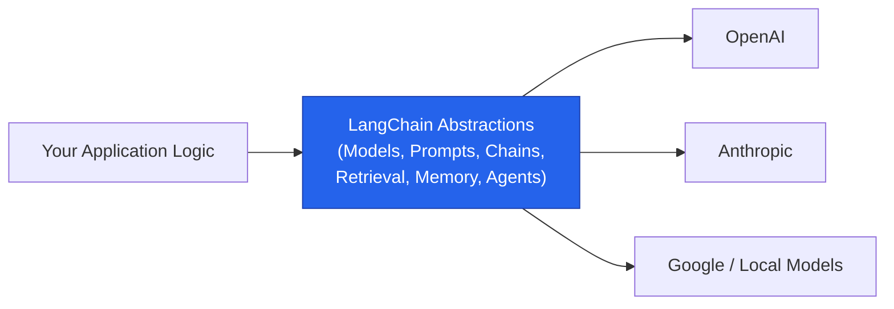
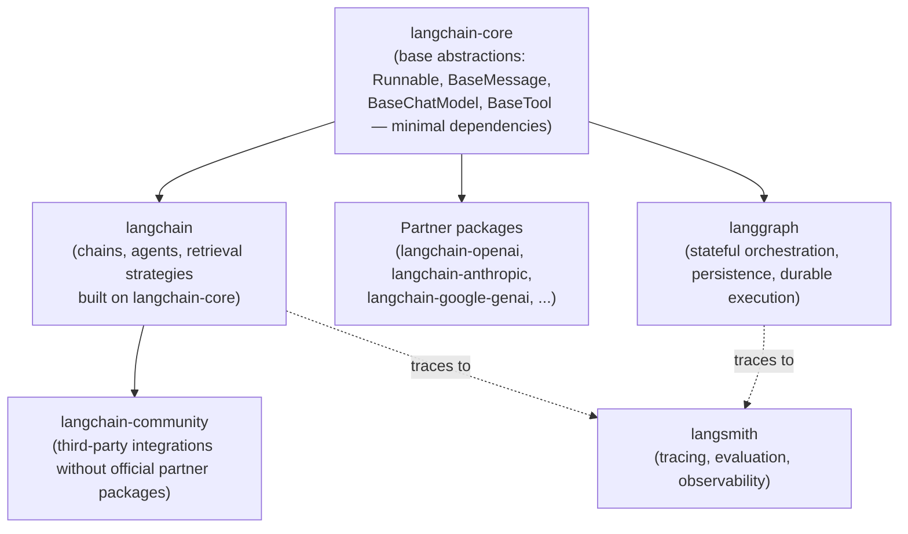
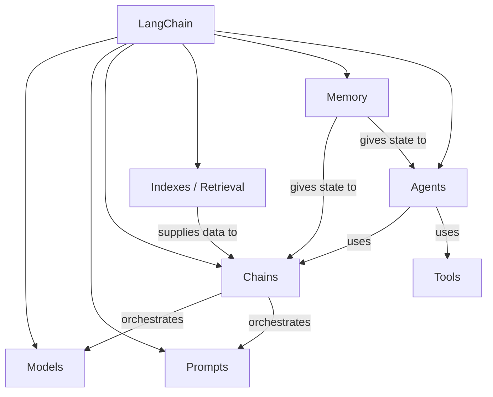
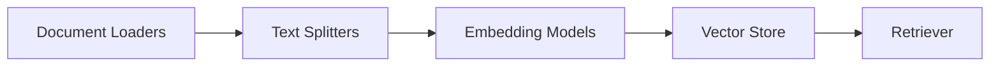
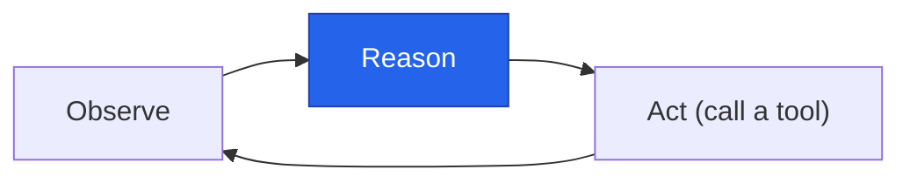
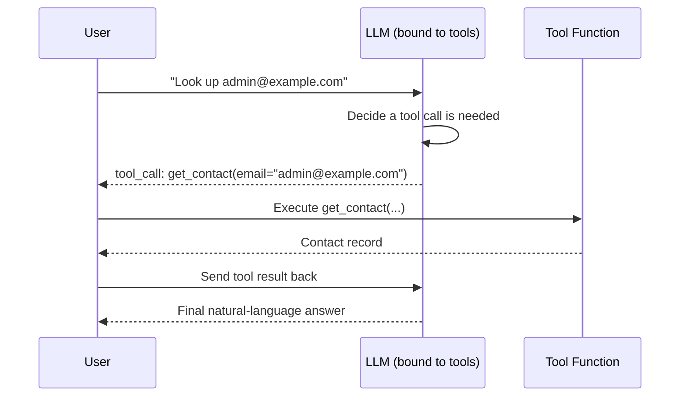

# LangChain Fundamentals

> A complete, interview-ready reference on **LangChain** — what it is, why it exists, its core components, and the modern (LCEL / LangGraph-based) way to use each one.

<p align="left">
  
  
  
</p>

---

## Learning Summary

**LangChain** is an open-source Python (and JS) framework for building applications powered by large language models. Its core value is a set of standardized, swappable building blocks — models, prompts, chains, retrieval, memory, and agents — so that switching an LLM provider, a vector store, or an agent strategy doesn't mean rewriting your application.

This note goes deep on every core topic:
- What LangChain is, its package architecture, and the concrete problems it solves
- The classic six components — **Models, Prompts, Chains, Indexes, Memory, Agents** — each covered in full detail, legacy vs. current API
- **LCEL and Runnables** — every primitive (`RunnableSequence`, `RunnableParallel`, `RunnableLambda`, `RunnableBranch`, `RunnablePassthrough`) with working code
- **Structured outputs and output parsers** — every parser type, every `with_structured_output` mode
- **Tools and tool calling** — schemas, injected arguments, error handling, parallel calls, and forced tool choice

> ⚠️ **Warning**: LangChain moves fast. Several APIs referenced here as "legacy" (`LLMChain`, `ConversationBufferMemory`, the classic `AgentExecutor`) still work but are being superseded by LCEL, LangGraph persistence, and `create_agent`. This note calls out both the legacy and current approach explicitly, everywhere they differ.

---

## Learning Objectives

By the end of this note, you will be able to:

- [x] Explain what LangChain is, its package structure, and why a standardization layer over raw LLM APIs is useful.
- [x] Name the six classic LangChain components and explain each in depth, including how its implementation has evolved.
- [x] Compose chains using every core LCEL primitive: sequence, parallel, branch, lambda, and passthrough.
- [x] Use `with_structured_output` and classic output parsers, and know when to reach for each.
- [x] Build tool-calling models and agents, including injected arguments and tool error handling.
- [x] Explain how modern agents (`create_agent`) relate to the older `AgentExecutor` pattern and LangGraph.
- [x] Answer detailed interview questions about LangChain's architecture, evolution, and trade-offs.

---

## Prerequisites

> 💡 **Tip**: No prior LangChain experience is required, but comfort with Python and a basic idea of how LLM APIs work (prompt in, text out) will make this much easier to follow.

```bash
pip install langchain langchain-core langchain-openai langgraph
```

---

## Table of Contents

- [What Is LangChain](#what-is-langchain)
- [Why Do We Need LangChain](#why-do-we-need-langchain)
- [LangChain Components Overview](#langchain-components-overview)
- [Models](#models)
- [Prompts](#prompts)
- [Chains](#chains)
- [Indexes](#indexes)
- [Memory](#memory)
- [Agents](#agents)
- [LCEL and Runnables](#lcel-and-runnables)
- [Structured Outputs](#structured-outputs)
- [Output Parsers](#output-parsers)
- [Tools and Tool Calling](#tools-and-tool-calling)
- [Real-World Use Cases](#real-world-use-cases)
- [Advantages](#advantages)
- [Disadvantages](#disadvantages)
- [Best Practices](#best-practices)
- [Common Mistakes](#common-mistakes)
- [Interview Questions](#interview-questions)
- [Cheat Sheet](#cheat-sheet)
- [Useful Links](#useful-links)
- [Summary](#summary)

---

## What Is LangChain

> 📌 **Important**: LangChain itself does not train or host models. It's an orchestration and abstraction layer that sits on top of model providers (OpenAI, Anthropic, Google, local models via Ollama, etc.).

**LangChain** is an open-source framework that simplifies building applications powered by large language models. It provides a unified interface across dozens of LLM providers and packages up the recurring pieces of an LLM application — prompting, chaining calls together, retrieving external data, remembering conversation state, and giving models the ability to call tools — as composable, swappable components.



Created by Harrison Chase in late 2022, LangChain has grown into one of the most widely used frameworks for LLM application development, with a large ecosystem including **LangGraph** (stateful agent orchestration), **LangSmith** (tracing and evaluation), and hundreds of third-party integrations.

### Package Architecture

LangChain is not a single package — it's split into layers so applications only depend on what they actually use:



| Package | Contains |
|---|---|
| `langchain-core` | Foundational abstractions — `Runnable`, messages, prompts, output parsers, the `BaseTool`/`BaseChatModel` interfaces. Minimal dependencies. |
| `langchain` | Higher-level chains, retrieval strategies, and agent-building helpers built on `langchain-core`. |
| `langchain-community` | Community-maintained integrations that don't have a dedicated partner package. |
| Partner packages (`langchain-openai`, `langchain-anthropic`, ...) | Provider-specific, officially maintained integrations. |
| `langgraph` | Low-level, graph-based orchestration for stateful and cyclical workflows — what modern agents run on. |
| `langsmith` | Tracing, debugging, and evaluation for both chains and agents. |

---

## Why Do We Need LangChain

Without a framework, every LLM application ends up re-solving the same handful of problems from scratch:

| Problem | Without LangChain | With LangChain |
|---|---|---|
| **Provider lock-in** | Hardcoded calls to one provider's SDK and request format | A standard `ChatModel` interface — swap OpenAI for Anthropic by changing one line |
| **Prompt management** | Prompts as scattered, hardcoded strings | Reusable, versionable `PromptTemplate` objects |
| **Multi-step logic** | Manually wiring together prompt to call to parse to next call | Declarative composition via LCEL (`prompt \| model \| parser`) |
| **External data (RAG)** | Custom code per document type, per vector database | Standard loaders, splitters, vector store, and retriever interfaces |
| **Conversation state** | Ad hoc dictionaries or session variables | Structured memory / LangGraph persistence |
| **Tool-using agents** | Custom function-calling glue code per provider | A standard `@tool` + `bind_tools` + agent-loop abstraction |

### A Concrete Before/After

Without LangChain, calling two different providers means two different request/response shapes:

```python
# Raw OpenAI SDK
import openai
resp = openai.chat.completions.create(
    model="gpt-4o-mini",
    messages=[{"role": "user", "content": "Explain LCEL in one sentence."}],
)
text = resp.choices[0].message.content

# Raw Anthropic SDK - different shape entirely
import anthropic
client = anthropic.Anthropic()
resp = client.messages.create(
    model="claude-sonnet-4-6",
    max_tokens=200,
    messages=[{"role": "user", "content": "Explain LCEL in one sentence."}],
)
text = resp.content[0].text
```

With LangChain, both providers expose the exact same interface:

```python
from langchain_openai import ChatOpenAI
from langchain_anthropic import ChatAnthropic

gpt = ChatOpenAI(model="gpt-4o-mini")
claude = ChatAnthropic(model="claude-sonnet-4-6")

for model in (gpt, claude):
    print(model.invoke("Explain LCEL in one sentence.").content)
```

> 🚀 **Best Practice**: The value of LangChain grows with the complexity of your application. A single prompt-in/text-out call barely needs it; a RAG pipeline, a multi-step agent, or a system that must support multiple LLM providers benefits enormously.

---

## LangChain Components Overview

Classic LangChain teaching material (and most tutorials, including many still being published) organizes the framework around six components:



| Component | Responsibility |
|---|---|
| **Models** | Standardized interface to LLMs and chat models across providers |
| **Prompts** | Reusable, parameterized templates for constructing model inputs |
| **Chains** | Composing multiple steps (prompt, model, parser, more calls) into one pipeline |
| **Indexes** | Loading, splitting, embedding, and retrieving external data (the "R" in RAG) |
| **Memory** | Retaining conversation or task state across multiple calls |
| **Agents** | Using an LLM as a reasoning engine to decide which tools/actions to take |

Each is covered in full detail below, including how the underlying implementation has shifted since LangChain's early releases.

---

## Models

At the center of every LangChain application is the model itself — LangChain provides a standardized interface for interacting with LLMs from many different providers (OpenAI, Anthropic, Google, Cohere, Hugging Face, local models via Ollama, and more).

### LLMs vs. Chat Models

LangChain historically distinguished two model interfaces:

| | Legacy `LLM` class | `BaseChatModel` (current standard) |
|---|---|---|
| **Input** | A single string | A list of messages (`SystemMessage`, `HumanMessage`, `AIMessage`, ...) |
| **Output** | A string | An `AIMessage` object (content + tool calls + metadata) |
| **Fits** | Older, completion-style APIs | Every modern provider (OpenAI, Anthropic, Gemini, etc.) |
| **Status** | Legacy — most providers no longer offer pure completion endpoints | The standard for all current work |

```python
from langchain_core.messages import SystemMessage, HumanMessage
from langchain_anthropic import ChatAnthropic

model = ChatAnthropic(model="claude-sonnet-4-6")
response = model.invoke([
    SystemMessage(content="You are a concise technical writer."),
    HumanMessage(content="What is LCEL?"),
])
print(response.content)
```

### Standard Model Parameters

Every chat model exposes a common set of parameters, regardless of provider:

| Parameter | Purpose |
|---|---|
| `temperature` | Randomness of output — lower is more deterministic |
| `max_tokens` | Maximum length of the generated response |
| `timeout` | Maximum time to wait for a response |
| `max_retries` | Automatic retries on transient failures (rate limits, network errors) |
| `stop` | Sequence(s) that cause generation to stop early |

```python
model = ChatAnthropic(
    model="claude-sonnet-4-6",
    temperature=0.2,
    max_tokens=1024,
    timeout=30,
    max_retries=2,
)
```

### Multimodal Input

Modern chat models accept more than text — images and PDFs can be passed as structured content blocks:

```python
response = model.invoke([
    HumanMessage(content=[
        {"type": "text", "text": "What's in this image?"},
        {"type": "image_url", "image_url": {"url": "https://example.com/photo.jpg"}},
    ])
])
```

### Streaming and Async

```python
# Streaming - print tokens as they arrive
for chunk in model.stream("Write a haiku about vector databases."):
    print(chunk.content, end="", flush=True)

# Async invocation
response = await model.ainvoke("Explain embeddings briefly.")
```

### Embedding Models

Embedding models are a related but distinct model type — instead of text-in/text-out, they're text-in/vector-out, and they power the retrieval stack covered under [Indexes](#indexes).

```python
from langchain_openai import OpenAIEmbeddings

embeddings = OpenAIEmbeddings(model="text-embedding-3-small")
vector = embeddings.embed_query("What is LangChain?")
```

> 💡 **Tip**: Because every chat model implements the same `Runnable` interface, switching providers is a one-line change — the rest of your chain, prompt, and parsing logic stays identical.

---

## Prompts

Instead of hardcoding prompt strings, LangChain's `PromptTemplate` (for plain-text models) and `ChatPromptTemplate` (for chat models) let you define a template with placeholders and fill them in at runtime.

### PromptTemplate and ChatPromptTemplate

```python
from langchain_core.prompts import ChatPromptTemplate

prompt = ChatPromptTemplate.from_messages([
    ("system", "You are a helpful assistant that explains concepts simply."),
    ("human", "Explain {topic} to a {audience}."),
])

formatted = prompt.invoke({"topic": "vector embeddings", "audience": "beginner"})
```

### Injecting Conversation History with MessagesPlaceholder

```python
from langchain_core.prompts import ChatPromptTemplate, MessagesPlaceholder

prompt = ChatPromptTemplate.from_messages([
    ("system", "You are a helpful assistant."),
    MessagesPlaceholder("history"),
    ("human", "{input}"),
])

prompt.invoke({"history": [("human", "My name is Sam"), ("ai", "Nice to meet you, Sam!")], "input": "What's my name?"})
```

`MessagesPlaceholder` is what lets a prompt template accept a variable-length list of prior messages — the standard way memory (covered below) gets fed back into a prompt.

### Few-Shot Prompting

When a task benefits from examples, `FewShotPromptTemplate` (or a manually built few-shot `ChatPromptTemplate`) inserts example input/output pairs before the real question:

```python
from langchain_core.prompts import FewShotPromptTemplate, PromptTemplate

examples = [
    {"input": "happy", "output": "sad"},
    {"input": "tall", "output": "short"},
]
example_prompt = PromptTemplate.from_template("Input: {input}\nOutput: {output}")

few_shot_prompt = FewShotPromptTemplate(
    examples=examples,
    example_prompt=example_prompt,
    suffix="Input: {adjective}\nOutput:",
    input_variables=["adjective"],
)
```

For large example sets, an **example selector** (e.g. semantic-similarity based) picks only the most relevant few examples per query instead of hardcoding a fixed list.

### Partial Prompts and Composition

```python
# Partial variables: bind a value now, fill the rest later
partial_prompt = prompt.partial(audience="15-year-old")
partial_prompt.invoke({"topic": "gradient descent"})
```

Prompt templates can also be composed — combining a reusable system-instructions template with a per-call user-message template — keeping large prompts maintainable instead of one giant string.

---

## Chains

**Chains** connect multiple steps — a prompt, a model call, a parser, possibly another model call — into a single, reusable pipeline.

> ⚠️ **Warning**: The original `Chain` class hierarchy (`LLMChain`, `SimpleSequentialChain`, `ConversationChain`, etc.) is now considered legacy. The modern, recommended way to build chains is **LCEL** (LangChain Expression Language), covered in detail in the next section.

```python
# Legacy style (still works, but discouraged for new code)
from langchain.chains import LLMChain
chain = LLMChain(llm=gpt, prompt=prompt)

# Modern style (LCEL)
chain = prompt | gpt
```

### A Real Multi-Step Chain

```python
translate_prompt = ChatPromptTemplate.from_template("Translate this to French:\n\n{text}")
summarize_prompt = ChatPromptTemplate.from_template("Summarize this in one sentence:\n\n{text}")

translate_chain = translate_prompt | gpt | StrOutputParser()
summarize_chain = summarize_prompt | gpt | StrOutputParser()

full_chain = (
    {"text": translate_chain}
    | summarize_chain
)
full_chain.invoke({"text": "LangChain is a framework for building LLM applications."})
```

Here the output of `translate_chain` (French text) is fed directly as the input to `summarize_chain` — this is the core pattern behind every LCEL pipeline: each step's output becomes the next step's input.

### Debugging Chains

Every LCEL chain can be traced automatically with **LangSmith** (set `LANGCHAIN_TRACING_V2=true` and an API key) — showing every intermediate input/output without adding print statements. For local debugging, `chain.get_graph().print_ascii()` visualizes the composed pipeline structure.

---

## Indexes

"Indexes" is the classic LangChain term for everything involved in connecting an LLM to external data — what today is usually just called the **retrieval** stack:



| Stage | Purpose | Common Options |
|---|---|---|
| **Document Loaders** | Load raw sources into standard `Document` objects | `PyPDFLoader`, `WebBaseLoader`, `TextLoader`, `CSVLoader` |
| **Text Splitters** | Break large documents into retrieval-sized chunks | `RecursiveCharacterTextSplitter`, language-aware splitters, `SemanticChunker` |
| **Embedding Models** | Convert chunks into numerical vectors | `OpenAIEmbeddings`, `HuggingFaceEmbeddings` (free/local), `GoogleGenerativeAIEmbeddings` |
| **Vector Store** | Store and index vectors for fast similarity search | `FAISS` (in-memory/file), `Chroma`, `Pinecone`, `Qdrant`, `Weaviate` |
| **Retriever** | The interface that actually fetches relevant chunks for a query | Vector store retriever, `BM25Retriever`, `EnsembleRetriever`, and more |

```python
from langchain_community.document_loaders import PyPDFLoader
from langchain_text_splitters import RecursiveCharacterTextSplitter
from langchain_community.vectorstores import FAISS
from langchain_openai import OpenAIEmbeddings

docs = PyPDFLoader("handbook.pdf").load()
chunks = RecursiveCharacterTextSplitter(chunk_size=500, chunk_overlap=50).split_documents(docs)

vectorstore = FAISS.from_documents(chunks, OpenAIEmbeddings())
retriever = vectorstore.as_retriever(search_kwargs={"k": 4})

relevant_docs = retriever.invoke("What is the refund policy?")
```

> 📌 **Important**: "Indexes" as a single module name has largely disappeared from current documentation — it's been split into the more specific Document Loaders, Text Splitters, Vector Stores, and Retrievers abstractions, but the underlying purpose (connecting an LLM to your own data) is unchanged. See the companion notes on [Document Loaders](../Document%20loaders), [Text Splitters](../Text%20Splitter), [Vector Stores](../Vector%20Store), and [Retrievers](../Retrievers) for full depth on each stage.

---

## Memory

**Memory** lets an application remember previous interactions instead of treating every call as stateless.

### Short-Term vs. Long-Term Memory

| Type | Scope | Typical Backing Store |
|---|---|---|
| **Short-term** | The current conversation/session | In-memory list of messages, or graph state |
| **Long-term** | Facts remembered across sessions (user preferences, past tickets) | A database or vector store, keyed by user/entity |

### Legacy Memory Classes

Older LangChain code stores conversation state in dedicated memory objects:

```python
# Legacy - still works, but being phased out
from langchain.memory import ConversationBufferMemory, ConversationSummaryMemory

buffer_memory = ConversationBufferMemory()          # keeps the full raw history
summary_memory = ConversationSummaryMemory(llm=gpt)  # keeps a running LLM-generated summary
```

Other legacy variants include `ConversationBufferWindowMemory` (keep only the last *k* messages) and `ConversationSummaryBufferMemory` (a hybrid: keep recent messages verbatim, summarize the rest).

### Modern Approach: LangGraph Persistence

> ⚠️ **Warning**: Legacy memory classes are being phased out in favor of **LangGraph's built-in persistence** — checkpointers that automatically save and restore graph state (including conversation history) for any application with real state-management needs.

```python
from langgraph.checkpoint.memory import MemorySaver
from langgraph.graph import StateGraph

checkpointer = MemorySaver()   # in-memory; swap for SqliteSaver/PostgresSaver in production
graph = StateGraph(...).compile(checkpointer=checkpointer)

# Each invocation with the same thread_id automatically resumes prior state
graph.invoke(inputs, config={"configurable": {"thread_id": "user-123"}})
```

| Checkpointer | Storage | Best For |
|---|---|---|
| `MemorySaver` | In-process memory | Local development, testing |
| `SqliteSaver` | SQLite file | Small-to-medium single-instance production apps |
| `PostgresSaver` | PostgreSQL | Multi-instance production deployments |

### Trimming Long Histories

Even with persistence, unbounded conversation history eventually exceeds the context window. `trim_messages` keeps the most recent messages (or a token budget) automatically:

```python
from langchain_core.messages import trim_messages

trimmed = trim_messages(full_history, max_tokens=2000, strategy="last", token_counter=gpt)
```

---

## Agents

**Agents** use an LLM as a reasoning engine to decide *which action to take next*, rather than following a fixed sequence like a chain.

### The ReAct Pattern

Most LangChain agents are built around the **ReAct** (Reason + Act) loop: the model reasons about the current state, decides on an action (usually a tool call), observes the result, and repeats until it has enough information to answer.



| | Chains | Agents |
|---|---|---|
| **Execution** | Static — predefined sequence of steps | Dynamic — LLM decides the next step at runtime |
| **Analogy** | A production line | An assistant that plans, executes, and rethinks |
| **Best for** | Well-defined, repeatable workflows | Open-ended tasks requiring judgment and tool use |

### From AgentExecutor to create_agent

> ⚠️ **Warning**: The older `AgentExecutor` pattern (an LLM plus a toolset, with LangChain manually handling the reasoning loop via a helper like `create_react_agent`) is still widely used but considered less modular. The current recommended approach is `create_agent`, which builds on **LangGraph's** runtime underneath, giving you durable execution, streaming, and persistence for free.

```python
from langchain.agents import create_agent

agent = create_agent(
    model=claude,
    tools=[get_contact, web_search],
    system_prompt="You are a helpful CRM assistant.",
)
result = agent.invoke({"messages": [("user", "Look up admin@example.com")]})
```

### Middleware and Human-in-the-Loop

Modern agent APIs support **middleware** — hooks that run before/after model calls or tool calls, useful for logging, guardrails, or approval gates. A common pattern is a human-in-the-loop checkpoint: the agent pauses before executing a sensitive tool (e.g. sending an email, deleting a record) and waits for explicit human approval before continuing — implemented via a LangGraph interrupt.

### Multi-Agent Systems

For complex workflows, a single agent is often replaced by several specialized agents coordinated by a **supervisor** (or peer-to-peer handoffs), each node in a LangGraph graph representing one agent or process step. This is where LCEL's simple linear/branching composition gives way to LangGraph's cyclical, stateful graphs.

---

## LCEL and Runnables

**LCEL (LangChain Expression Language)** is the declarative pipe-based syntax for composing chains, and the `Runnable` interface is what every LangChain component (models, prompts, parsers, retrievers, tools) implements to make that composition possible.


```python
chain = prompt | claude | (lambda msg: msg.content.upper())
result = chain.invoke({"topic": "LCEL", "audience": "developer"})
```

### The Runnable Interface

Every `Runnable` exposes the same core methods, regardless of what it wraps:

| Method | Purpose |
|---|---|
| `.invoke(input)` | Run once, synchronously, and return the result |
| `.batch([inputs])` | Run over multiple inputs, in parallel where possible |
| `.stream(input)` | Stream results incrementally as they're produced |
| `.ainvoke(input)` | Async version of `.invoke()` |
| `.abatch([inputs])` | Async version of `.batch()` |
| `.astream(input)` | Async version of `.stream()` |
| `.astream_events(input)` | Stream fine-grained internal events (useful for custom UIs) |
| `\|` (pipe) | Compose this `Runnable` with another into a new `RunnableSequence` |

`A | B` is literally equivalent to `RunnableSequence(A, B)` — LCEL's pipe syntax is syntactic sugar over building these composition objects explicitly.

### RunnableParallel

Runs multiple Runnables concurrently on the *same* input and merges their outputs into a dict — the standard pattern for a RAG chain that needs both retrieved context and the original question:

```python
from langchain_core.runnables import RunnableParallel, RunnablePassthrough

setup = RunnableParallel(
    context=retriever,          # fetch docs
    question=RunnablePassthrough(),  # pass the question through unchanged
)
rag_chain = setup | prompt | claude | StrOutputParser()
```

A plain Python dict literal used with `|` is automatically coerced into a `RunnableParallel` — the `setup = {...}` shorthand you'll see in most tutorials is exactly this.

### RunnableLambda

Wraps any plain Python function so it becomes a composable step in a chain — the escape hatch for custom logic that doesn't fit a built-in Runnable:

```python
from langchain_core.runnables import RunnableLambda

def clean_input(x: dict) -> dict:
    return {**x, "question": x["question"].strip().lower()}

chain = RunnableLambda(clean_input) | prompt | claude
```

### RunnableBranch

Routes to one of several Runnables based on conditions evaluated against the input — the LCEL equivalent of an if/elif/else:

```python
from langchain_core.runnables import RunnableBranch

branch = RunnableBranch(
    (lambda x: "code" in x["topic"], code_chain),
    (lambda x: "data" in x["topic"], data_chain),
    default_chain,   # fallback if no condition matches
)
```

### RunnablePassthrough

Forwards input unchanged — useful inside a `RunnableParallel` to keep the original input available alongside computed values. `.assign(**kwargs)` is a variant that merges new computed keys into an existing dict input without dropping the existing ones:

```python
chain = RunnablePassthrough.assign(context=retriever) | prompt | claude
```

### When to Graduate to LangGraph

> 🚀 **Best Practice**: The heuristic is simple — **no cycles and no durable state → LCEL is enough. Cycles, long-running state, or human-in-the-loop pauses → move to LangGraph.** `RunnableBranch` handles conditional routing, but not loops; LangGraph shares the same `Runnable` foundation, so this isn't a rewrite from scratch, just a step up in orchestration power.

---

## Structured Outputs

Getting a model to return data in a specific shape (a Pydantic model, a `TypedDict`, a raw JSON schema) rather than free-form text is one of the most common LangChain needs.

```python
from pydantic import BaseModel, Field

class CodeReview(BaseModel):
    issues: list[str] = Field(description="List of code issues found")
    severity: str = Field(description="low, medium, or high")

structured_llm = claude.with_structured_output(CodeReview)
result = structured_llm.invoke("Review this code: for i in range(len(items)): print(items[i])")

print(result.issues, result.severity)
```

### Schema Types

`with_structured_output` accepts several schema formats:

| Schema Type | Example |
|---|---|
| Pydantic model | `class CodeReview(BaseModel): ...` |
| `TypedDict` | `class CodeReview(TypedDict): issues: list[str]` |
| Raw JSON Schema dict | `{"title": "CodeReview", "type": "object", "properties": {...}}` |

### Method Parameter

Most providers support more than one underlying mechanism, selectable via the `method` argument:

| `method` | Mechanism |
|---|---|
| `"function_calling"` (default on most providers) | Uses the provider's native tool/function-calling API to force the schema |
| `"json_mode"` | Asks the model to emit valid JSON directly, without a formal tool schema |
| `"json_schema"` | Uses a provider's native structured-output/JSON-schema mode, where supported |

```python
structured_llm = claude.with_structured_output(CodeReview, method="function_calling")
```

### Inspecting the Raw Response

Passing `include_raw=True` returns both the parsed object and the original raw model message — useful for debugging or logging token usage:

```python
structured_llm = claude.with_structured_output(CodeReview, include_raw=True)
result = structured_llm.invoke("...")
print(result["parsed"], result["raw"])
```

> 💡 **Tip**: Pydantic field `description`s aren't just documentation — the model reads them as instructions for what each field should contain. Write them like guidance, not labels.

> ⚠️ **Warning**: Streaming structured output is limited — most providers can't stream a partially-valid Pydantic object token-by-token the way they stream plain text. Expect the parsed result to arrive as a single unit even when using `.stream()`.

---

## Output Parsers

Before `with_structured_output` became the standard, LangChain used **output parsers** — components that ask the model to format its response in a specific way (usually JSON) and then parse that text back into a structured object.

### Common Parser Types

| Parser | Produces |
|---|---|
| `StrOutputParser` | Plain string (extracts `.content` from the model's message) |
| `JsonOutputParser` | A Python dict from JSON text, with partial-parsing support while streaming |
| `PydanticOutputParser` | A validated Pydantic model instance |
| `CommaSeparatedListOutputParser` | A Python list from a comma-separated string |
| `StructuredOutputParser` | A dict matching a list of named response fields |
| `DatetimeOutputParser` | A parsed `datetime` object |

```python
from langchain_core.output_parsers import PydanticOutputParser

parser = PydanticOutputParser(pydantic_object=CodeReview)
chain = prompt | claude | parser
```

### Format Instructions

Most parsers can generate the instructions text that tells the model exactly how to format its response — typically injected into the prompt itself:

```python
prompt = ChatPromptTemplate.from_template(
    "Review this code and respond in this format:\n{format_instructions}\n\nCode:\n{code}"
).partial(format_instructions=parser.get_format_instructions())
```

### Output Parsers vs. with_structured_output

| | Output Parsers | `with_structured_output` |
|---|---|---|
| **Mechanism** | Ask the model to emit formatted text, then parse it | Uses the provider's native structured-output / tool-calling API |
| **Reliability** | Depends on the model reliably following formatting instructions | Enforced by the provider's API — generally more reliable |
| **Status** | Still useful for models/providers without native structured output | Preferred approach for providers that support it |

> ⚠️ **Warning**: `with_structured_output` and manually bound tools can interact in surprising ways on some providers — check your provider's LangChain integration notes before combining `bind_tools` and `with_structured_output` on the same model instance.

---

## Tools and Tool Calling

A **tool** is a function the model can choose to invoke — giving it the ability to look things up, take actions, or query external systems instead of only generating text.

### Defining Tools

```python
from langchain_core.tools import tool

@tool
def get_contact(email: str) -> dict:
    """Fetch a CRM contact by email address.

    Use this when the user wants to look up, retrieve, or find
    information about a specific contact using their email.
    """
    return db.query("SELECT * FROM contacts WHERE email = ?", email)
```

For more control than a decorated function offers (custom names, async implementations, error handling), `StructuredTool.from_function` or a full `BaseTool` subclass gives you the same building block with more configuration surface.

> 📌 **Important**: The `@tool` decorator reads your function's docstring and type hints to generate the schema the model sees. Write docstrings as instructions the model will actually read and act on — not just human-facing documentation.

### Binding and Invoking Tools

```python
llm_with_tools = claude.bind_tools([get_contact])
response = llm_with_tools.invoke("Look up admin@example.com")
```

**How tool calling works, step by step:**

1. Define a tool (with the `@tool` decorator, or a `BaseTool` subclass for more control).
2. Bind it to a model with `.bind_tools([...])`.
3. Invoke the model — it decides whether to call the tool, and with what arguments, based on the query.
4. Your application executes the tool call and (typically) feeds the result back to the model for a final answer.



### Injected Arguments

Some tool arguments shouldn't come from the model at all — a user ID, a database connection, or graph state. `InjectedToolArg` marks a parameter as filled in by your application, not by the LLM, so the model never even sees it in the tool's schema:

```python
from typing import Annotated
from langchain_core.tools import tool, InjectedToolArg

@tool
def get_my_orders(status: str, user_id: Annotated[str, InjectedToolArg]) -> list:
    """Look up the current user's orders by status."""
    return db.query_orders(user_id, status)
```

### Tool Error Handling

By default, an exception inside a tool call propagates and can break the agent loop. Raising a `ToolException` (or setting `handle_tool_error` on the tool) lets you return a graceful error message back to the model instead, so it can retry or explain the failure to the user.

### Toolkits

A **toolkit** is a pre-built bundle of related tools for a common integration (e.g. a SQL database toolkit exposing "list tables," "describe schema," and "run query" as separate tools) — useful when an integration naturally needs several coordinated tools rather than just one.

### Parallel Tool Calls and Forced Tool Choice

Most providers can return multiple tool calls in a single turn, letting an agent execute several independent lookups concurrently. You can also force a specific tool (or force *some* tool call at all) via the `tool_choice` parameter instead of leaving the choice entirely to the model:

```python
llm_with_tools = claude.bind_tools([get_contact], tool_choice="get_contact")
```

---

## Real-World Use Cases

- **Conversational assistants** — chains + memory maintain context across a multi-turn conversation.
- **Enterprise knowledge bots** — indexes/retrieval + models answer questions grounded in internal documents.
- **CRM and support automation** — agents + tools look up records, draft replies, and take actions on a user's behalf.
- **Data extraction pipelines** — structured outputs turn unstructured text (invoices, emails, reports) into clean, typed records.
- **Multi-provider products** — the standardized model interface lets a product route between OpenAI, Anthropic, and local models based on cost or latency needs.

---

## Advantages

- A single, consistent interface across dozens of LLM providers, vector stores, and tool integrations.
- LCEL's declarative composition supports streaming, batching, and async out of the box, for free.
- A very large integration ecosystem (1,000+ connectors) covering most common data sources and tools.
- `create_agent` + LangGraph gives production-grade durability, retries, and persistence without hand-rolling them.

## Disadvantages

- A large, fast-moving API surface — legacy patterns (`LLMChain`, classic memory classes, `AgentExecutor`) coexist with modern ones, which can confuse newcomers following older tutorials.
- Abstraction has a cost: debugging a multi-layered chain can be harder than debugging a raw API call.
- Some structured-output and tool-calling interactions are provider-specific and not perfectly abstracted away yet.
- For very simple, single-call use cases, LangChain can add more complexity than it removes.

---

## Best Practices

- Default to **LCEL** (`prompt | model | parser`) for new chains; treat the legacy `Chain` classes as read-only knowledge for maintaining older code.
- Default to **`create_agent`** for new agents rather than hand-building an `AgentExecutor` loop.
- Prefer **`with_structured_output`** over manual output parsers whenever your provider supports it natively.
- Write tool docstrings and Pydantic field descriptions as instructions for the model, not just documentation for humans.
- Use LangGraph persistence (checkpointers) for any application that needs real conversation or task memory, rather than ad hoc dictionaries.
- Use `InjectedToolArg` for any tool parameter that should come from your application, not the model.

## Common Mistakes

- [ ] Learning from an older tutorial and building new code around `LLMChain` or classic memory classes instead of LCEL and LangGraph persistence.
- [ ] Writing vague tool docstrings, causing the model to call the wrong tool or pass malformed arguments.
- [ ] Combining `bind_tools` and `with_structured_output` on the same model call without checking provider-specific behavior first.
- [ ] Treating agents as chains — expecting a fixed sequence of steps instead of designing for the LLM's dynamic tool-choice behavior.
- [ ] Not setting retry/looping limits on custom agent logic, risking runaway tool-calling loops.
- [ ] Letting sensitive parameters (user IDs, credentials) flow through the model as regular tool arguments instead of using injected arguments.

---

## Interview Questions

<details>
<summary><b>Q1. What problem does LangChain actually solve?</b></summary>

<br>

It standardizes the recurring pieces of building an LLM application — model access, prompt templating, multi-step orchestration, external data retrieval, conversation memory, and tool-using agents — so that swapping a provider, vector store, or agent strategy doesn't require rewriting the whole application.
</details>

<details>
<summary><b>Q2. What replaced the legacy Chain class hierarchy, and why?</b></summary>

<br>

LCEL (LangChain Expression Language), which composes Runnable components with the pipe operator (prompt | model | parser). It replaced classes like LLMChain because it's more declarative, supports streaming/batching/async automatically, and composes more predictably than nested chain objects.
</details>

<details>
<summary><b>Q3. How has Memory changed in modern LangChain applications?</b></summary>

<br>

Classic memory classes like ConversationBufferMemory are being superseded by LangGraph's built-in persistence — checkpointers that automatically save and restore an application's state (including conversation history) keyed by a thread ID, rather than managing memory objects manually.
</details>

<details>
<summary><b>Q4. What's the difference between a chain and an agent?</b></summary>

<br>

A chain follows a fixed, predefined sequence of steps every time. An agent uses the LLM itself as a reasoning engine to decide, at runtime, which action or tool to take next — making it dynamic rather than static, at the cost of being less predictable.
</details>

<details>
<summary><b>Q5. What's the difference between an output parser and with_structured_output?</b></summary>

<br>

An output parser asks the model to produce formatted text (usually JSON) and then parses that text after the fact — reliability depends on the model following instructions. with_structured_output uses the provider's native structured-output or tool-calling API to enforce the schema directly, which is generally more reliable where supported.
</details>

<details>
<summary><b>Q6. How does create_agent relate to LangGraph?</b></summary>

<br>

create_agent is a high-level LangChain API for building agents, but under the hood it constructs and runs on a LangGraph graph — giving you LangGraph's durable execution, retries, streaming, and persistence without requiring you to build the graph by hand.
</details>

<details>
<summary><b>Q7. What information does the @tool decorator use to build a tool's schema?</b></summary>

<br>

The function's type hints (for argument types) and its docstring (for the tool's description and usage guidance) — both are read by the framework to construct the schema the model sees, and are what the model uses to decide when and how to call the tool.
</details>

<details>
<summary><b>Q8. What's the difference between RunnableParallel and RunnableLambda?</b></summary>

<br>

RunnableParallel runs multiple Runnables concurrently on the same input and merges their outputs into a dict (e.g. running a retriever and a passthrough at the same time). RunnableLambda wraps a single plain Python function so it can participate sequentially in an LCEL chain — it doesn't run anything in parallel by itself.
</details>

<details>
<summary><b>Q9. When should you use InjectedToolArg?</b></summary>

<br>

Whenever a tool needs a parameter that shouldn't be decided or even seen by the model — a user ID, a database connection, or internal graph state. Marking it with InjectedToolArg removes it from the schema the LLM sees, and your application fills it in at execution time instead.
</details>

<details>
<summary><b>Q10. When should you move from plain LCEL to LangGraph?</b></summary>

<br>

When the workflow needs cycles (looping back to a previous step), durable long-running state, or human-in-the-loop pauses. LCEL's RunnableBranch handles conditional routing but not loops or persistence — LangGraph shares the same Runnable foundation, so moving to it is an upgrade in orchestration power, not a rewrite.
</details>

---

## Cheat Sheet

```bash
pip install langchain langchain-core langchain-openai langgraph
```

| Task | Snippet |
|---|---|
| Create a chat model | `ChatOpenAI(model="gpt-4o-mini")` |
| Create a prompt template | `ChatPromptTemplate.from_messages([...])` |
| Inject conversation history | `MessagesPlaceholder("history")` |
| Compose an LCEL chain | `prompt \| model \| parser` |
| Run several steps in parallel | `RunnableParallel(context=retriever, question=RunnablePassthrough())` |
| Wrap custom logic | `RunnableLambda(my_function)` |
| Conditional routing | `RunnableBranch((cond1, chain1), (cond2, chain2), default_chain)` |
| Structured output | `model.with_structured_output(MySchema)` |
| Legacy output parser | `PydanticOutputParser(pydantic_object=MySchema)` |
| Define a tool | `@tool` decorator on a documented function |
| Bind tools to a model | `model.bind_tools([tool1, tool2])` |
| Force a specific tool | `model.bind_tools([tool1], tool_choice="tool1")` |
| Build a modern agent | `create_agent(model=..., tools=[...])` |
| Persist state across calls | `graph.compile(checkpointer=MemorySaver())` |
| Trim long message history | `trim_messages(history, max_tokens=2000, strategy="last")` |

> 📌 **Rule of thumb**: New chain logic to **LCEL**. New agent to **create_agent**. New structured output to **with_structured_output** first, output parser as fallback. New conversational state to **LangGraph persistence**, not manual memory classes. Cycles or long-running state to **LangGraph**, not RunnableBranch.

---

## Useful Links

- [LangChain Documentation](https://python.langchain.com/docs/introduction/)
- [LangChain Expression Language (LCEL)](https://python.langchain.com/docs/concepts/lcel/)
- [LangChain — Structured Output](https://python.langchain.com/docs/how_to/structured_output/)
- [LangChain — Tool Calling](https://python.langchain.com/docs/concepts/tool_calling/)
- [LangGraph Documentation](https://langchain-ai.github.io/langgraph/)
- [LangChain — Retrievers (related note)](../Retrievers)

---

## Summary

> LangChain's enduring value is standardization: one set of interfaces for models, prompts, chains, retrieval, memory, and agents, so an application can evolve — swap providers, add RAG, add tools, add multi-step reasoning — without a rewrite each time.

- The six classic components (Models, Prompts, Chains, Indexes, Memory, Agents) are still the right mental model, even though several of their implementations have moved to LCEL, dedicated retrieval abstractions, and LangGraph.
- LCEL and the Runnable interface — sequence, parallel, branch, lambda, passthrough — are the modern foundation almost everything else in LangChain is built on.
- For structured data, prefer with_structured_output; for tool use, @tool + bind_tools with injected arguments where needed; for agents, create_agent on LangGraph.

---

<p align="center"><i>Compiled as part of personal LangChain / agentic AI study notes — July 2026.</i></p>
