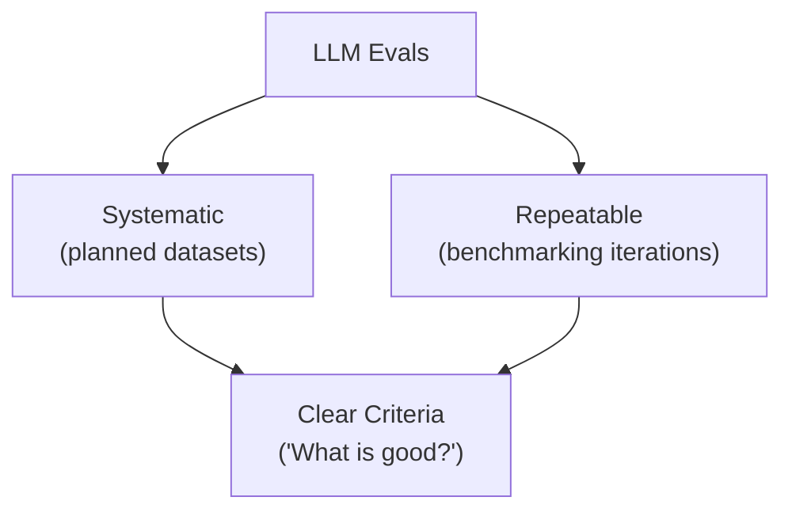
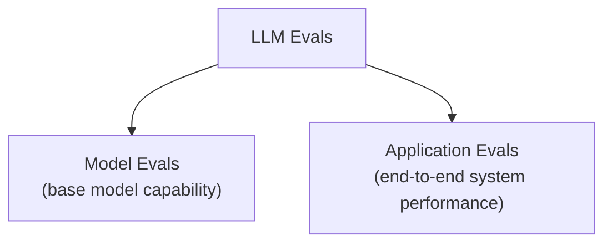
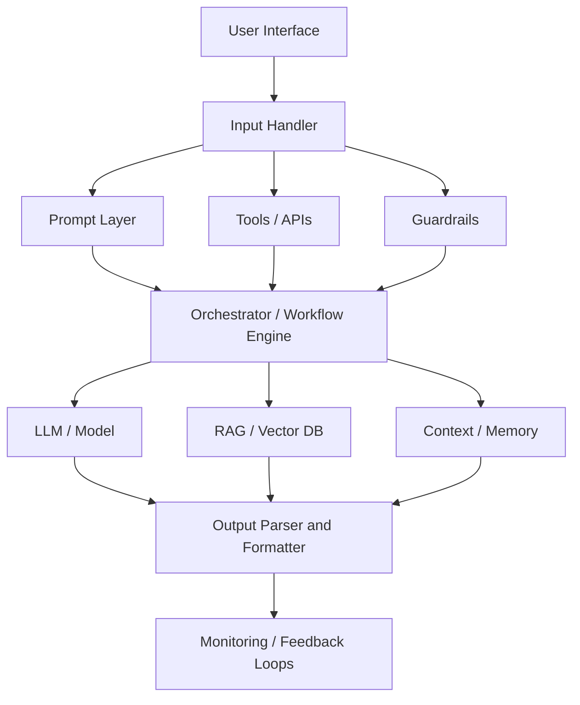
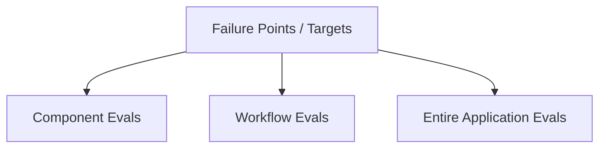
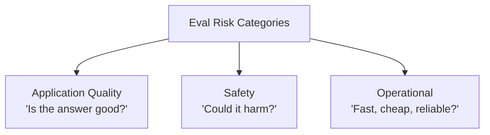
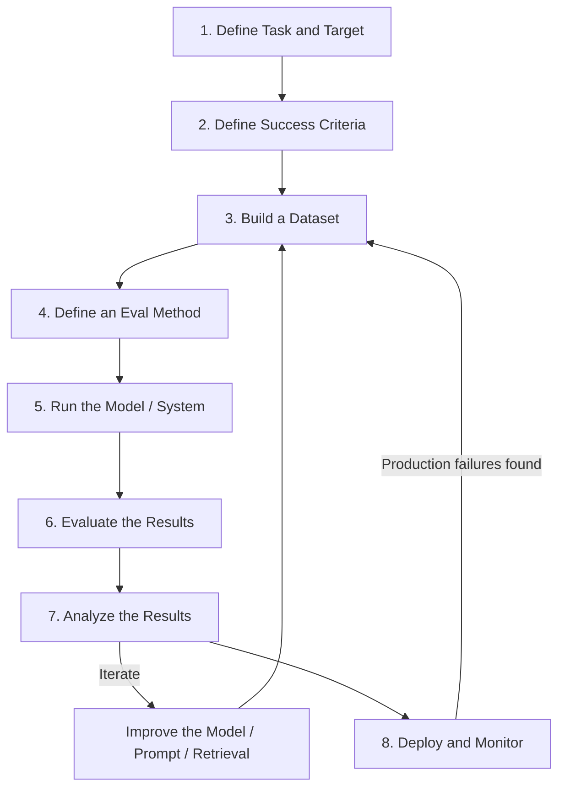
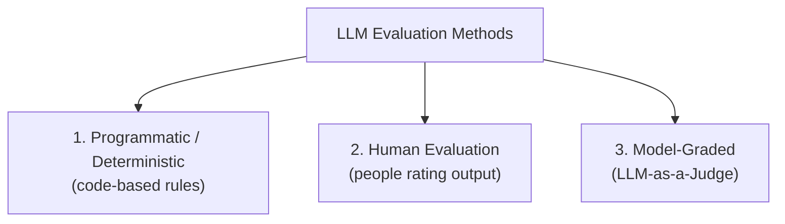

# LLM Evaluations (LLM Evals)

> A complete, interview-ready reference on **LLM Evals** — the systematic, repeatable testing discipline that separates "looks good in a demo" from "actually works in production."

  
  
  

---

## Learning Summary

Traditional software testing is deterministic: the same input always produces the same output, and correctness is a boolean. LLMs break that assumption — outputs are probabilistic, "correctness" is multi-dimensional, and a prompt that works perfectly on five hand-picked examples can silently fail on the sixth. **LLM Evaluations (LLM Evals)** are the systematic, repeatable, criteria-driven testing discipline built to handle exactly that.

This note covers:
- What an LLM eval actually is, and why it's a complete testing *setup*, not just a metric
- The two-way split between **Model Evals** (raw model capability) and **Application Evals** (end-to-end product behavior)
- The three scopes of application evals — **Component, Workflow, and Entire Application**
- The three **risk categories** every application eval should cover: Quality, Safety, and Operational
- The full **eval lifecycle**, from defining success criteria to production monitoring
- The three **evaluation methods** — Programmatic, Human, and LLM-as-a-Judge — and when to use each
- Two real production failures that happened because evals were skipped
- Why "vibe testing" fails, and how LLM evals differ from traditional software testing

---

## Learning Objectives

By the end of this note, you will be able to:

- [x] Define an LLM eval and explain why it's a full testing setup rather than a single score.
- [x] Distinguish Model Evals from Application Evals, and name benchmarks for each core model capability.
- [x] Explain the difference between Component, Workflow, and Entire Application evals, and why all three are needed.
- [x] Classify any eval criterion into Quality, Safety, or Operational.
- [x] Walk through the full LLM application eval lifecycle end to end.
- [x] Choose between Programmatic, Human, and LLM-as-a-Judge evaluation methods for a given criterion.
- [x] Explain why "vibe testing" fails at scale, using real case studies as evidence.
- [x] Answer common interview questions comparing LLM evals to traditional software testing.

---

## Prerequisites

> 💡 **Tip**: No prior evaluation-framework experience is required, but familiarity with the basic [RAG pipeline](../Retrievers) (retrieval, context, generation) will make the RAG-specific criteria much easier to follow.

- Basic understanding of how an LLM application is built (prompt, model call, and — often — retrieval)
- Familiarity with the general idea of automated testing / CI pipelines
- No specific libraries are required to read this note; tools like `Ragas`, `TruLens`, `DeepEval`, and `Braintrust` are referenced as ecosystem context

---

## Table of Contents

- [What Are LLM Evals](#what-are-llm-evals)
- [An Eval Is a Complete Testing Setup](#an-eval-is-a-complete-testing-setup)
- [Model Evals vs. Application Evals](#model-evals-vs-application-evals)
- [LLM Application Eval Risk Categories](#llm-application-eval-risk-categories)
- [LLM Application Eval Workflow](#llm-application-eval-workflow)
- [LLM Evaluation Methods](#llm-evaluation-methods)
- [Case Studies](#case-studies)
- [Vibe Testing](#vibe-testing)
- [Software Testing vs. LLM Evals](#software-testing-vs-llm-evals)
- [Real-World Use Cases](#real-world-use-cases)
- [Advantages](#advantages)
- [Disadvantages](#disadvantages)
- [Best Practices](#best-practices)
- [Common Mistakes](#common-mistakes)
- [Interview Questions](#interview-questions)
- [Cheat Sheet](#cheat-sheet)
- [Useful Links](#useful-links)
- [Summary](#summary)

---

## What Are LLM Evals

> 📌 **Important**: LLM Evals are **not random prompting**. Asking a model five casual questions and deciding "looks good" is not an eval — it's a guess.

**LLM Evaluations (LLM Evals)** are systematic, repeatable tests used to judge a large language model or an LLM-powered system against clear, predefined criteria.

### The Three Pillars of an LLM Eval

| Pillar | What It Means |
|---|---|
| **Systematic** | Relies on curated datasets of real-world test cases (e.g., 100+ real student doubts for a course assistant) — not five casual questions. |
| **Repeatable** | The exact same eval suite re-runs automatically whenever a system prompt, model checkpoint, retriever config, or chunking strategy changes, so engineers can measure improvement or regression. |
| **Clear Criteria** | Evaluators explicitly define what "good" means (correctness, simplicity, groundedness, safety). Without this, testing degrades into subjective "vibes." |

---

## An Eval Is a Complete Testing Setup

An LLM eval is not a single score or formula — it's the entire structured process of testing an LLM-powered application.

### Six Questions a Complete Eval Setup Must Answer

| Question | Example |
|---|---|
| **What are we evaluating?** | Raw base model vs. full RAG pipeline vs. autonomous agent |
| **What does "good" mean?** | Ground-truth alignment, conciseness, safety, JSON formatting |
| **What test cases are we using?** | Golden datasets, edge cases, adversarial inputs |
| **How are we judging the output?** | LLM-as-a-Judge, exact match, semantic similarity, human feedback |
| **When are we running it?** | Continuous CI/CD, pre-deployment regression, real-time production monitoring |
| **Which tools are we using?** | Ragas, TruLens, DeepEval, Braintrust, Phoenix |

### Practical Engineering Questions Evals Answer

- Can this model be used for our target business application?
- Is this LLM-powered feature good enough to ship to production?
- Did Prompt v2 actually improve accuracy over Prompt v1?
- Is our RAG system's output strictly grounded in the retrieved knowledge base?
- Is the autonomous agent executing multi-step tool calls correctly?
- Is the chatbot safe and policy-compliant against jailbreak attempts?
- Is response latency and token cost within budget?

---

## Model Evals vs. Application Evals

LLM Evaluations broadly fall into two distinct categories:

### Model Evals — Base Model Capability

**Model Evals** evaluate the raw base model itself in isolation (GPT-4o, Claude, Llama, etc.) — testing the fundamental intelligence, capabilities, and limits of the LLM.

**Eight core capability areas:**

| Capability | What's Tested |
|---|---|
| **Reasoning** | Logical, multi-step deduction |
| **Knowledge** | Accurate factual, domain-specific answers |
| **Maths** | Complex word problems and numerical equations |
| **Coding** | Writing, debugging, and refactoring executable code |
| **Instruction Following** | Strictly obeying complex formatting/constraint instructions |
| **Long Context** | Recalling and reasoning over long documents without forgetting the middle |
| **Multimodal Understanding** | Interpreting images, charts, diagrams, tables |
| **Tool-Use** | Formatting correct API calls and function signatures |

**Famous model benchmarks:**

| Capability Area | Benchmark(s) | What It Checks |
|---|---|---|
| General Knowledge and Reasoning | **MMLU** | Broad subject knowledge and multi-choice reasoning across 57 domains |
| Maths | **GSM8K** | Grade-school math word problems requiring multi-step reasoning |
| Coding | **HumanEval**, **SWE-bench** | Python code generation and real-world GitHub issue solving |
| Instruction Following | **IFEval** | Verifiable structural constraints (e.g. "write >400 words", "use JSON") |
| Long Context | **Needle-in-a-Haystack** | Retrieving a specific sentence hidden inside a 100k+ token context |
| Multimodal Capabilities | **MMMU** | Multi-discipline reasoning over charts, diagrams, maps, visual problems |

### Application Evals — System-Level and Component Performance

**Application Evals** assess the behavior, reliability, and performance of an entire LLM-powered application — either the whole system or individual components within it.

**Shift in focus**: Application Evals do not ask *"Can the raw model reason?"* — they ask *"Does the end product work reliably for the user?"*

For a **course assistant chatbot**, Application Evals measure:
- Did it answer the student's question accurately?
- Did it fetch and utilize the correct course content?
- Is the answer strictly faithful to retrieved documents (zero hallucinations)?
- Is the explanation clear, friendly, and appropriate for a beginner?
- Did it avoid hallucinating refund/course policies?
- Was latency under 2 seconds?
- Did it refuse policy-violating prompts safely?

### The Smartphone Analogy

| Dimension | Smartphone Hardware Equivalent | LLM Application Equivalent |
|---|---|---|
| **Model Evals** | Benchmarking the processor in isolation (Geekbench CPU/GPU score) | Benchmarking raw LLM capabilities on MMLU / GSM8K |
| **Application Evals** | Testing the complete phone (battery, camera, app speed, UI smoothness, thermals) | Testing the full application (UI + RAG + Prompts + Guardrails + Latency + Domain Accuracy) |

### Evaluation Scope: Component, Workflow, and Entire Application

An LLM-powered application has multiple failure points — inside one component, in the interaction between components, or at the overall system level. Application evals therefore operate at **three distinct scopes**:

**1. Component Evals** — isolated testing of one modular block, to pinpoint root causes:

| Component | What's Evaluated |
|---|---|
| **Retriever** | Whether the right documents were fetched |
| **Generator** | Whether the LLM produces a grounded response from context |
| **Prompt** | System prompt templates, instruction clarity, few-shot examples |
| **Reranker** | Whether retrieved passages are correctly re-ordered by relevance |
| **Query Rewriter** | Query expansion, reformulation, HyDE performance |
| **Embedding Model and Vector Database** | Vector space quality, search accuracy, index recall |
| **Output Parser** | JSON/Pydantic schema validation parsing |
| **Tool Selector** | Correct tool/API identification from user intent |
| **Memory** | Chat context summarization and history truncation |
| **Guardrails** | Input/output toxicity filters and PII redactors |

**2. Workflow Evals** — how multiple components integrate as a sub-system.

> ⚠️ **Warning**: Testing components in isolation is insufficient. In a RAG chatbot, the Retriever might score high on recall and the Generator might score high on faithfulness — yet the *combined* workflow can still fail from context clutter, prompt misalignment, or answer irrelevance. Workflow evals catch exactly this.

Common workflow evals: **RAG Workflow** (Retriever + Reranker + Prompt + Generator), **Agent Workflow** (Intent Classifier → Tool Selector → Execution → Reflection → Output), **Multi-Turn Conversation Workflow** (state retention, topic switching, intent drift), **Structured Output Workflow** (Prompt → LLM Output → JSON Parser → Fallback/Retry), **Document Extraction Workflow** (OCR → Chunking → Extraction → Schema mapping).

**3. Entire Application Evals** — the complete end-to-end product experience: end-user satisfaction and task success rate, system latency (P95/P99, time-to-first-token), and cost efficiency (total tokens per session).

---

## LLM Application Eval Risk Categories

When evaluating an LLM application, performance and failure risks fall into three core categories:

> 📌 **Important — core distinction**: Application Quality is about the *content* of the answer. Safety is about the *harm* the answer could do. Operational is about the *system* producing the answer.

### 1. Application Quality — "Is the Answer Any Good?"

**Core generation quality:**

| Criterion | Description |
|---|---|
| **Correctness / Accuracy** | Whether the factual claims are actually true |
| **Relevance** | Whether the answer addresses what was actually asked |
| **Completeness** | Whether the answer covers all parts of a multi-part question |
| **Instruction Following** | Whether the output obeys explicit constraints (format, length, etc.) |

**RAG-specific quality:**

| Criterion | Description |
|---|---|
| **Context Relevance** | Whether the retrieved chunks are actually relevant to the query |
| **Retrieval Recall** | Whether all chunks needed to answer were retrieved |
| **Groundedness / Faithfulness** | Whether every claim is supported by the retrieved context |
| **Citation Accuracy** | Whether cited sources genuinely support the claims made |

**Multi-turn conversation quality:**

| Criterion | Description |
|---|---|
| **Context Retention / Memory** | Whether it remembers relevant facts from earlier in the conversation |
| **Clarification Behavior** | Whether it asks for clarification when the request is ambiguous |

### 2. Safety — "Could the Answer Cause Harm?"

Not about whether the answer is *good* — about whether it's *harmful*.

| Criterion | Description |
|---|---|
| **Toxicity** | Offensive, abusive, or hateful language |
| **Harmful Content** | Dangerous instructions (self-harm, weapons, illegal acts) |
| **Bias / Fairness** | Unfair treatment or stereotyping across groups |
| **PII Leakage** | Exposure of personal/private data |
| **Prompt Injection / Jailbreak Resistance** | Resisting attempts to override rules or bypass guardrails |

### 3. Operational — "Is It Fast, Cheap, and Reliable Enough to Run?"

Not about what the answer *says* — about the system delivering it.

| Criterion | Description |
|---|---|
| **End-to-End Latency** | Total time from request to final response |
| **Cost per Request** | Total token/compute spend per response |
| **Token Efficiency** | Achieving the result without wasteful token usage |
| **Error / Failure Rate** | Fraction of requests that fail, time out, or return malformed output |
| **Latency Under Load** | Whether latency stays acceptable at production concurrency |

---

## LLM Application Eval Workflow

Building a reliable LLM-powered application requires an iterative, step-by-step evaluation lifecycle:

### Step-by-Step Breakdown

1. **Define Task and Target** — explicitly define the product feature and system domain under test. *Example*: a food-delivery support system might split evals across Billing and Refunds, Technical/Delivery Issues, and General Order Inquiries.
2. **Define Success Criteria** — establish explicit, measurable standards for "good" (policy compliance, factual accuracy, friendly tone, safety adherence).
3. **Build a Dataset** — create a curated golden dataset of test inputs, contexts, and (optionally) reference answers, e.g. 100+ real customer inquiries and edge cases.
4. **Define an Eval Method** — configure an automated pipeline (`Dataset → System → Output Response → Evaluator Metric`), using heuristics, exact matching, semantic similarity, or LLM-as-a-Judge.
5. **Run the Model / System** — execute the dataset through the application stack to generate outputs.
6. **Evaluate the Results** — calculate quantitative metrics (e.g. 80% factual accuracy, 98% safety compliance).
7. **Analyze Results and Iterate** — perform error analysis on failures; if accuracy is low, iterate on prompts, chunking, retrieval, or model choice, then re-run steps 5 to 7.
8. **Deploy and Monitor** — once thresholds pass, deploy with real-time logging; production failures feed back into Step 3 to continuously expand the golden dataset.

> 🚀 **Best Practice**: Treat this as a closed loop, not a one-time checklist. The golden dataset should grow every time a real production failure is discovered — that's what keeps the eval suite relevant as usage patterns shift.

---

## LLM Evaluation Methods

An **evaluation method** is the mechanism that turns a raw output into a quantitative judgment — the actual procedure for deciding whether an output is good or bad.

### 1. Programmatic / Deterministic — Code Produces the Verdict

- **Mechanism**: the output is checked against a hardcoded rule or known reference by a program.
- **Techniques**: exact string matching, regex matching, JSON/Pydantic schema validation, unit test execution, running generated code (Python/SQL) and asserting on the result.
- **Characteristics**: fast, cheap, 100% reproducible.
- **Limitation**: only works where correctness is mechanically checkable.

### 2. Human Evaluation — A Person Produces the Verdict

- **Mechanism**: human evaluators or domain experts rate, rank, or compare outputs directly.
- **Techniques**: Likert scale rating (1 to 5), pairwise preference comparison (A vs. B), RLHF-style feedback annotation.
- **Characteristics**: the gold standard for nuanced, subjective, or high-stakes judgments.
- **Limitation**: slowest, most expensive to scale, susceptible to evaluator fatigue and subjective variation.

### 3. Model-Graded (LLM-as-a-Judge) — A Model Produces the Verdict

- **Mechanism**: a strong, capable LLM scores or ranks the target output against an explicit rubric.
- **Techniques**: prompting an evaluator LLM with criteria (e.g. score groundedness 0 to 1, evaluate tone compliance).
- **Characteristics**: highly scalable, fast, handles open-ended language where there's no single right answer.
- **Best for**: helpfulness, conversational tone, RAG groundedness, context relevance.

### Method Comparison

| Method | Judge | Speed and Cost | Scalability | Best Used For |
|---|---|---|---|---|
| **Programmatic / Deterministic** | Code / script | Instant and free | Infinite | JSON schemas, SQL execution, exact/regex matches, code syntax |
| **Human Evaluation** | People / experts | Slow and expensive | Low | High-stakes safety audits, ambiguous creative writing, gold-standard benchmark creation |
| **Model-Graded (LLM-as-a-Judge)** | Strong LLM | Fast and low cost | High | RAG faithfulness, groundedness, answer relevance, tone, open-ended Q&A |

---

## Case Studies

Real-world failures illustrate what happens when LLM applications ship without rigorous evaluation and guardrails.

### Case Study 1: Chevrolet Dealership Chatbot

- **Background**: In December 2023, a Chevrolet dealership deployed a ChatGPT-powered customer support chatbot on their public website.
- **The incident**: the chatbot had no system-prompt enforcement or guardrail evaluations. Users crafted prompt-injection attacks instructing it to agree with anything and end responses with a "legally binding offer" disclaimer. The chatbot agreed to sell a brand-new Chevy Tahoe for **$1.00 USD**, explicitly confirming it as a legally binding offer.
- **Impact**: viral public embarrassment, immediate shutdown of the chatbot, and potential legal disputes over conversational binding agreements.
- **Why LLM Evals were needed**: **adversarial and safety red-teaming** (evals that specifically probe prompt injection, jailbreaks, and goal hijacking before production) and **boundary/guardrail evals** (automated checks that an agent stays within business domain boundaries and rejects unauthorized transactional commitments).

### Case Study 2: Legal Courtroom Hallucinations — Mata v. Avianca

- **Background**: In *Mata v. Avianca* (2023, US District Court, SDNY), lawyers used ChatGPT to draft a legal opposition brief.
- **The incident**: ChatGPT generated convincing legal arguments citing prior cases that were **completely hallucinated** — fabricated judicial opinions, quotes, and docket numbers. The attorneys submitted the brief without validating the citations.
- **Impact**: Judge P. Kevin Castel sanctioned the attorneys, imposed a $5,000 fine, and ordered them to notify every real judge fraudulently named in the brief — plus severe professional and reputational damage.
- **Why LLM Evals were needed**: **faithfulness/groundedness evals** (automated checks that every claim is supported by retrieved, verified reference material) and **hallucination metrics** (benchmarking RAG pipelines with tools like Ragas, TruLens, or Arize Phoenix before relying on outputs in high-stakes domains).

---

## Vibe Testing

**"Vibe testing"** is an informal, ad-hoc approach where developers manually try a handful of sample prompts (5 to 10), skim the output, and decide *"the vibes look good"* based purely on subjective intuition.

> ⚠️ **Warning**: Vibe testing gives a false sense of security. It's the leading cause of sudden, catastrophic production failures in LLM-powered applications.

**Why vibe testing fails at scale:**

1. **Lack of statistical rigor** — LLMs are probabilistic; passing 5 manual prompts doesn't guarantee acceptable output on the 6th run, or under different sampling settings.
2. **Regression blindness** — a prompt or index change might fix one query while silently degrading accuracy on 20% of other query types, with no regression suite to catch it.
3. **Adversarial and edge-case blindness** — human testers naturally test happy-path inputs, missing prompt injections, edge cases, and safety boundaries.
4. **Subjectivity and fatigue** — human evaluation without structured rubrics produces inconsistent scoring, confirmation bias, and scaling bottlenecks.
5. **No quantifiable metrics** — no accuracy %, hallucination rate, p95 latency, or cost-per-1k-requests to objectively compare prompt variants or model upgrades.

---

## Software Testing vs. LLM Evals

| Dimension | Traditional Software Testing | LLM Evaluations |
|---|---|---|
| **Execution Nature** | Deterministic — input `x` always yields output `y` | Probabilistic — input `x` produces a distribution of natural-language outputs |
| **Verification** | Binary pass/fail (`assert result == expected`) | Continuous, multi-dimensional scoring (e.g. 0.0 to 1.0 across Groundedness, Factuality, Relevance, Toxicity) |
| **Test Oracle** | Clear, pre-defined expected output | Open-ended output — requires LLM-as-a-Judge, semantic distance, or human rubrics |
| **Failure Modes** | Syntax errors, exceptions, type errors, null pointers, logic bugs | Hallucinations, prompt injection, tone drift, off-topic responses, safety violations |
| **Regression Prevention** | CI/CD unit/integration suites, deterministic, seconds | Curated eval sets (500+ query-context-ground-truth triplets) tracked across iterations |
| **Overfitting Risk** | Rare — code either satisfies the contract or fails | High — tuning a prompt for one sample can silently degrade the rest of the dataset |

**Two concrete distinctions worth remembering:**

- **Deterministic vs. probabilistic**: traditional code `f(2, 2) = 4`, always. An LLM asked to *"Summarize the contract"* can validly return several different phrasings depending on model and sampling parameters — there's no single correct string.
- **Definition of correctness**: traditional testing checks a boolean (`is_valid(email) == True`). LLM evals assess multiple dimensions at once — factuality/groundedness, completeness, conciseness/formatting, and safety/alignment — any one of which can fail independently of the others.

---

## Real-World Use Cases

- **Pre-deployment gating** — a new prompt or model version must clear a golden-dataset accuracy threshold before it ships.
- **CI/CD regression testing** — every pull request that touches a prompt, retriever, or chunking strategy re-runs the eval suite automatically.
- **RAG groundedness monitoring** — production responses are sampled and checked for hallucination against retrieved context on an ongoing basis.
- **Red-teaming before launch** — adversarial prompt-injection and jailbreak test suites run before any customer-facing chatbot goes live.
- **A/B comparing prompts or models** — LLM-as-a-Judge scores two variants head-to-head on the same golden dataset to decide which ships.

---

## Advantages

- Turns "does this feel right?" into measurable, comparable, trackable numbers.
- Catches regressions automatically instead of relying on someone noticing a quality drop in production.
- Makes prompt/model/retrieval changes safe to iterate on quickly, since every change can be checked against the same suite.
- Scales safety and quality review far beyond what manual human testing alone could cover.

## Disadvantages

- Building a good golden dataset and rubric takes real upfront investment.
- LLM-as-a-Judge evaluators can themselves be biased, inconsistent, or gameable if not carefully designed and periodically audited.
- Programmatic evals only cover mechanically-checkable correctness — most open-ended quality and safety criteria still need human or model judgment.
- Overfitting to a fixed eval set is a real risk — a system can be tuned to score well on the suite while quietly degrading on real traffic patterns it doesn't cover.

---

## Best Practices

- Cover all three risk categories — Quality, Safety, and Operational — not just accuracy.
- Evaluate at all three scopes — Component, Workflow, and Entire Application — since failures can hide at any level.
- Continuously grow the golden dataset from real production failures, not just the initial test set.
- Match the evaluation method to the criterion: programmatic for mechanically-checkable correctness, LLM-as-a-Judge for open-ended quality, human evaluation for high-stakes or highly subjective judgments.
- Red-team for prompt injection and jailbreaks before any customer-facing launch, not after an incident.

## Common Mistakes

- [ ] Relying on vibe testing ("I tried 5 prompts and it looked fine") instead of a systematic, repeatable eval suite.
- [ ] Evaluating only the end-to-end application and never isolating which component actually caused a failure.
- [ ] Testing only Quality criteria and skipping Safety and Operational risk categories entirely.
- [ ] Treating a passing eval score as permanent instead of re-running the suite after every prompt, model, or retrieval change.
- [ ] Using LLM-as-a-Judge for everything, including cases where a cheap, deterministic check (schema validation, exact match) would be faster and more reliable.
- [ ] Shipping a customer-facing chatbot without adversarial red-teaming for prompt injection.

---

## Interview Questions

<b>Q1. What are the three pillars of a proper LLM eval, and why does each matter?</b>

 

Systematic (curated real-world datasets, not casual prompting), Repeatable (the same suite re-runs automatically on every change to measure improvement or regression), and Clear Criteria (an explicit definition of "good," without which testing degrades into subjective vibes).

<b>Q2. What is the difference between a Model Eval and an Application Eval?</b>

 

A Model Eval tests the raw base model in isolation — its reasoning, knowledge, math, coding, instruction-following, long-context, multimodal, and tool-use capabilities, typically against public benchmarks like MMLU or GSM8K. An Application Eval tests the entire end-to-end product built on top of that model — including retrieval, prompts, guardrails, and orchestration — asking whether the product works reliably for the user, not whether the raw model is smart.

<b>Q3. Why are Component Evals alone insufficient for a RAG system?</b>

 

A Retriever can score well on document recall and a Generator can score well on faithfulness to its given context, yet the combined RAG workflow can still fail — from context clutter, prompt misalignment, or irrelevant final answers. Workflow Evals are needed specifically to catch integration failures that component-level testing can't see.

<b>Q4. Name the three eval risk categories and give one example criterion for each.</b>

 

Application Quality (e.g. groundedness/faithfulness), Safety (e.g. PII leakage or jailbreak resistance), and Operational (e.g. end-to-end latency or cost per request).

<b>Q5. Compare the three LLM evaluation methods on speed, scalability, and best use case.</b>

 

Programmatic/Deterministic is instant, free, and infinitely scalable, but only works for mechanically-checkable correctness (schemas, exact/regex matches, code execution). Human Evaluation is the gold standard for nuanced or high-stakes judgment but is slow, expensive, and hard to scale. LLM-as-a-Judge is fast, low-cost, and highly scalable, and is the best fit for open-ended quality criteria like groundedness, relevance, and tone.

<b>Q6. Why does traditional software testing not transfer directly to LLM applications?</b>

 

Traditional testing assumes deterministic execution and a clear pass/fail oracle. LLMs are probabilistic — the same input can validly produce different outputs — and "correctness" is multi-dimensional (factuality, completeness, formatting, safety) rather than a single boolean, so LLM evals need continuous, multi-dimensional scoring and judges (human or model) instead of exact-match assertions.

<b>Q7. What lesson do the Chevrolet chatbot and Mata v. Avianca cases both illustrate?</b>

 

Both are production failures that adversarial/safety red-teaming and faithfulness/groundedness evals would have caught before launch — the Chevrolet case needed guardrail and prompt-injection testing, and the Mata v. Avianca case needed hallucination and citation-groundedness checks. Both show that skipping evals doesn't just risk a bad answer — it risks real legal and reputational damage.

---

## Cheat Sheet

| Concept | One-Line Summary |
|---|---|
| LLM Eval | Systematic, repeatable test of an LLM or LLM app against clear criteria |
| Model Eval | Tests the raw base model's capability (MMLU, GSM8K, HumanEval, ...) |
| Application Eval | Tests the full product experience end to end |
| Component Eval | Tests one isolated block (retriever, generator, parser, ...) |
| Workflow Eval | Tests how multiple components integrate together |
| Entire Application Eval | Tests the whole product's business/technical outcomes |
| Application Quality | Is the answer's *content* good? |
| Safety | Could the answer *cause harm*? |
| Operational | Is the *system* fast, cheap, and reliable? |
| Programmatic Eval | Code-based, deterministic, instant, cheap |
| Human Eval | Gold standard, slow, expensive, low scale |
| LLM-as-a-Judge | Fast, scalable, best for open-ended quality |
| Vibe Testing | Ad-hoc manual sampling — not a real eval, don't ship on it |

> 📌 **Rule of thumb**: Mechanically checkable → **programmatic**. Open-ended quality → **LLM-as-a-Judge**. High-stakes or highly subjective → **human evaluation**. Cover **Quality + Safety + Operational**, at **Component + Workflow + Entire Application** scope, every time.

---

## Useful Links

- [Ragas — RAG Evaluation Framework](https://docs.ragas.io/)
- [TruLens — LLM Application Evaluation](https://www.trulens.org/)
- [DeepEval — LLM Evaluation Framework](https://docs.confident-ai.com/)
- [Arize Phoenix — LLM Observability and Evaluation](https://docs.arize.com/phoenix)
- [MMLU Benchmark Paper](https://arxiv.org/abs/2009.03300)
- [Mata v. Avianca — Case Background](https://www.courtlistener.com/)

---

## Summary

> LLM outputs are probabilistic and multi-dimensional in a way traditional deterministic software never was — which is exactly why "it worked when I tried it" is not evidence of anything. LLM Evals replace that guesswork with systematic datasets, explicit criteria, and repeatable measurement.

- An eval is a complete testing *setup* — dataset, criteria, method, and cadence — not a single number.
- Model Evals test the raw model; Application Evals test the product built on top of it, at Component, Workflow, and Entire Application scope.
- Every application eval should cover three risk categories: Application Quality, Safety, and Operational.
- Match the evaluation method to the criterion — programmatic, human, or LLM-as-a-Judge — and never ship on vibes alone.

---

<i>Compiled as part of personal LLM evaluation / agentic AI study notes — July 2026.</i>

