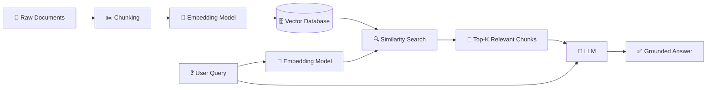
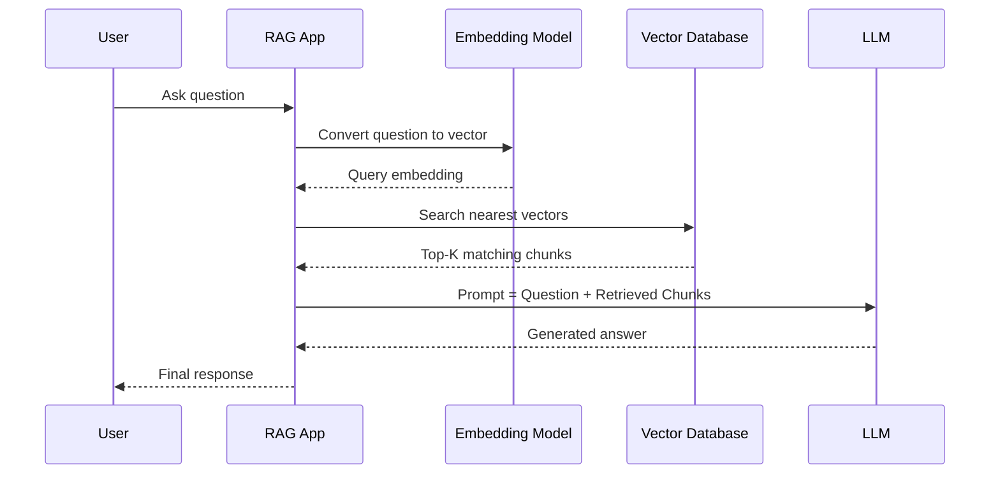
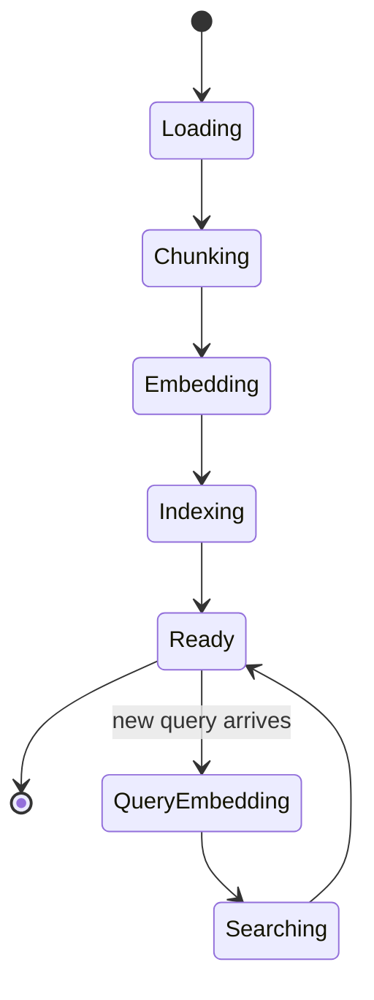

# 🧠 Understanding Embeddings for RAG Applications

> A complete, beginner-to-advanced guide covering what embeddings are, why they power Retrieval-Augmented Generation (RAG), which models to use, and how to generate embeddings **locally and for free** — without relying on OpenAI, Gemini, or other paid APIs.

---

## 📄 Learning Summary

Embeddings are the numerical backbone of modern AI search and retrieval systems. This document captures a structured deep-dive into:

- What embeddings are and how they work mathematically and conceptually
- Why RAG (Retrieval-Augmented Generation) systems cannot function without them
- The current landscape of embedding models (proprietary vs. open-source)
- Free and local alternatives to paid embedding APIs (OpenAI, Gemini, Cohere)
- Step-by-step instructions to generate embeddings on your own machine
- Best practices, common mistakes, and interview-ready knowledge

---

## 🎯 Learning Objectives

By the end of this document, you will be able to:

- [x] Explain what an embedding is in plain language and in mathematical terms
- [x] Describe why RAG pipelines depend entirely on embedding quality
- [x] Compare leading embedding models (open-source and proprietary)
- [x] Run embedding generation **100% locally**, with no API key and no cost
- [x] Identify best practices and avoid common RAG/embedding mistakes
- [x] Answer common interview questions on embeddings and vector search

---

## ✅ Prerequisites

> 💡 **Tip:** You don't need deep ML expertise — basic Python and command-line comfort is enough to follow along.

- Basic Python (functions, pip installs, virtual environments)
- Basic understanding of what an LLM is
- (Optional) Familiarity with vector databases (FAISS, Chroma, Qdrant, Milvus)
- A machine with at least 8GB RAM (GPU optional but helpful)

---

## 📚 Table of Contents

- [Learning Summary](#-learning-summary)
- [Learning Objectives](#-learning-objectives)
- [Prerequisites](#-prerequisites)
- [1. What Is an Embedding?](#1-what-is-an-embedding)
- [2. Why Embeddings Are Needed in RAG](#2-why-embeddings-are-needed-in-rag)
- [3. Architecture: How Embeddings Fit Into a RAG Pipeline](#3-architecture-how-embeddings-fit-into-a-rag-pipeline)
- [4. Embedding Models Landscape](#4-embedding-models-landscape)
- [5. Free Alternatives to OpenAI / Gemini Embeddings](#5-free-alternatives-to-openai--gemini-embeddings)
- [6. How to Generate Embeddings Locally](#6-how-to-generate-embeddings-locally)
- [7. Real-World Use Cases](#7-real-world-use-cases)
- [8. Advantages & Disadvantages](#8-advantages--disadvantages)
- [9. Best Practices](#9-best-practices)
- [10. Common Mistakes](#10-common-mistakes)
- [11. Interview Questions](#11-interview-questions)
- [12. Cheat Sheet](#12-cheat-sheet)
- [13. Useful Links](#13-useful-links)
- [14. Summary](#14-summary)

---

## 1. What Is an Embedding?

An **embedding** is a way of converting a piece of data — text, an image, audio, or code — into a **fixed-length vector of numbers** (e.g., 384, 768, or 1024 floating-point values) such that:

> 📌 **Important:** Items with *similar meaning* end up with vectors that are *close together* in this high-dimensional space, while dissimilar items end up far apart.

For example:

```text
"I love pizza"      → [0.021, -0.114, 0.532, ..., 0.087]
"Pizza is my favorite food" → [0.019, -0.109, 0.540, ..., 0.091]
"The stock market crashed"  → [0.732, 0.211, -0.456, ..., -0.334]
```

The first two sentences are semantically similar, so their vectors sit **close together** in vector space (measured using **cosine similarity** or **dot product**). The third sentence is unrelated and its vector sits far away.

### Key Idea: Meaning as Geometry

Embeddings turn the abstract problem of "does this text mean the same thing as that text?" into a concrete geometry problem: "how close are these two points in space?"

<details>
<summary>🔍 Click to expand: A short mathematical view</summary>

An embedding model is a function:

```
f(text) → ℝⁿ
```

Where `n` is the embedding dimension (commonly 384, 768, 1024, 1536, 3072). Similarity between two embeddings `A` and `B` is typically computed using **cosine similarity**:

```
cosine_similarity(A, B) = (A · B) / (‖A‖ * ‖B‖)
```

A score close to `1` means highly similar; close to `0` means unrelated; negative values mean semantically opposite (rare in text embeddings, common in some contrastive setups).

</details>

---

## 2. Why Embeddings Are Needed in RAG Applications

**RAG (Retrieval-Augmented Generation)** is an architecture where an LLM's answer is grounded in external documents retrieved at query time, instead of relying solely on what the model memorized during training.

> ⚠ **Warning:** Without embeddings, "retrieval" in RAG would have to rely on simple keyword matching (like `Ctrl+F`), which fails badly on paraphrased or conceptually related queries.

Embeddings solve the **retrieval problem** in RAG:

| Without Embeddings (Keyword Search) | With Embeddings (Semantic Search) |
|---|---|
| "car repair cost" ≠ "vehicle maintenance price" | Correctly matches semantically similar phrases |
| Brittle, exact-match dependent | Understands paraphrasing, synonyms, intent |
| Fast but low quality on natural language | Slightly slower, dramatically higher quality |
| No understanding of context | Captures contextual/semantic meaning |

### The RAG Flow in Plain English

1. You have a large knowledge base (PDFs, docs, wikis, tickets).
2. Each chunk of text is converted into an embedding and stored in a **vector database**.
3. When a user asks a question, the question is *also* converted into an embedding.
4. The vector database finds the **nearest** stored embeddings (i.e., most relevant chunks).
5. Those chunks are inserted into the LLM's prompt as context.
6. The LLM generates an answer **grounded** in the retrieved text.

> 🚀 **Best Practice:** Retrieval quality is often the single biggest lever on RAG accuracy — a mediocre LLM with great retrieval usually beats a great LLM with poor retrieval.

---

## 3. Architecture: How Embeddings Fit Into a RAG Pipeline

### 3.1 High-Level Flow



### 3.2 Sequence of a Single Query



### 3.3 Ingestion State Machine



---

## 4. Embedding Models Landscape

Embedding models fall into two broad categories: **proprietary (paid, API-based)** and **open-source (free, self-hostable)**.

### 4.1 Proprietary / API-based Models

| Model | Provider | Dimensions | Notes |
|---|---|---|---|
| `text-embedding-3-large` | OpenAI | 3072 (configurable) | Strong general-purpose, widely used baseline |
| `gemini-embedding-001` | Google | 768–3072 | Tops several English MTEB leaderboards |
| `embed-v4` | Cohere | 1024–1536 | Multilingual, strong for enterprise RAG |
| `voyage-3` | Voyage AI | 1024 | Popular in production RAG stacks |

> ⚠ **Warning:** These require an API key, cost money per token, and send your data to a third-party server — a dealbreaker for privacy-sensitive or offline applications.

### 4.2 Open-Source / Free Models

| Model | Params | Context Length | License | Best For |
|---|---|---|---|---|
| `all-MiniLM-L6-v2` | 22M | 256 tokens | Apache 2.0 | Ultra-lightweight, edge devices, quick prototyping |
| `all-mpnet-base-v2` | 110M | 384 tokens | Apache 2.0 | General-purpose sentence similarity |
| `nomic-embed-text` | 137M | 8,192 tokens | Apache 2.0 | Long documents, great size/quality balance |
| `BGE-M3` | 568M | 8,192 tokens | MIT | Multilingual (100+ languages), dense + sparse + multi-vector in one model |
| `gte-multilingual-base` | 305M | 8,192 tokens | Apache 2.0 | Strong multilingual retrieval |
| `Qwen3-Embedding-8B` | 8B | 32,768 tokens | Apache 2.0 | State-of-the-art open-source accuracy, instruction-aware |
| `NV-Embed-v2` | 7B | 32,768 tokens | Non-commercial | Top MTEB scores (research/eval use) |

> 💡 **Tip:** For most self-hosted production RAG systems in 2026, **BGE-M3** (multilingual workhorse) and **nomic-embed-text** (lightweight, long-context) are the most commonly recommended defaults, with **Qwen3-Embedding** as the high-accuracy option when you have more compute.

---

## 5. Free Alternatives to OpenAI / Gemini Embeddings

You do **not** need to pay per API call to build a RAG system. Here are the main free routes:

### 5.1 Comparison of Free Routes

| Approach | Cost | Internet Required | Setup Difficulty | Best For |
|---|---|---|---|---|
| `sentence-transformers` (Python library) | Free | Only for first download | ⭐ Easy | Prototyping, small apps |
| **Ollama** (local model runner) | Free | Only for first download | ⭐ Easy | Local dev, no Python ML stack needed |
| **Hugging Face Inference (free tier)** | Free (rate-limited) | Yes | ⭐⭐ Medium | Quick testing without local compute |
| **LM Studio / text-embeddings-inference (TEI)** | Free | Only for first download | ⭐⭐ Medium | Production-grade local serving |
| **llama.cpp (GGUF embeddings)** | Free | Only for first download | ⭐⭐⭐ Advanced | Very low-resource / CPU-only environments |

### 5.2 Task Checklist to Go Fully Free

- [x] Pick an open-source model (e.g., `nomic-embed-text`, `BGE-M3`, `all-MiniLM-L6-v2`)
- [x] Run it locally via `sentence-transformers` or **Ollama**
- [x] Store vectors in a free, self-hosted vector DB (Chroma, FAISS, Qdrant, Milvus)
- [x] (Optional) Pair with a free/local LLM (via Ollama) for a **100% offline RAG stack**

> 🚀 **Best Practice:** A fully local stack = `Ollama (LLM)` + `Ollama or sentence-transformers (embeddings)` + `Chroma/FAISS (vector store)`. Zero API cost, zero data leaving your machine.

---

## 6. How to Generate Embeddings Locally

### 6.1 Option A — Python + `sentence-transformers` (Most Popular)

```bash
pip install sentence-transformers
```

```python
from sentence_transformers import SentenceTransformer

# Downloads the model once, then runs 100% locally afterwards
model = SentenceTransformer("nomic-ai/nomic-embed-text-v1.5", trust_remote_code=True)

texts = [
    "search_document: The Eiffel Tower is located in Paris.",
    "search_query: Where is the Eiffel Tower?"
]

embeddings = model.encode(texts, normalize_embeddings=True)

print(embeddings.shape)  # e.g. (2, 768)
```

**What this code does:**
- Loads a pretrained embedding model from Hugging Face (cached locally after first run).
- `model.encode()` converts each string into a fixed-size vector.
- `normalize_embeddings=True` makes cosine similarity calculations simpler (unit-length vectors).
- No API key, no internet needed after the first download.

> 📌 **Important:** Nomic's model expects task prefixes like `search_document:` and `search_query:` — always check a model's card for required prompt formatting.

### 6.2 Option B — Ollama (No Python ML Stack Required)

```bash
# 1. Install Ollama: https://ollama.com/download
# 2. Pull an embedding model
ollama pull nomic-embed-text

# 3. Generate an embedding via REST API
curl http://localhost:11434/api/embeddings -d '{
  "model": "nomic-embed-text",
  "prompt": "The quick brown fox jumps over the lazy dog"
}'
```

**What this does:**
- `ollama pull` downloads a quantized, optimized local model.
- The `/api/embeddings` endpoint returns a JSON array of floats representing the embedding.
- Works entirely offline after the initial pull — great for privacy-sensitive apps.

### 6.3 Option C — Minimal Local RAG Pipeline (End-to-End)

```python
from sentence_transformers import SentenceTransformer
import chromadb

# 1. Load a free local embedding model
model = SentenceTransformer("BAAI/bge-small-en-v1.5")

# 2. Set up a local, file-based vector database (no server needed)
client = chromadb.PersistentClient(path="./local_vector_db")
collection = client.get_or_create_collection("my_docs")

# 3. Add documents (embeddings generated locally)
docs = [
    "Paris is the capital of France.",
    "Python is a popular programming language.",
    "The mitochondria is the powerhouse of the cell."
]
embeddings = model.encode(docs).tolist()

collection.add(
    documents=docs,
    embeddings=embeddings,
    ids=[f"doc_{i}" for i in range(len(docs))]
)

# 4. Query
query = "What is the capital city of France?"
query_embedding = model.encode([query]).tolist()

results = collection.query(query_embeddings=query_embedding, n_results=1)
print(results["documents"])
```

**What this does:**
- Combines a local embedding model (`bge-small-en-v1.5`) with **Chroma**, a free, embeddable vector database.
- Everything — embeddings, storage, and search — runs on your own machine.
- This is a minimal but complete local RAG retrieval pipeline, with zero paid API calls.

### 6.4 Config Snapshot (`config.yaml`)

```yaml
embedding:
  provider: local
  model: BAAI/bge-small-en-v1.5
  normalize: true
  batch_size: 32

vector_store:
  provider: chroma
  persist_path: ./local_vector_db

llm:
  provider: ollama
  model: llama3.1:8b
```

**What this does:** A typical config file separating the embedding model, vector store, and LLM — useful when you want to swap components (e.g., local → cloud) without touching application code.

---

## 7. Real-World Use Cases

- 🔎 **Semantic search** — search engines that understand intent, not just keywords
- 🤖 **RAG chatbots** — customer support bots grounded in internal docs
- 🧾 **Document deduplication** — detecting near-duplicate contracts, tickets, or emails
- 🧑‍💻 **Code search** — finding relevant code snippets by intent ("function that sorts a list")
- 🎯 **Recommendation systems** — "users who liked X also liked Y" via embedding similarity
- 🗂️ **Clustering & topic modeling** — automatically grouping similar documents
- 🌐 **Cross-lingual search** — querying in English, retrieving relevant French documents

---

## 8. Advantages & Disadvantages

### ✅ Advantages

- Captures semantic meaning, not just exact keyword matches
- Language-agnostic when using multilingual models
- Enables fast approximate nearest-neighbor search at scale (millions+ of vectors)
- Open-source models let you run everything for **free**, fully offline
- Reusable across search, clustering, recommendation, and RAG simultaneously

### ❌ Disadvantages

- Embeddings are a "black box" — hard to debug *why* two texts matched
- Quality depends heavily on chunking strategy and model choice
- Larger models (Qwen3-8B, NV-Embed-v2) need significant RAM/VRAM
- Vector databases add infrastructure complexity at scale
- Embedding drift: re-embedding is required if you switch models (old and new vectors aren't compatible)

---

## 9. Best Practices

> 🚀 **Best Practice Checklist**

- [x] Always match your **query prefix** and **document prefix** conventions to what the model expects (e.g., Nomic's `search_query:` / `search_document:`)
- [x] Normalize embeddings before cosine similarity comparisons
- [x] Chunk documents thoughtfully (300–800 tokens with slight overlap is a common starting point)
- [x] Benchmark on **your own data**, not just public leaderboards like MTEB
- [x] Keep embedding model + vector DB dimension consistent (e.g., 768 vs 1024 mismatches will break search)
- [x] Cache embeddings — don't regenerate them on every query for static documents
- [x] Version your embeddings (tag vectors with the model name/version used)

---

## 10. Common Mistakes

> ⚠ **Common Pitfalls**

- ❌ Mixing embeddings from two different models in the same vector index
- ❌ Forgetting to normalize vectors when the similarity metric assumes unit length
- ❌ Using a tiny context-window model (e.g., 256 tokens) on long documents without proper chunking
- ❌ Assuming a top-ranked MTEB model will automatically perform best on your specific domain/data
- ❌ Not re-embedding your knowledge base after upgrading to a new embedding model
- ❌ Ignoring multilingual requirements when your users query in multiple languages

---

## 11. Interview Questions

<details>
<summary><strong>Q1. What is an embedding, in one sentence?</strong></summary>

A numerical vector representation of data (text, image, audio) designed so that semantically similar items are located close together in vector space.
</details>

<details>
<summary><strong>Q2. Why can't RAG just use keyword search instead of embeddings?</strong></summary>

Keyword search fails on paraphrasing, synonyms, and conceptual similarity ("car repair" vs. "vehicle maintenance"). Embeddings capture meaning, enabling semantic retrieval that keyword matching cannot achieve.
</details>

<details>
<summary><strong>Q3. What's the difference between cosine similarity and dot product for embeddings?</strong></summary>

Cosine similarity measures the angle between two vectors (scale-independent), while dot product also factors in vector magnitude. Many models normalize embeddings to unit length, making dot product and cosine similarity equivalent.
</details>

<details>
<summary><strong>Q4. Why would you choose a local/open-source embedding model over OpenAI's API?</strong></summary>

Cost (free after setup), data privacy (nothing leaves your infrastructure), offline availability, and no rate limits or vendor lock-in.
</details>

<details>
<summary><strong>Q5. What happens if you change your embedding model after already indexing thousands of documents?</strong></summary>

You must re-embed and re-index all documents — vectors from different models live in incompatible spaces and cannot be compared directly.
</details>

<details>
<summary><strong>Q6. What is MTEB?</strong></summary>

The Massive Text Embedding Benchmark — a standardized suite of tasks (retrieval, classification, clustering, STS, reranking) used to compare embedding models on a public leaderboard.
</details>

<details>
<summary><strong>Q7. Name two open-source embedding models suitable for production RAG.</strong></summary>

Examples include BGE-M3 (multilingual, MIT license) and nomic-embed-text (long-context, lightweight, Apache 2.0).
</details>

---

## 12. Cheat Sheet

```text
EMBEDDING QUICK REFERENCE
──────────────────────────
Task                         → Suggested Model
──────────────────────────────────────────────
Quick prototype / tiny app   → all-MiniLM-L6-v2
Long documents, local        → nomic-embed-text
Multilingual production RAG  → BGE-M3
Max open-source accuracy     → Qwen3-Embedding-8B
Max accuracy (any license)   → NV-Embed-v2 / Gemini Embedding
Zero-cost, offline stack     → Ollama + nomic-embed-text + Chroma/FAISS

SIMILARITY METRICS
──────────────────────────
cosine_similarity(A,B) = (A·B) / (‖A‖‖B‖)
Range: -1 (opposite) to 1 (identical)

TYPICAL DIMENSIONS
──────────────────────────
Small models   : 384
Medium models  : 768
Large models   : 1024–3072
```

---

## 13. Useful Links

- 📘 Sentence-Transformers documentation — https://www.sbert.net/
- 📘 Hugging Face MTEB Leaderboard — https://huggingface.co/spaces/mteb/leaderboard
- 📘 Ollama — https://ollama.com/
- 📘 BGE-M3 model card — https://huggingface.co/BAAI/bge-m3
- 📘 Nomic Embed model card — https://huggingface.co/nomic-ai/nomic-embed-text-v1.5
- 📘 Qwen3 Embedding — https://huggingface.co/Qwen
- 📘 ChromaDB documentation — https://docs.trychroma.com/
- 📘 FAISS (Facebook AI Similarity Search) — https://github.com/facebookresearch/faiss
- 📘 LangChain RAG documentation — https://python.langchain.com/docs/tutorials/rag/

---

## 14. Summary

> Embeddings are the foundation that makes semantic search — and therefore RAG — possible. They convert unstructured content into comparable vectors, letting systems retrieve information by **meaning** rather than exact wording.

While proprietary APIs (OpenAI, Gemini, Cohere) offer convenient, high-quality embeddings, a mature open-source ecosystem — **BGE-M3, Nomic Embed, Qwen3-Embedding**, and tools like **Ollama** and **sentence-transformers** — makes it entirely possible to build a **fully free, fully local, privacy-preserving RAG pipeline** with no ongoing API costs.

**Next steps for further research:**
- [ ] Benchmark 2–3 open-source models on your own sample documents
- [ ] Experiment with hybrid search (dense + sparse/BM25) using BGE-M3
- [ ] Explore quantized models (GGUF) for CPU-only local deployment
- [ ] Compare chunking strategies (fixed-size vs. semantic chunking) and their impact on retrieval quality

---

<div align="center">

📌 *Generated from personal learning notes — refine and expand as your understanding grows.*

</div>
