# Retrievers in LangChain / RAG

> A complete, interview-ready reference on **Retrievers** — the component that decides *what* context an LLM sees in a RAG (Retrieval-Augmented Generation) pipeline.

<p align="left">
  
  
  
</p>

---

## Learning Summary

Once chunks are [loaded](../Document%20loaders), [split](../Text%20Splitter), embedded, and stored in a [vector store](../Vector%20Store), something still has to decide *which* chunks actually get handed to the LLM for a given question. That's the retriever's job.

This note covers:
- What a retriever is and how it fits into a RAG pipeline
- Retrievers classified by **data source** (Vector Store, Wikipedia, ArXiv) and by **search strategy** (MMR, Multi-Query, Contextual Compression, BM25, Parent Document, Self-Query, Time-Weighted, Multi-Vector, Ensemble)
- When to reach for each one, with LangChain code examples
- A full side-by-side comparison table for quick revision

---

## Learning Objectives

By the end of this note, you will be able to:

- [x] Define a retriever and explain how it differs from a vector store.
- [x] Classify retrievers along the two axes: data source and search strategy.
- [x] Explain how MMR, Multi-Query, and Contextual Compression each solve a different retrieval problem.
- [x] Use LangChain code to build Vector Store, BM25, Parent Document, Self-Query, and Ensemble retrievers.
- [x] Choose the right retriever (or combination) for a given real-world scenario.
- [x] Answer common interview questions about retrieval strategies in RAG.

---

## Prerequisites

> 💡 **Tip**: [Vector Stores](../Vector%20Store) are the most common backing store for retrievers — reading that note first will make this one click faster.

- Basic Python and familiarity with LangChain's `Document` object
- A high-level understanding of embeddings and vector similarity search
- LangChain installed in your environment:

```bash
pip install langchain langchain-community rank_bm25 lark
```

---

## Table of Contents

- [What Is a Retriever?](#what-is-a-retriever)
- [Architecture & Data Flow](#architecture-data-flow)
- [Types of Retrievers](#types-of-retrievers)
- [Vector Store Retriever](#vector-store-retriever)
- [Wikipedia Retriever](#wikipedia-retriever)
- [ArXiv Retriever](#arxiv-retriever)
- [Maximal Marginal Relevance (MMR)](#maximal-marginal-relevance-mmr)
- [Multi-Query Retriever](#multi-query-retriever)
- [Contextual Compression Retriever](#contextual-compression-retriever)
- [BM25 Retriever](#bm25-retriever)
- [Parent Document Retriever](#parent-document-retriever)
- [Self-Query Retriever](#self-query-retriever)
- [Time-Weighted Vector Retriever](#time-weighted-vector-retriever)
- [Multi-Vector Retriever](#multi-vector-retriever)
- [Ensemble Retriever (Hybrid Search)](#ensemble-retriever-hybrid-search)
- [Summary Comparison Table](#summary-comparison-table)
- [Real-World Use Cases](#real-world-use-cases)
- [Advantages](#advantages)
- [Disadvantages](#disadvantages)
- [Best Practices](#best-practices)
- [Common Mistakes](#common-mistakes)
- [Interview Questions](#interview-questions)
- [Cheat Sheet](#cheat-sheet)
- [Useful Links](#useful-links)
- [Summary](#summary)

---

## What Is a Retriever?

> 📌 **Important**: A retriever is an **interface**, not a storage system. A vector store *holds* embeddings; a retriever *decides how to query* them (and possibly other sources too).

A **retriever** is a component in LangChain that fetches relevant documents from a data source in response to an unstructured query.

| | Description |
|---|---|
| **Input** | Unstructured text query |
| **Process** | Queries an underlying data source/store using a specific search strategy |
| **Output** | A list of relevant `Document` objects (text + metadata) |

**Key characteristics:**
- **Multiple types & categorizations** — retrievers vary by *where* data comes from (data source) and *how* it's searched/processed (search strategy).
- **Runnable interface** — every LangChain retriever implements the standard `Runnable` interface (LCEL), supporting `.invoke()`, `.batch()`, `.stream()`, and piping with `|`.

---

## Architecture & Data Flow

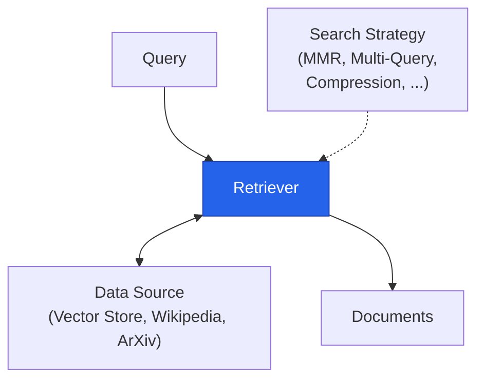

A retriever sits between a raw query and a data source, applying a chosen search strategy to decide exactly which documents come back — and in what order.

---

## Types of Retrievers

Retrievers can be classified along two independent axes:

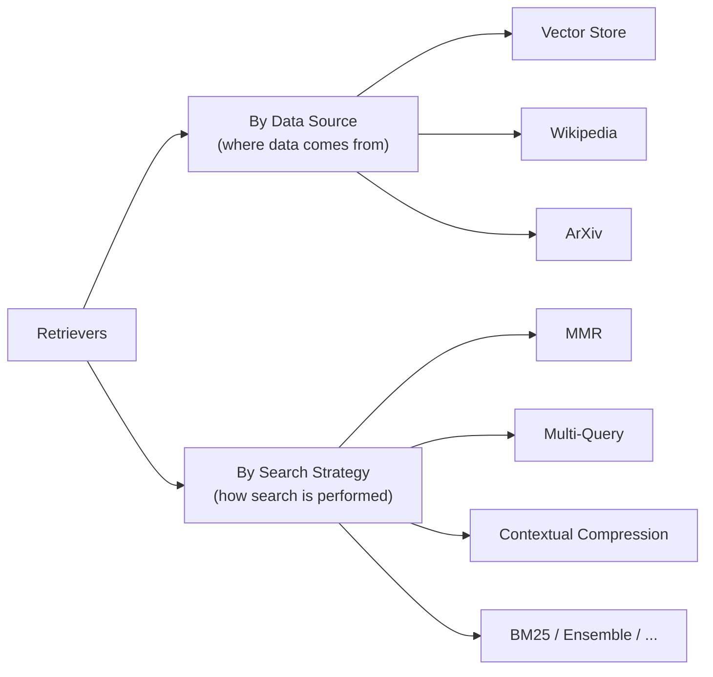

| Axis | Examples |
|---|---|
| **A. Data Source** — where the data is fetched from | Vector Store Retriever, Wikipedia Retriever, ArXiv Retriever |
| **B. Search Strategy** — how search & post-processing are performed | MMR, Multi-Query, Contextual Compression, BM25, Parent Document, Self-Query, Time-Weighted, Multi-Vector, Ensemble |

---

## Vector Store Retriever

**Definition**: The most common retriever type — searches and fetches documents from a vector store based on **semantic similarity** using vector embeddings.

**How it works:**
1. Source documents are stored in a vector store (FAISS, Chroma, Weaviate, Pinecone, ...).
2. Each document chunk is converted into a high-dimensional dense vector using an embedding model.
3. The user query is embedded with the *same* model, compared against stored vectors via a distance metric (cosine similarity, Euclidean distance), and the **top-k** most similar documents are returned.

```python
from langchain_community.vectorstores import FAISS
from langchain_openai import OpenAIEmbeddings

vectorstore = FAISS.from_documents(documents, OpenAIEmbeddings())
retriever = vectorstore.as_retriever(search_kwargs={"k": 4})

docs = retriever.invoke("What is contextual compression?")
```

---

## Wikipedia Retriever

**Definition**: Queries the **Wikipedia API** to fetch relevant content for a given query — no pre-indexing required.

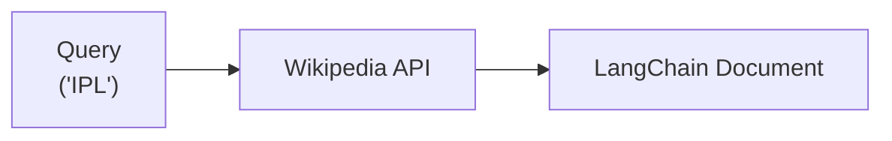

**How it works:** send the query string to Wikipedia's API → Wikipedia returns the most relevant article page(s) → the retriever formats page content and metadata into standard `Document` objects.

```python
from langchain_community.retrievers import WikipediaRetriever

retriever = WikipediaRetriever()
docs = retriever.invoke("Albert Einstein")
```

> 💡 **Tip**: Great for general-knowledge questions where you don't want to maintain your own index at all.

---

## ArXiv Retriever

**Definition**: Queries the **arXiv API** to retrieve scientific preprints, papers, abstracts, and metadata matching a query.

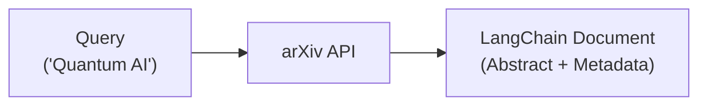

```python
from langchain_community.retrievers import ArxivRetriever

retriever = ArxivRetriever(load_max_docs=5)
docs = retriever.invoke("Quantum Machine Learning")
```

**When to use:** academic literature research, domain-specific scientific Q&A, and live fetching of state-of-the-art research without pre-chunking or pre-embedding paper catalogs.

---

## Maximal Marginal Relevance (MMR)

> *"How can we pick results that are not only relevant to the query but also different from each other?"*

**Definition**: An algorithm that reduces redundancy in retrieved results while maintaining high relevance to the query.

**Why use it?** In standard similarity search, top-k documents can end up all very similar to each other, repeating the same information, and lacking diverse perspective.

**How it works:**
1. Picks the **most relevant** document to the query first.
2. For each subsequent pick, chooses the document that is **most relevant to the query AND least similar to already-selected documents**.
3. Repeats until *k* documents are chosen.

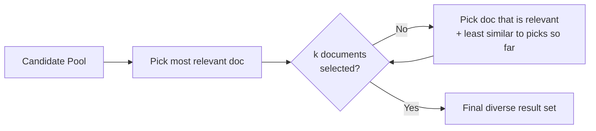

```python
retriever = vectorstore.as_retriever(
    search_type="mmr",
    search_kwargs={"k": 4, "fetch_k": 20, "lambda_mult": 0.5},
)
```

> 🚀 **Best Practice**: Ensures the LLM's context window receives **diverse yet relevant** context instead of wasting space on semantically overlapping chunks.

---

## Multi-Query Retriever

> *"Sometimes a single query might not capture all the ways information is phrased in your documents."*

**Definition**: Uses an LLM to generate multiple semantically different variations of a user's original query.

**Problem it solves:** A query like *"How can I stay healthy?"* might miss documents phrased as *"What should I eat?"* or *"How can I manage stress?"* — even though they're all relevant.

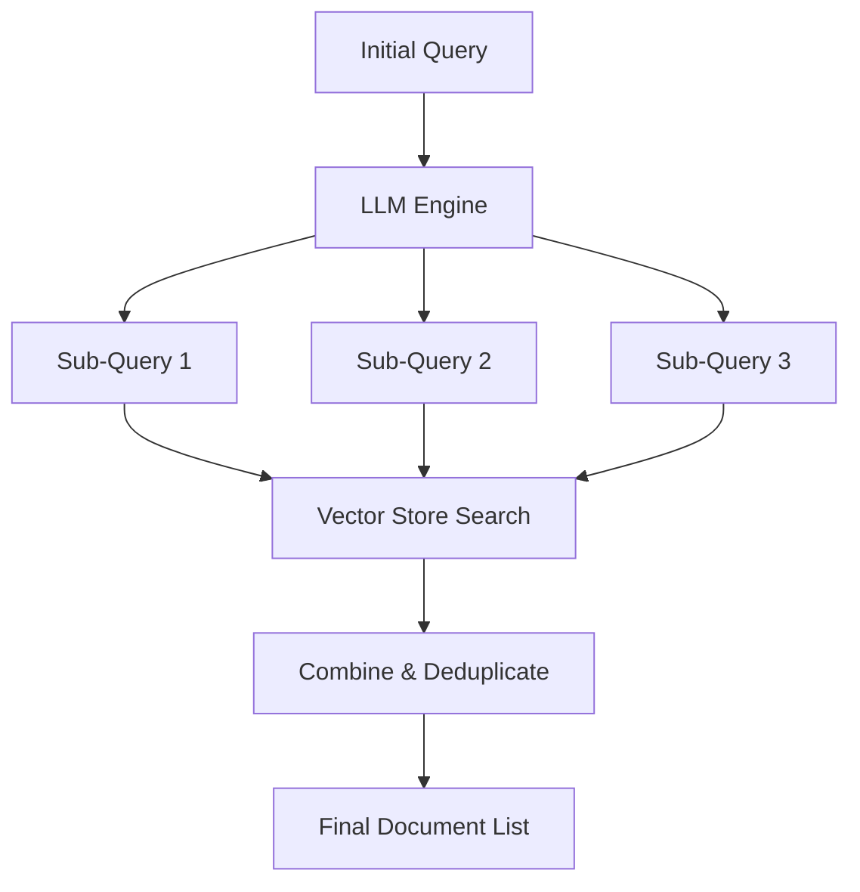

```python
from langchain.retrievers.multi_query import MultiQueryRetriever
from langchain_openai import ChatOpenAI

retriever = MultiQueryRetriever.from_llm(
    retriever=vectorstore.as_retriever(),
    llm=ChatOpenAI(temperature=0),
)
docs = retriever.invoke("How can I stay healthy?")
```

---

## Contextual Compression Retriever

> *"Why pass full paragraphs to an LLM when only a single sentence is relevant?"*

**Definition**: Compresses and filters retrieved documents **post-search**, returning only the specific sentences relevant to the query.

**Problem it solves:** standard retrievers return whole chunks even when only one sentence answers the query — wasting context window, increasing cost/latency, and risking hallucination from irrelevant noise.

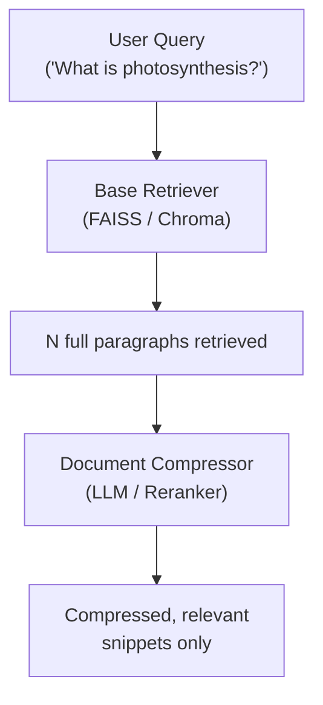

```python
from langchain.retrievers import ContextualCompressionRetriever
from langchain.retrievers.document_compressors import LLMChainExtractor
from langchain_openai import ChatOpenAI

compressor = LLMChainExtractor.from_llm(ChatOpenAI(temperature=0))
retriever = ContextualCompressionRetriever(
    base_compressor=compressor,
    base_retriever=vectorstore.as_retriever(),
)
```

**When to use:** long chunks with mixed information, strict context-window limits, cost/latency optimization, or improving RAG accuracy by removing distractors.

---

## BM25 Retriever

> *"Semantic vectors understand meaning, but BM25 catches exact keyword matches."*

**Definition**: A sparse keyword retriever using the **BM25** ranking algorithm — an advanced variant of TF-IDF — to score documents by exact keyword occurrence.

**Problem it solves:** dense embeddings are great for meaning but weak on exact acronyms (`BERT`, `LSTM`), unique IDs (`ERR-404-XYZ`), or proper nouns.

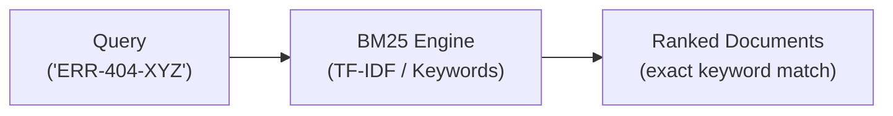

```python
from langchain_community.retrievers import BM25Retriever

retriever = BM25Retriever.from_documents(documents)
retriever.k = 4
```

**When to use:** technical document search, error-log lookups, code search, legal citation databases, or as the keyword branch of a hybrid architecture.

---

## Parent Document Retriever

> *"Small chunks match better in vector search; large documents give better context to LLMs."*

**Definition**: Indexes **small child chunks** in a vector store for precise similarity search, while storing and returning the larger **parent documents** to the LLM.

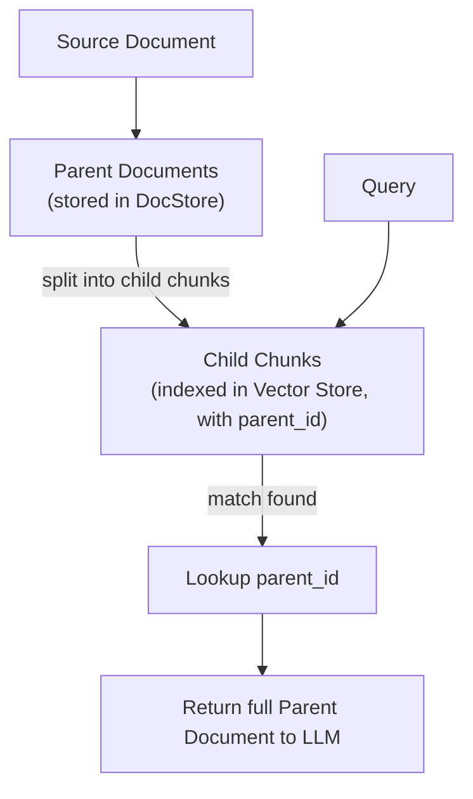

```python
from langchain.retrievers import ParentDocumentRetriever
from langchain.storage import InMemoryStore
from langchain_text_splitters import RecursiveCharacterTextSplitter

child_splitter = RecursiveCharacterTextSplitter(chunk_size=400)
retriever = ParentDocumentRetriever(
    vectorstore=vectorstore,
    docstore=InMemoryStore(),
    child_splitter=child_splitter,
)
retriever.add_documents(documents)
```

**When to use:** large books, long articles, or complex reports where a single line triggers retrieval, but the LLM needs the full surrounding section to answer accurately.

---

## Self-Query Retriever

> *"Extract both semantic text queries AND structured metadata filters from a natural language question."*

**Definition**: Uses an LLM to parse a query into (1) a semantic query string and (2) a structured metadata filter.

**Problem it solves:** a query like *"Show movies directed by Christopher Nolan released after 2010"* embedded as a whole often returns semantically similar but factually wrong results (wrong director, wrong year).

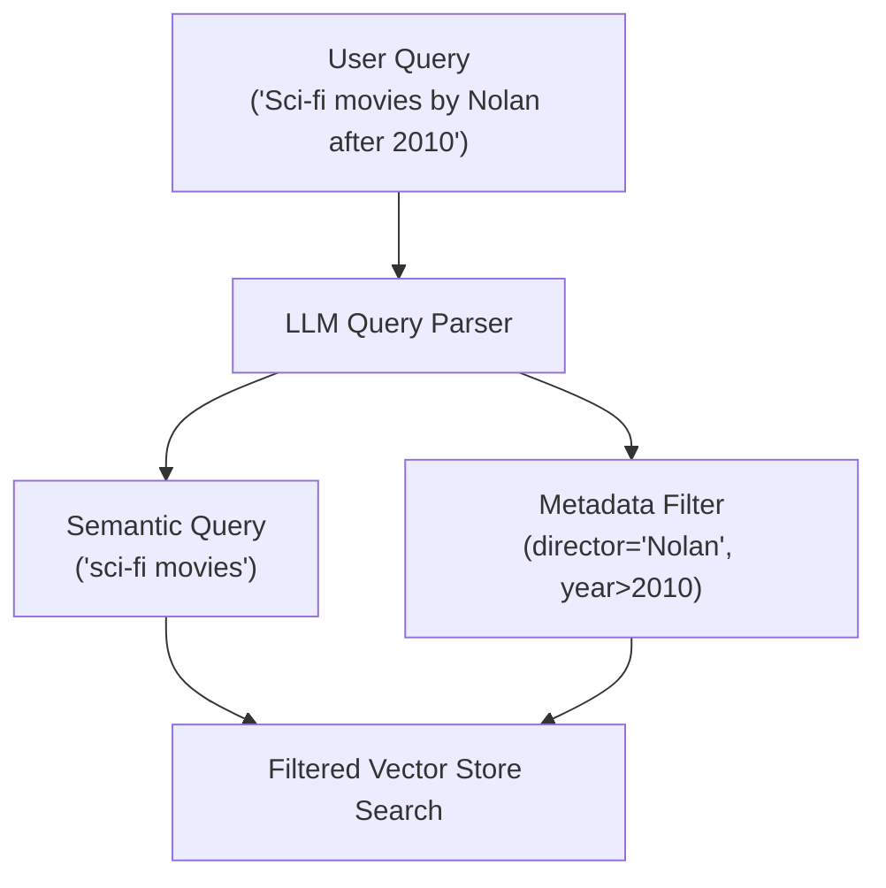

```python
from langchain.retrievers.self_query.base import SelfQueryRetriever
from langchain.chains.query_constructor.base import AttributeInfo

metadata_field_info = [
    AttributeInfo(name="director", description="The movie's director", type="string"),
    AttributeInfo(name="year", description="Release year", type="integer"),
]
retriever = SelfQueryRetriever.from_llm(
    llm, vectorstore, document_content_description="Movie summaries", metadata_field_info=metadata_field_info,
)
```

**When to use:** vector stores with rich metadata — e-commerce (price/brand), news (publish date/author), document vaults (tags/permissions).

---

## Time-Weighted Vector Retriever

> *"Balance semantic relevance with temporal freshness."*

**Definition**: Combines semantic similarity with a **time-decay penalty**, prioritizing recent or frequently accessed documents over stale ones.

$$\text{Score} = \text{SemanticSimilarity} + (1 - \text{DecayRate})^{\text{HoursPassed}}$$

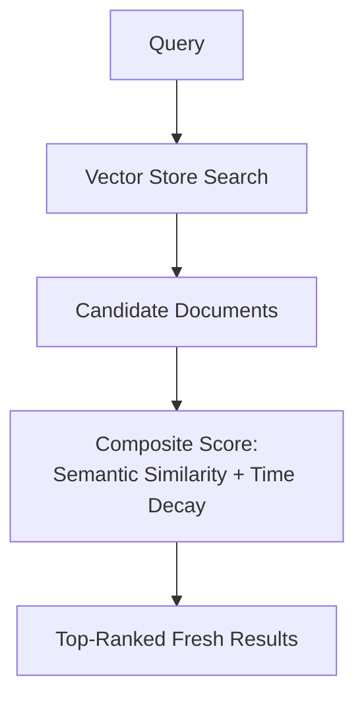

```python
from langchain.retrievers import TimeWeightedVectorStoreRetriever

retriever = TimeWeightedVectorStoreRetriever(
    vectorstore=vectorstore, decay_rate=0.01, k=4,
)
```

**When to use:** conversational agents with long-term memory, dynamic data feeds, news monitoring, or any time-sensitive retrieval.

---

## Multi-Vector Retriever

> *"Store multiple vectors per document for flexible retrieval, while keeping the source document intact."*

**Definition**: Decouples the vectors stored in the vector database from the object returned to the LLM — allowing **multiple vectors per document** (summaries, sub-chunks, hypothetical questions).

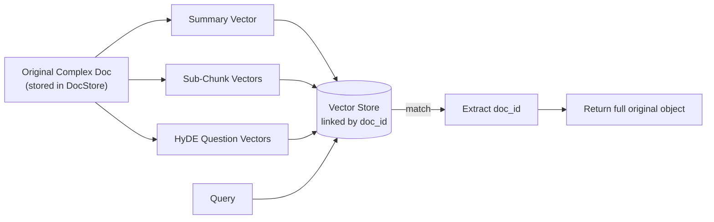

```python
from langchain.retrievers.multi_vector import MultiVectorRetriever
from langchain.storage import InMemoryStore

retriever = MultiVectorRetriever(
    vectorstore=vectorstore, docstore=InMemoryStore(), id_key="doc_id",
)
```

**When to use:** multimodal RAG (tables, images), HyDE (Hypothetical Document Embeddings), or combining high-level summaries with fine-grained search.

---

## Ensemble Retriever (Hybrid Search)

> *"Combine sparse keyword search with dense semantic search for hybrid retrieval."*

**Definition**: Combines results from multiple retrievers (e.g. `BM25Retriever` + `VectorStoreRetriever`) and re-ranks them using **Reciprocal Rank Fusion (RRF)**.

$$\text{RRF\_Score}(d) = \sum_{r \in R} \frac{1}{k + r(d)}$$

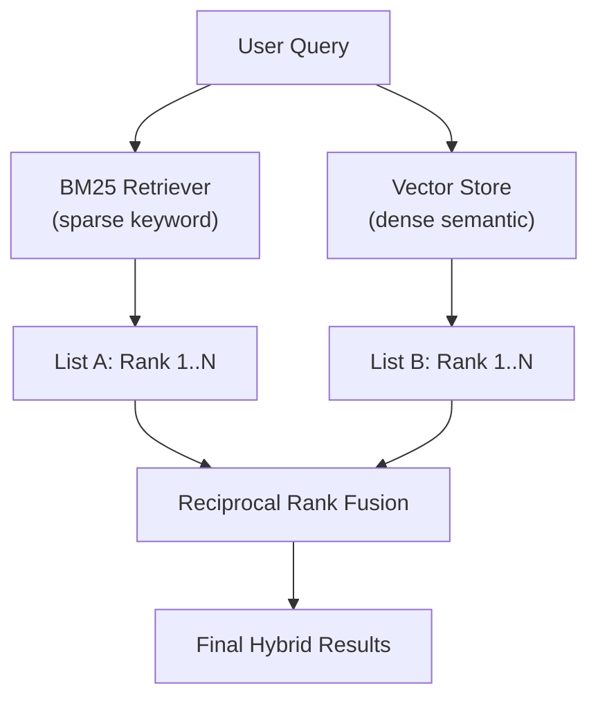

```python
from langchain.retrievers import EnsembleRetriever

bm25_retriever = BM25Retriever.from_documents(documents)
vector_retriever = vectorstore.as_retriever()

ensemble_retriever = EnsembleRetriever(
    retrievers=[bm25_retriever, vector_retriever],
    weights=[0.5, 0.5],
)
```

**When to use:** production-grade enterprise RAG systems that need top accuracy across both keyword and semantic search.

---

## Summary Comparison Table

| Retriever | Category | Engine / Source | Core Mechanism | Key Advantage |
|---|---|---|---|---|
| `WikipediaRetriever` | Data Source | Wikipedia API | Fetches live articles via search terms | Live external knowledge, no pre-embedding |
| `ArxivRetriever` | Data Source | arXiv API | Fetches live papers and abstracts | Real-time academic literature, no pre-indexing |
| Vector Store (`Chroma`/`FAISS`) | Data Source | Vector Database | Semantic distance search | Fast standard similarity search |
| MMR | Search Strategy | Vector Database | Iterative relevance + diversity selection | Eliminates redundant, overlapping chunks |
| Multi-Query Retriever | Search Strategy | LLM + Vector Store | LLM generates multi-perspective sub-queries | Captures differently-phrased relevant facts |
| Contextual Compression | Search Strategy | Base Retriever + Compressor | Extracts query-relevant snippets | Minimizes context usage, lowers cost/latency |
| BM25 Retriever | Search Strategy | Sparse Matrix / Keywords | TF-IDF term frequency scoring | Superior for exact terms, acronyms, IDs |
| Parent Document Retriever | Search Strategy | Vector Store + DocStore | Small chunks indexed, parent doc returned | Best precision + full context |
| Self-Query Retriever | Search Strategy | LLM + Vector Store | Semantic query + metadata filter | Logical metadata constraints in queries |
| Time-Weighted Vector Retriever | Search Strategy | Vector Store + Decay | Similarity + exponential time decay | Prioritizes recent/frequent info |
| Multi-Vector Retriever | Search Strategy | Vector Store + DocStore | Multiple vectors per document | Ideal for complex docs, tables, HyDE |
| Ensemble Retriever | Search Strategy | Multiple Retrievers | Reciprocal Rank Fusion | Combines sparse + dense for top accuracy |

---

## Real-World Use Cases

- **Enterprise knowledge base** → Ensemble Retriever (BM25 + Vector Store) for both exact-term and semantic recall.
- **Legal contract search** → BM25 Retriever for clause numbers and defined terms, Parent Document Retriever for full-clause context.
- **Customer support bot** → Contextual Compression to keep only the answer-bearing sentence, minimizing token cost.
- **Research assistant** → ArXiv + Wikipedia Retrievers combined with a Vector Store Retriever over internal notes.
- **E-commerce product search** → Self-Query Retriever to parse "red running shoes under $100" into semantic query + price filter.
- **Long-term chat memory** → Time-Weighted Vector Retriever to surface recent conversation context over stale history.

---

## Advantages

- A single `Runnable` interface means every retriever type can be swapped or composed with `|` in LCEL chains.
- Search-strategy retrievers (MMR, Compression, Ensemble) can wrap *any* base retriever, so improvements compose.
- Data-source retrievers (Wikipedia, ArXiv) require zero pre-indexing for external knowledge.
- Specialized retrievers (Parent Document, Multi-Vector) resolve the classic "small chunks vs. rich context" trade-off.

## Disadvantages

- More sophisticated retrievers (Multi-Query, Self-Query, Contextual Compression) add LLM calls — extra latency and cost.
- BM25 alone misses semantic meaning; vector search alone misses exact terms — neither is sufficient in isolation.
- Ensemble/hybrid retrieval adds tuning complexity (weights, RRF constant `k`).
- Time-Weighted and Multi-Vector retrievers require extra infrastructure (timestamps, a DocStore) beyond a plain vector store.

---

## Best Practices

- Default to a plain **Vector Store Retriever** first; add complexity (MMR, Compression, Ensemble) only once you've measured a real retrieval gap.
- Use **MMR** whenever your corpus has near-duplicate or highly similar chunks.
- Use **BM25 or Ensemble** whenever queries include IDs, codes, acronyms, or proper nouns.
- Use **Parent Document Retriever** whenever you split aggressively for embedding precision but the LLM needs surrounding context.
- Always set an explicit `k` (and `fetch_k` for MMR) rather than relying on defaults — tune it against real queries.

## Common Mistakes

- [ ] Assuming a single retriever type will handle every query pattern in a diverse corpus.
- [ ] Using Contextual Compression or Self-Query without accounting for the added LLM latency/cost.
- [ ] Forgetting to set `retriever.k` on `BM25Retriever`, leaving it at a default that doesn't match your use case.
- [ ] Building an Ensemble Retriever with unequal-quality sub-retrievers and equal weights, skewing results.
- [ ] Using Parent Document Retriever without persisting the DocStore, losing parent documents on restart.

---

## Interview Questions

<details>
<summary><b>Q1. What's the difference between a retriever and a vector store?</b></summary>

<br>

A vector store is a storage/indexing system that holds embeddings and can perform similarity search. A retriever is a higher-level interface that decides *how* to query one or more data sources (which may or may not be a vector store) and returns `Document` objects — every retriever implements the same `Runnable` interface regardless of what's underneath it.
</details>

<details>
<summary><b>Q2. How does MMR reduce redundancy compared to plain similarity search?</b></summary>

<br>

MMR iteratively selects documents that are relevant to the query *and* dissimilar to documents already chosen, instead of just picking the top-k most similar documents outright — this avoids returning several near-duplicate chunks that waste context window space.
</details>

<details>
<summary><b>Q3. Why would you use a Multi-Query Retriever?</b></summary>

<br>

Because a single query embedding may not be close to documents that discuss the same topic using different wording. An LLM generates several rephrased sub-queries, each retrieves independently, and the results are merged and deduplicated — improving recall for differently-phrased relevant content.
</details>

<details>
<summary><b>Q4. What problem does Contextual Compression solve?</b></summary>

<br>

Standard retrievers return whole chunks even when only one sentence answers the query. Contextual Compression passes retrieved chunks through a compressor (LLM or reranker) that extracts only the query-relevant snippet, reducing token cost, latency, and the risk of the LLM getting distracted by irrelevant text.
</details>

<details>
<summary><b>Q5. When would BM25 outperform dense vector search?</b></summary>

<br>

When the query contains exact keywords that matter precisely — acronyms, error codes, product SKUs, or proper nouns — where semantic proximity in embedding space doesn't guarantee the exact term appears in the top results.
</details>

<details>
<summary><b>Q6. Explain the Parent Document Retriever's core trade-off and how it resolves it.</b></summary>

<br>

Small chunks produce precise embeddings for search but lack context; large chunks provide context but dilute embeddings. The Parent Document Retriever indexes small child chunks for precise search, while storing full parent documents in a separate DocStore — returning the full parent (via its `parent_id`) once a child chunk matches.
</details>

<details>
<summary><b>Q7. What is Reciprocal Rank Fusion, and where is it used?</b></summary>

<br>

RRF is a rank-merging formula, RRF_Score(d) = Σ 1/(k + rank(d)), used by the Ensemble Retriever to combine ranked result lists from multiple retrievers (e.g. BM25 and vector search) into one unified ranking, without needing the retrievers' raw scores to be on the same scale.
</details>

---

## Cheat Sheet

```bash
pip install langchain langchain-community rank_bm25 lark
```

| Task | Snippet |
|---|---|
| Basic vector store retriever | `vectorstore.as_retriever(search_kwargs={"k": 4})` |
| MMR retriever | `vectorstore.as_retriever(search_type="mmr", search_kwargs={"k": 4, "fetch_k": 20})` |
| Multi-query retriever | `MultiQueryRetriever.from_llm(retriever=..., llm=...)` |
| Contextual compression | `ContextualCompressionRetriever(base_compressor=..., base_retriever=...)` |
| BM25 retriever | `BM25Retriever.from_documents(documents)` |
| Parent document retriever | `ParentDocumentRetriever(vectorstore=..., docstore=..., child_splitter=...)` |
| Self-query retriever | `SelfQueryRetriever.from_llm(llm, vectorstore, description, metadata_field_info)` |
| Ensemble (hybrid) retriever | `EnsembleRetriever(retrievers=[bm25, vector], weights=[0.5, 0.5])` |

> 📌 **Rule of thumb**: Redundant results → **MMR** · Differently-phrased queries → **Multi-Query** · Long noisy chunks → **Contextual Compression** · Exact terms/IDs → **BM25** · Small-chunk precision + big context → **Parent Document** · Natural-language filters → **Self-Query** · Recency matters → **Time-Weighted** · Best of keyword + semantic → **Ensemble**.

---

## Useful Links

- [LangChain — Retrievers Overview](https://python.langchain.com/docs/concepts/retrievers/)
- [LangChain — MultiQueryRetriever](https://python.langchain.com/docs/how_to/MultiQueryRetriever/)
- [LangChain — Contextual Compression](https://python.langchain.com/docs/how_to/contextual_compression/)
- [LangChain — Ensemble Retriever](https://python.langchain.com/docs/how_to/ensemble_retriever/)
- [LangChain — Parent Document Retriever](https://python.langchain.com/docs/how_to/parent_document_retriever/)
- [LangChain — Self-Querying Retriever](https://python.langchain.com/docs/how_to/self_query/)
- [LangChain — Vector Stores (previous stage)](../Vector%20Store)

---

## Summary

> A vector store holds embeddings; a retriever decides how to search them (and possibly other sources). Choosing the right retriever — or combination of retrievers — is often the single highest-leverage lever for improving RAG answer quality.

- Retrievers split into two axes: **data source** (Vector Store, Wikipedia, ArXiv) and **search strategy** (MMR, Multi-Query, Compression, BM25, Parent Document, Self-Query, Time-Weighted, Multi-Vector, Ensemble).
- Start simple (plain vector store retriever); add MMR, Compression, or Ensemble only once you've measured a concrete retrieval problem.
- Hybrid search (Ensemble of BM25 + dense vectors) is the standard for production-grade enterprise RAG.

---

<p align="center"><i>Compiled as part of personal RAG / LangChain study notes — July 2026.</i></p>
