# 🔍 Retrievers in LangChain & RAG

> 📌 **Important**
> A **retriever** is an interface / component in LangChain that fetches relevant documents from a data source in response to an unstructured query.

---

## 📝 Learning Summary

Retrievers act as the bridge between your data sources and your Large Language Models (LLMs) in a Retrieval-Augmented Generation (RAG) pipeline. They take an unstructured text query, apply specific search strategies to query an underlying data store, and return a list of relevant `Document` objects containing both text content and metadata.

## 🎯 Learning Objectives

By the end of this document, you will understand:
* The core architecture and data flow of LangChain Retrievers.
* The difference between data source retrievers and search strategy retrievers.
* How advanced retrieval techniques like MMR, Multi-Query, and Contextual Compression work.
* When to utilize specialized retrievers like Parent Document, Self-Query, and Ensemble (Hybrid) Search.

## 📋 Prerequisites

* Basic Python programming.
* Understanding of embeddings and RAG concepts.
* Familiarity with LangChain Expression Language (LCEL).

---

## 📚 Table of Contents

1. [Key Characteristics](#1-key-characteristics)
2. [Architecture & Data Flow](#2-architecture--data-flow)
3. [Types of Retrievers](#3-types-of-retrievers)
4. [Data Source Retrievers](#4-data-source-retrievers)
    * [Wikipedia Retriever](#wikipedia-retriever)
    * [ArXiv Retriever](#arxiv-retriever)
    * [Vector Store Retriever](#vector-store-retriever)
5. [Search Strategy Retrievers](#5-search-strategy-retrievers)
    * [Maximal Marginal Relevance (MMR)](#maximal-marginal-relevance-mmr)
    * [Multi-Query Retriever](#multi-query-retriever)
    * [Contextual Compression Retriever](#contextual-compression-retriever)
    * [BM25 Retriever](#bm25-retriever)
    * [Parent Document Retriever](#parent-document-retriever)
    * [Self-Query Retriever](#self-query-retriever)
    * [Time-Weighted Vector Retriever](#time-weighted-vector-retriever)
    * [Multi-Vector Retriever](#multi-vector-retriever)
    * [Ensemble Retriever](#ensemble-retriever)
6. [Summary Comparison Table](#6-summary-comparison-table)

---

## 1. Key Characteristics

1. **Multiple Types & Categorizations**: Retrievers vary based on *where* data comes from (Data Source) and *how* data is searched/processed (Search Strategy).
2. **Runnables Interface**: All retrievers in LangChain implement the standard `Runnable` interface (LCEL - LangChain Expression Language). They seamlessly support `.invoke()`, `.batch()`, `.stream()`, and piping `|`.

---

## 2. Architecture & Data Flow

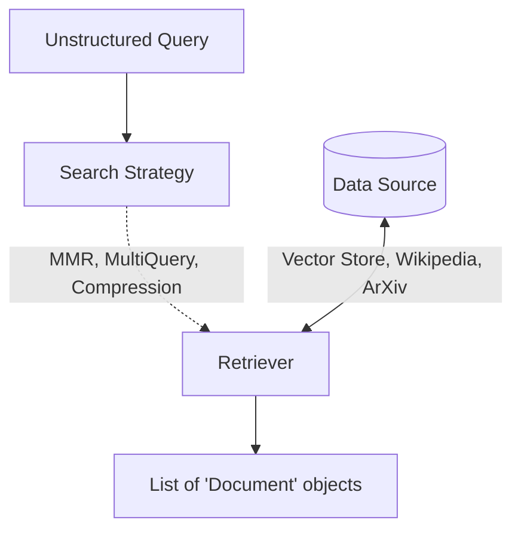

---

## 3. Types of Retrievers

Retrievers in LangChain can be classified along two main axes:

### A. Based on **Data Source** (Where the data is fetched from)
* **Vector Store Retriever**: Fetches vector embeddings stored in databases like ChromaDB, FAISS, Pinecone, Milvus, etc.
* **Wikipedia Retriever**: Fetches pages and articles directly from Wikipedia API based on query terms.
* **ArXiv Retriever**: Fetches academic research papers and pre-prints directly from ArXiv.

### B. Based on **Search Strategy** (How search and post-processing are performed)
* **MMR (Maximal Marginal Relevance)**: Balances similarity/relevance with diversity.
* **Multi-Query Retriever**: Uses an LLM to generate query variations.
* **Contextual Compression**: Reranks and compresses/filters retrieved documents.

---

## 4. Data Source Retrievers

### Wikipedia Retriever

A component that queries the **Wikipedia API** to fetch relevant content.

**How It Works:**
1. **Input Query**: You provide a search query (e.g., `"Albert Einstein"`).
2. **Send API Request**: Forwards the query string to Wikipedia's API.
3. **Article Retrieval**: Retrieves the most relevant article page(s).
4. **Document Formatting**: Formats content and metadata into standard LangChain `Document` objects.

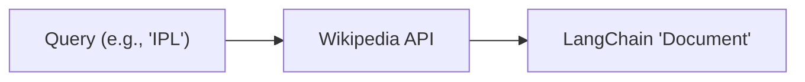

### ArXiv Retriever

Queries the **arXiv API** to retrieve scientific preprints, abstracts, and metadata.

**When to Use:**
* Academic literature research.
* Domain-specific scientific Q&A systems.
* Live fetching of research without pre-chunking catalogs.

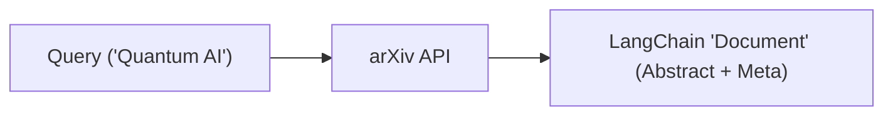

### Vector Store Retriever

> 💡 **Tip**
> This is the most common type of retriever. It searches based on **semantic similarity** using **vector embeddings**.

**How It Works:**
1. **Document Storage**: Store source documents in a vector store.
2. **Document Embedding**: Chunks are converted into high-dimensional dense vectors.
3. **Query Execution**: User query is converted into a vector. The retriever compares it with stored vectors and returns the **top-$k$** most similar documents.

---

## 5. Search Strategy Retrievers

### Maximal Marginal Relevance (MMR)

> *"How can we pick results that are not only relevant to the query but also different from each other?"*

**MMR** is designed to **reduce redundancy** in retrieved results while maintaining high relevance.

**How It Works:**
1. Picks the most relevant document to the query first.
2. Picks subsequent documents that are most relevant to the query AND least similar to already selected documents.
3. Repeats until $k$ documents are chosen.

**Benefits:** Ensures the LLM context window receives diverse context, preventing wasted space on semantically overlapping chunks.

---

### Multi-Query Retriever

> *"Sometimes a single query might not capture all the ways information is phrased in your documents."*

Automates query expansion by using an **LLM** to generate multiple semantically different variations of a user's initial query.

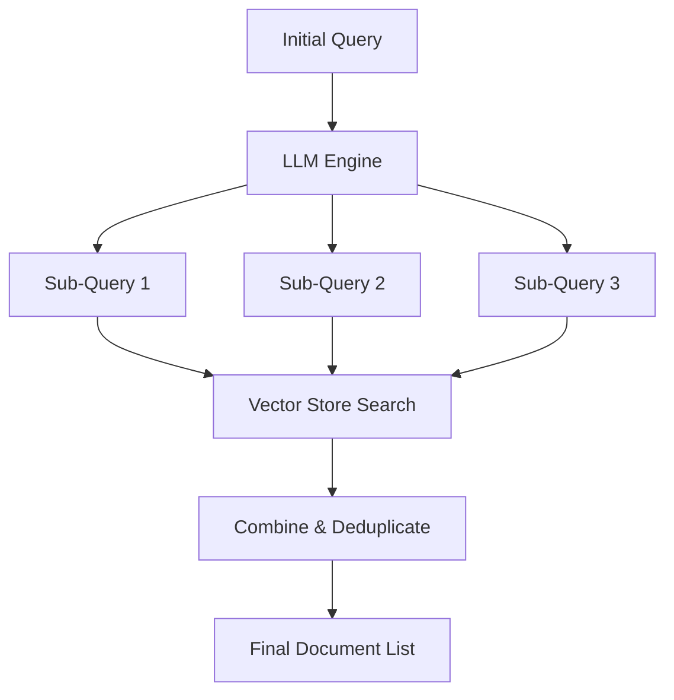

---

### Contextual Compression Retriever

> *"Why pass full paragraphs to an LLM when only a single sentence is relevant?"*

Improves retrieval quality by compressing and filtering retrieved documents post-search — returning only the specific sentences relevant to the query.

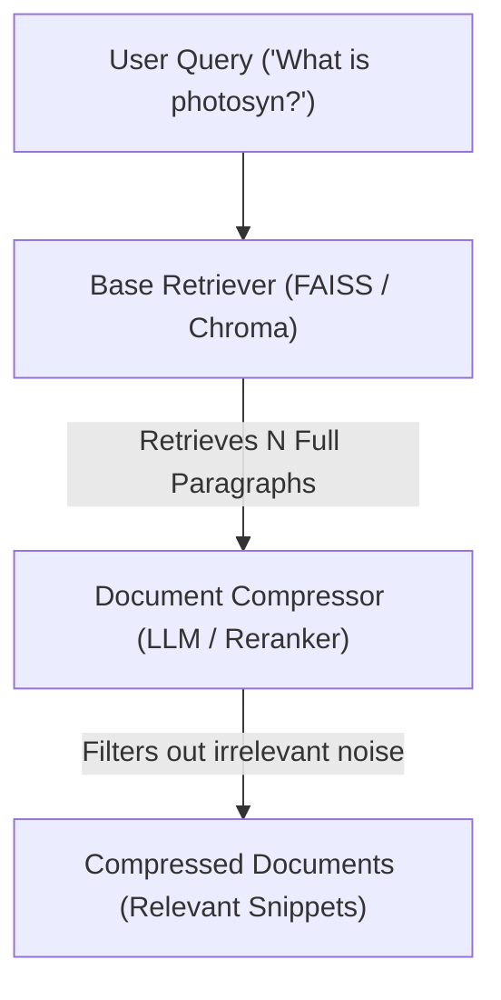

**When to Use:**
* To minimize token counts for strict context limitations.
* To optimize cost and latency.
* To improve LLM accuracy by removing distracting background noise.

---

### BM25 Retriever

A sparse keyword retriever using the **BM25** ranking algorithm (a TF-IDF variant) to evaluate relevance based on exact keyword occurrences.

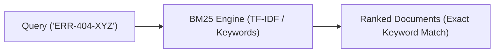

**When to Use:** Ideal for exact acronyms, technical jargon, product SKUs, and proper nouns where semantic dense vectors fail.

---

### Parent Document Retriever

> *"Small chunks match better in vector search; large documents give better context to LLMs."*

Indexes **small child chunks** for precise similarity search, but returns the larger **parent documents** to the LLM for rich context.

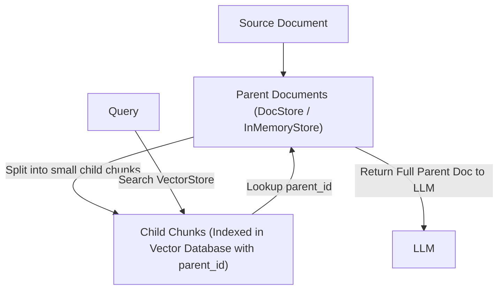

---

### Self-Query Retriever

Uses an LLM to parse a user's natural language question into two distinct components:
1. A **semantic query string** for vector search.
2. A **structured metadata filter** executed against vector store metadata.

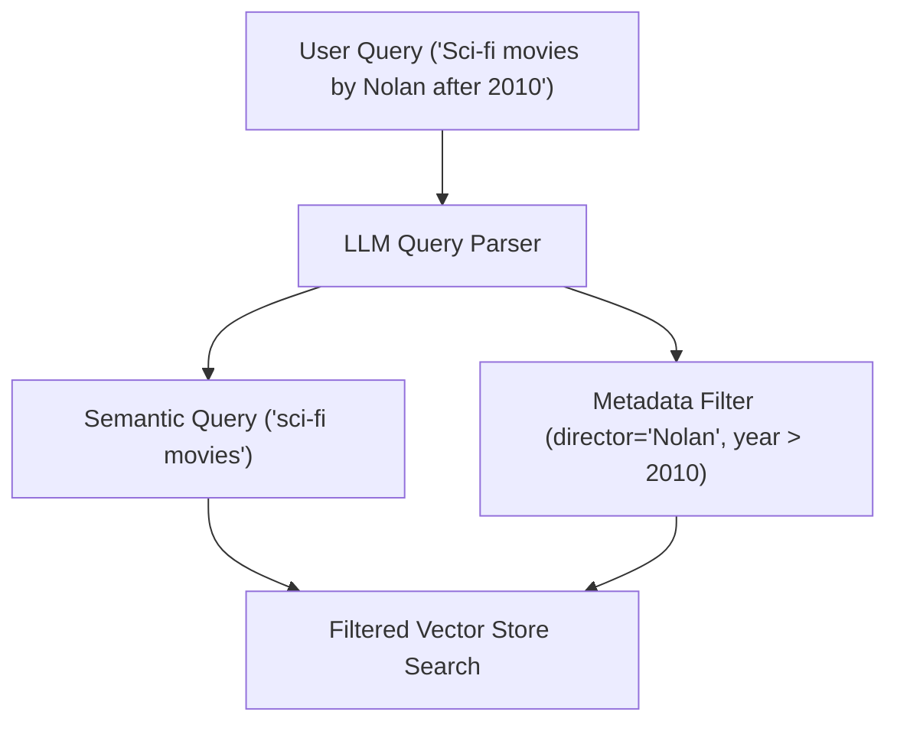

---

### Time-Weighted Vector Retriever

> *"Balance semantic relevance with temporal freshness."*

Combines **semantic vector similarity** with a **time-decay penalty**, ensuring recent documents are prioritized.

$$\text{Score} = \text{SemanticSimilarity} + (1 - \text{DecayRate})^{\text{HoursPassed}}$$

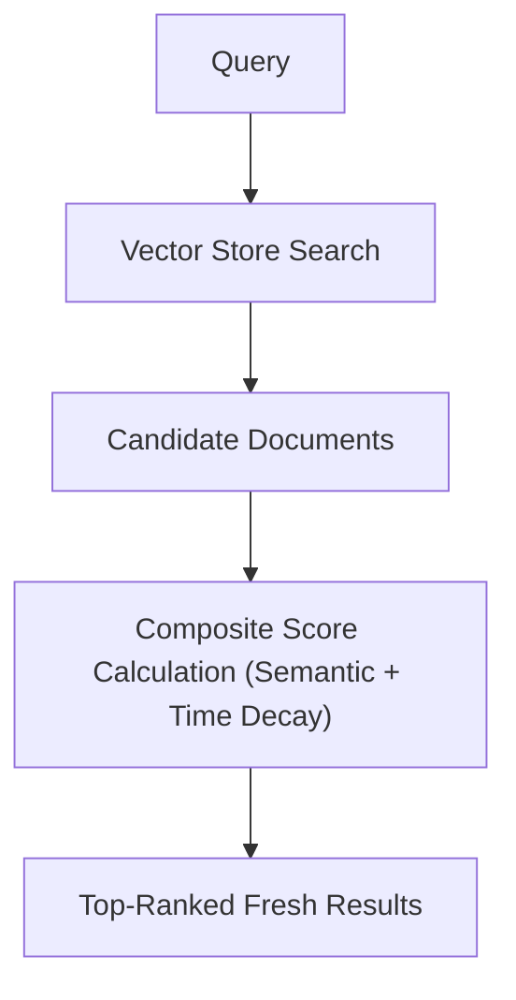

---

### Multi-Vector Retriever

Allows storing **multiple vectors per single document** (e.g., summaries, sub-chunks, hypothetical questions) while keeping the full source document intact in a DocStore.

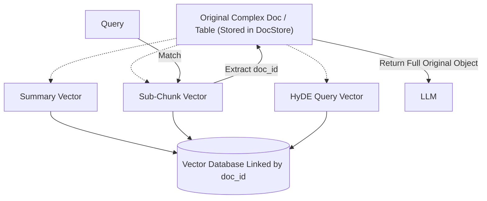

---

### Ensemble Retriever

> 🚀 **Best Practice**
> Combine sparse keyword search with dense semantic search for hybrid retrieval to get the best of both worlds.

Combines search results from multiple distinct retrievers and re-ranks them using **Reciprocal Rank Fusion (RRF)**.

$$\text{RRF\_Score}(d) = \sum_{r \in R} \frac{1}{k + r(d)}$$

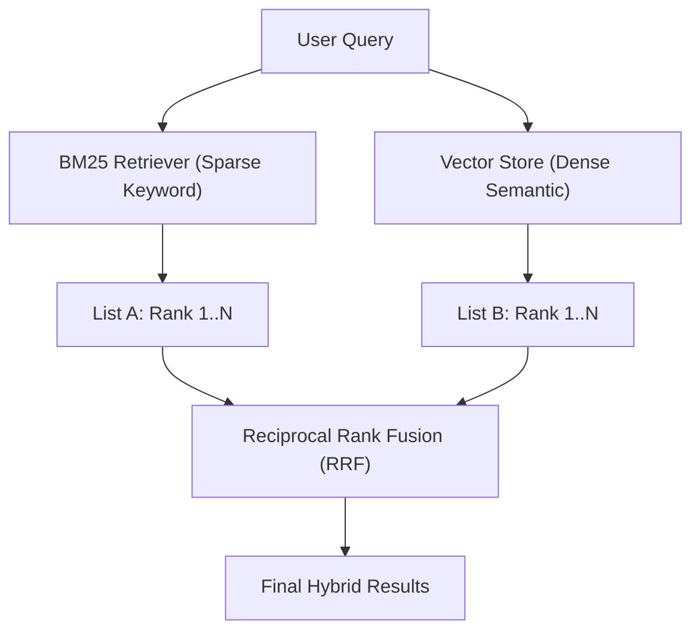

---

## 6. Summary Comparison Table

| Retriever | Category | Engine / Source | Core Mechanism | Key Advantage |
|---|---|---|---|---|
| **`WikipediaRetriever`** | Data Source | Wikipedia API | Fetches live articles via search terms | Live, external encyclopedic knowledge without pre-embedding. |
| **`ArxivRetriever`** | Data Source | arXiv API | Fetches live research papers and abstracts | Real-time academic literature retrieval without pre-indexing. |
| **Vector Store (`Chroma`)** | Data Source | Vector Database | Semantic distance search via vector embeddings | Fast, standard vector similarity search for static document stores. |
| **MMR (`FAISS`)** | Search Strategy | Vector Database | Iterative selection balancing relevance & diversity | Eliminates redundant, overlapping document chunks in prompt context. |
| **Multi-Query Retriever** | Search Strategy | LLM + Vector Store | LLM generates multi-perspective sub-queries | Overcomes distance-based query limitations and captures differently phrased facts. |
| **Contextual Compression** | Search Strategy / Post-Processing | Base Retriever + Compressor | Extracts query-relevant snippets & discards irrelevant noise | Minimizes context window usage, lowers token costs/latency, and boosts accuracy. |
| **BM25 Retriever** | Search Strategy | Sparse Matrix | TF-IDF based term frequency keyword scoring | Superior for exact terms, acronyms, code identifiers, and product SKUs. |
| **Parent Document Retriever** | Search Strategy | Vector Store + DocStore | Small child chunks in vector store; returns parent doc | Best vector search precision while providing full context to LLMs. |
| **Self-Query Retriever** | Search Strategy | LLM + Vector Store | LLM extracts semantic query + structured metadata filter | Allows querying vector database with logical metadata constraints. |
| **Time-Weighted Vector Retriever** | Search Strategy | Vector Store + Timestamp Decay | Combines similarity score with exponential time-decay | Prioritizes recent or frequently accessed information over stale facts. |
| **Multi-Vector Retriever** | Search Strategy | Vector Store + DocStore | Multiple vector representations per document/object | Ideal for complex docs, tables, images, summaries, or HyDE queries. |
| **Ensemble Retriever** | Search Strategy | Multiple Retrievers (BM25 + Vector Store) | Reciprocal Rank Fusion (RRF) | Combines sparse (keyword) and dense (semantic) retrieval for top accuracy. |

---
