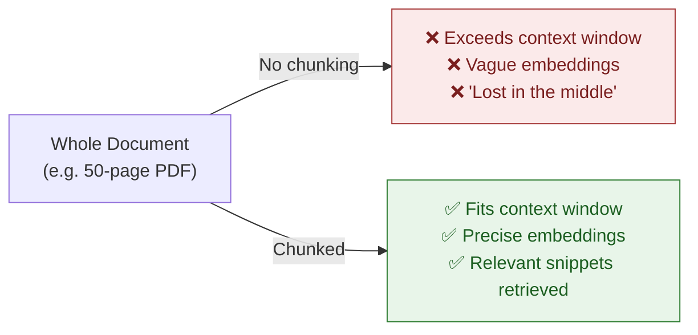
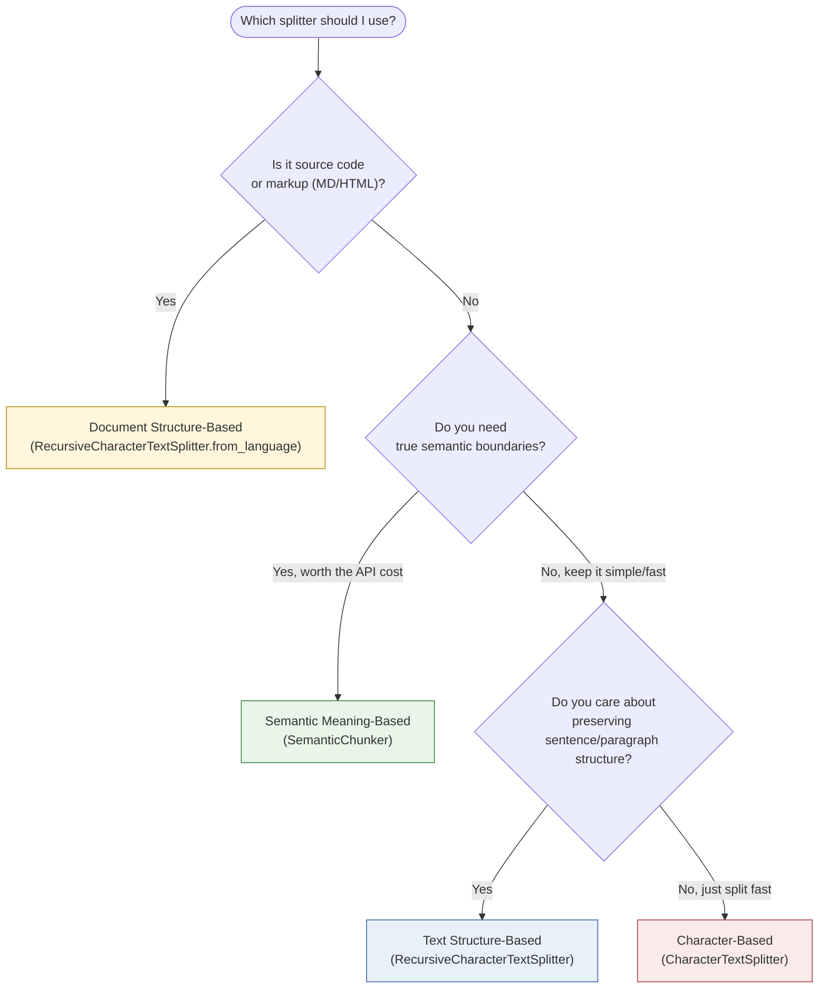
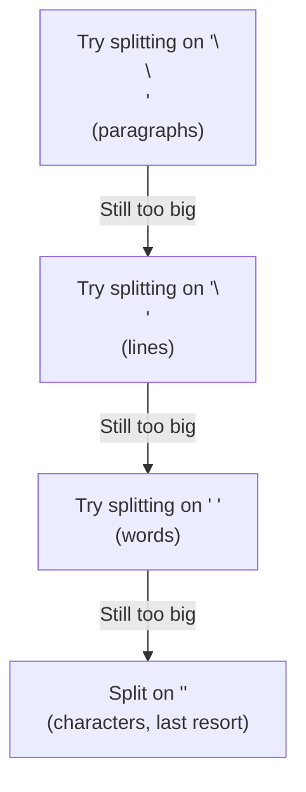
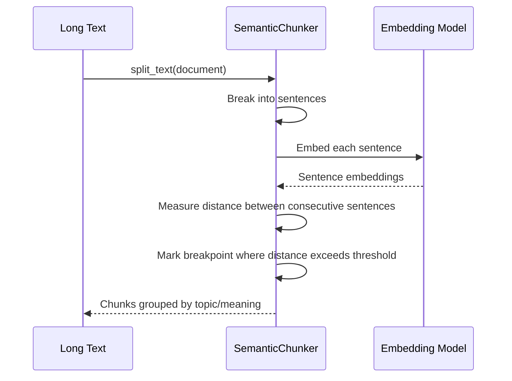
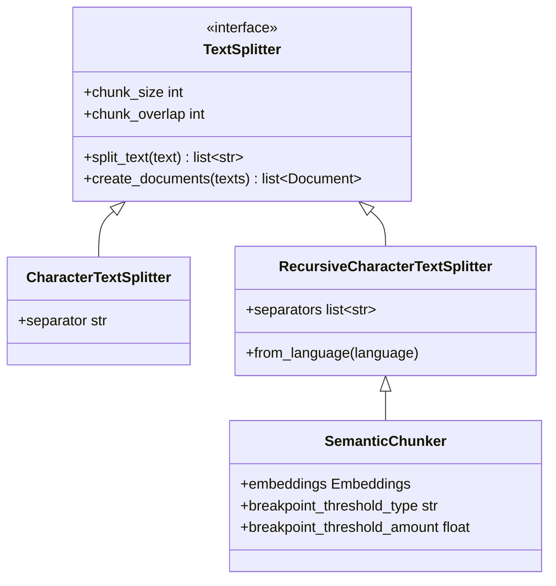

# ✂️ Text Splitters in RAG

> A complete, interview-ready reference on **Text Splitters (Chunking)** — the stage right after Document Loading in every RAG (Retrieval-Augmented Generation) pipeline.

<p align="left">
  
  
  
</p>

---

## 📝 Learning Summary

Once a [Document Loader](../Document%20loaders) turns raw sources into `Document` objects, those documents are usually **too large** to embed or feed to an LLM directly. **Text Splitters** (a.k.a. **chunkers**) break large text into smaller, semantically useful pieces — balancing retrieval precision against context loss.

This note covers:
- **Why** chunking exists — context windows, retrieval precision, memory, and the "lost in the middle" problem
- The **4 types of text splitting**: character-based, recursive (structure-based), document/code-structure-based, and semantic meaning-based
- Key parameters (`chunk_size`, `chunk_overlap`, `separators`, `breakpoint_threshold_type`) and when to tune them
- Which splitter to reach for depending on your data: prose, code, markdown, or high-stakes semantic retrieval

---

## 🎯 Learning Objectives

By the end of this note, you will be able to:

- [x] Explain why LLMs and vector databases need chunked text instead of whole documents
- [x] Describe the "lost in the middle" phenomenon and why smaller chunks help
- [x] Differentiate `CharacterTextSplitter`, `RecursiveCharacterTextSplitter`, language-aware splitting, and `SemanticChunker`
- [x] Tune `chunk_size`, `chunk_overlap`, and `separators` correctly for a given use case
- [x] Choose the right splitter for prose, source code, markdown, and highly semantic content
- [x] Answer common interview questions about chunking strategy in RAG systems

---

## 📋 Prerequisites

> 💡 **Tip**: A basic understanding of [Document Loaders](../Document%20loaders) is helpful, since Text Splitters operate on the `Document` objects loaders produce.

- Basic Python
- A high-level idea of what RAG (Retrieval-Augmented Generation) and embeddings are
- LangChain installed in your environment:

```bash
pip install langchain langchain-text-splitters langchain-experimental
```

---

## 📚 Table of Contents

- [✂️ Text Splitters in RAG](#️-text-splitters-in-rag)
  - [📝 Learning Summary](#-learning-summary)
  - [🎯 Learning Objectives](#-learning-objectives)
  - [📋 Prerequisites](#-prerequisites)
  - [🧠 Why Is Text Splitting / Chunking Needed?](#-why-is-text-splitting--chunking-needed)
  - [🏗️ Architecture: Where Splitting Fits in a RAG Pipeline](#️-architecture-where-splitting-fits-in-a-rag-pipeline)
  - [🧩 The 4 Types of Text Splitting](#-the-4-types-of-text-splitting)
    - [1️⃣ Character-Based Splitting](#1️⃣-character-based-splitting)
    - [2️⃣ Text Structure-Based Splitting (Recursive)](#2️⃣-text-structure-based-splitting-recursive)
    - [3️⃣ Document Structure-Based Splitting (Code / Markup)](#3️⃣-document-structure-based-splitting-code--markup)
    - [4️⃣ Semantic Meaning-Based Splitting](#4️⃣-semantic-meaning-based-splitting)
  - [🔍 Side-by-Side Comparison](#-side-by-side-comparison)
  - [⚙️ Key Parameters Explained](#️-key-parameters-explained)
  - [🌍 Real-World Use Cases](#-real-world-use-cases)
  - [✅ Advantages](#-advantages)
  - [❌ Disadvantages](#-disadvantages)
  - [🚀 Best Practices](#-best-practices)
  - [⚠️ Common Mistakes](#️-common-mistakes)
  - [🎤 Interview Questions](#-interview-questions)
  - [⚡ Cheat Sheet](#-cheat-sheet)
  - [🔗 Useful Links](#-useful-links)
  - [🏁 Summary](#-summary)

---

## 🧠 Why Is Text Splitting / Chunking Needed?

> 📌 **Important**: Chunking is not just a performance optimization — poor chunking silently degrades answer quality even when everything else in a RAG pipeline is correct.

- **Context Window & Token Limits** — Large files/documents cannot be fed directly into LLMs all at once due to context window constraints, high costs, and latency.
- **Retrieval Efficiency** — Vector databases store embeddings of individual text chunks. Smaller, well-defined chunks improve vector similarity search (semantic search) precision.
- **Load & Memory Efficiency** — Allows loading and processing only relevant snippets instead of entire heavy documents.
- **Better Context Quality** — Prevents the **"lost in the middle"** phenomenon, where LLMs fail to extract key facts buried inside massive blocks of text.



---

## 🏗️ Architecture: Where Splitting Fits in a RAG Pipeline


Text Splitters sit **directly between loading and embedding**. Every chunk produced here becomes one retrievable unit — get the chunking wrong, and no amount of clever prompting downstream can fully recover the lost context.

---

## 🧩 The 4 Types of Text Splitting



### 1️⃣ Character-Based Splitting

`CharacterTextSplitter` splits text purely based on a **single separator character** (e.g. space, newline, or empty string) and a **fixed chunk size**.

```python
from langchain_text_splitters import CharacterTextSplitter

splitter = CharacterTextSplitter(
    separator="\n",
    chunk_size=500,
    chunk_overlap=50,
)
chunks = splitter.split_text(long_text)
```

| Aspect | Details |
|---|---|
| **How it works** | Splits on one separator, cutting strictly at `chunk_size` boundaries |
| **Key Parameters** | `chunk_size`, `chunk_overlap`, `separator` |
| ✅ **Advantages** | Extremely simple, fast, low computational overhead |
| ❌ **Disadvantages** | Ignores natural sentence structure and semantics — can cut sentences or words abruptly |
| **Module** | `from langchain_text_splitters import CharacterTextSplitter` |

> ⚠️ **Warning**: Because it only respects a single separator, `CharacterTextSplitter` can produce chunks that end mid-sentence or even mid-word if that separator doesn't occur often enough within `chunk_size`.

---

### 2️⃣ Text Structure-Based Splitting (Recursive)

`RecursiveCharacterTextSplitter` iteratively splits text using a **list of hierarchical separators** (by default: `["\n\n", "\n", " ", ""]`). It tries to keep paragraphs, sentences, and words together as long as possible before falling back to a smaller separator.

```python
from langchain_text_splitters import RecursiveCharacterTextSplitter

splitter = RecursiveCharacterTextSplitter(
    chunk_size=500,
    chunk_overlap=50,
    separators=["\n\n", "\n", " ", ""],  # default, shown explicitly
)
chunks = splitter.split_text(long_text)
```



| Aspect | Details |
|---|---|
| **How it works** | Recursively tries each separator in order, only falling back when a chunk is still too large |
| **Key Parameters** | `chunk_size`, `chunk_overlap`, `separators` |
| ✅ **Advantages** | Maintains natural text layout and readability far better than character splitting — the **general standard** for raw text/prose |
| **Module** | `from langchain_text_splitters import RecursiveCharacterTextSplitter` |

> 🚀 **Best Practice**: When in doubt, start with `RecursiveCharacterTextSplitter`. It's the default choice for most prose-heavy RAG pipelines and rarely produces jarring mid-sentence cuts.

---

### 3️⃣ Document Structure-Based Splitting (Code / Markup)

A specialized form of recursive splitting — via `RecursiveCharacterTextSplitter.from_language` — tailored to the **syntax/grammar** of code or markup documents (Python, Markdown, HTML, JS, C++, and more).

```python
from langchain_text_splitters import RecursiveCharacterTextSplitter, Language

python_splitter = RecursiveCharacterTextSplitter.from_language(
    language=Language.PYTHON,
    chunk_size=500,
    chunk_overlap=50,
)
chunks = python_splitter.split_text(python_source_code)
```

| Aspect | Details |
|---|---|
| **How it works** | Uses language-specific separators (e.g. `class`, `def`, markdown headers) instead of generic ones |
| **Key Parameters** | `language`, `chunk_size`, `chunk_overlap` |
| ✅ **Advantages** | Respects code/markup boundaries — keeps classes, functions, code blocks, or markdown headers together in a single chunk |
| **Module** | `from langchain_text_splitters import RecursiveCharacterTextSplitter, Language` |

> 💡 **Tip**: `Language` supports many values beyond Python — including `MARKDOWN`, `HTML`, `JS`, `TS`, `CPP`, `GO`, `JAVA`, and more. Always match the `Language` enum to your actual source file type.

---

### 4️⃣ Semantic Meaning-Based Splitting

`SemanticChunker` embeds sentences using an embedding model (e.g. OpenAI or Gemini embeddings) and looks at the **distance/similarity between consecutive sentences**. It splits text when a significant topic change (a **breakpoint**) occurs — grouping is based on meaning, not arbitrary length.

```python
from langchain_experimental.text_splitter import SemanticChunker
from langchain_openai import OpenAIEmbeddings

splitter = SemanticChunker(
    embeddings=OpenAIEmbeddings(),
    breakpoint_threshold_type="percentile",   # or: standard_deviation, interquartile, gradient
    breakpoint_threshold_amount=95,
)
chunks = splitter.create_documents([long_text])
```



| Aspect | Details |
|---|---|
| **How it works** | Embeds sentences, measures semantic distance, splits at meaningful topic shifts |
| **Key Parameters** | `embeddings`, `breakpoint_threshold_type` (`standard_deviation`, `percentile`, `interquartile`, `gradient`), `breakpoint_threshold_amount` |
| ✅ **Advantages** | Grouping is based purely on **semantic meaning** rather than arbitrary length or line breaks |
| ❌ **Disadvantages** | Slower, and incurs **API embedding calls for every sentence** during splitting |
| **Module** | `from langchain_experimental.text_splitter import SemanticChunker` |

> ⚠️ **Warning**: Because `SemanticChunker` calls an embedding API per sentence, it can get **slow and expensive** on very large documents. Reserve it for cases where retrieval quality is critical enough to justify the cost.

---

## 🔍 Side-by-Side Comparison

| Splitter | Basis | Speed | Cost | Best For |
|---|---|---|---|---|
| **CharacterTextSplitter** | Single fixed separator | ⚡ Fastest | Free | Quick prototypes, simple/uniform text |
| **RecursiveCharacterTextSplitter** | Hierarchical separators | ⚡ Fast | Free | General-purpose prose — the default choice |
| **`.from_language`** (code/markup) | Language-aware separators | ⚡ Fast | Free | Source code, Markdown, HTML documentation |
| **SemanticChunker** | Embedding similarity | 🐢 Slowest | 💰 API calls per sentence | High-stakes retrieval where topical accuracy matters most |



---

## ⚙️ Key Parameters Explained

| Parameter | Meaning | Typical Range |
|---|---|---|
| `chunk_size` | Maximum size (in characters or tokens) of each chunk | 200–1500 |
| `chunk_overlap` | Number of characters/tokens repeated between consecutive chunks, preserving context across the boundary | 10–20% of `chunk_size` |
| `separator(s)` | Character(s) the splitter tries to break on, in priority order | `["\n\n", "\n", " ", ""]` (default) |
| `language` | Which language-aware separator set to use for code/markup splitting | `Language.PYTHON`, `Language.MARKDOWN`, etc. |
| `breakpoint_threshold_type` | Statistical method used to decide where a "topic change" breakpoint occurs | `percentile`, `standard_deviation`, `interquartile`, `gradient` |
| `breakpoint_threshold_amount` | The sensitivity/cutoff value paired with the threshold type | Depends on type (e.g. 90–99 for `percentile`) |

> 💡 **Tip**: `chunk_overlap` exists specifically to reduce information loss at chunk boundaries — a sentence split across two chunks still has a chance of being fully captured in at least one of them.

---

## 🌍 Real-World Use Cases

- **Customer support knowledge base** → `RecursiveCharacterTextSplitter` over help-center articles for balanced, readable chunks.
- **Codebase-aware coding assistant** → `RecursiveCharacterTextSplitter.from_language(Language.PYTHON)` to keep functions/classes intact.
- **Legal/medical RAG assistant** → `SemanticChunker` where topical precision materially affects the correctness of retrieved context.
- **Quick internal prototype / hackathon** → `CharacterTextSplitter` for speed when chunk quality isn't the bottleneck yet.

---

## ✅ Advantages

- Chunking makes it possible to work with documents far larger than any single LLM context window.
- Smaller, well-scoped chunks produce sharper embeddings and more precise similarity search.
- `chunk_overlap` mitigates context loss at chunk boundaries.
- Language-aware splitting keeps logical code/document units (functions, sections) intact.

## ❌ Disadvantages

- Poor `chunk_size`/`chunk_overlap` tuning can still split key facts across chunks.
- `CharacterTextSplitter` risks abrupt, semantically meaningless cuts.
- `SemanticChunker` is slow and costs an embedding API call per sentence.
- Overlap increases storage and embedding cost, since the same text is embedded more than once.

---

## 🚀 Best Practices

- Default to `RecursiveCharacterTextSplitter` unless you have a specific reason to use something else.
- Set `chunk_overlap` to roughly 10–20% of `chunk_size` to preserve boundary context without excessive duplication.
- For source code or markdown, always use the language-aware `.from_language(...)` variant instead of generic recursive splitting.
- Reserve `SemanticChunker` for pipelines where retrieval accuracy justifies the extra latency and embedding cost.
- Always test retrieval quality with a few realistic queries after changing `chunk_size` — the "right" size is empirical, not universal.

## ⚠️ Common Mistakes

- [ ] Using `CharacterTextSplitter` on prose and getting chunks that cut off mid-sentence.
- [ ] Setting `chunk_overlap` to 0, losing context right at chunk boundaries.
- [ ] Using generic recursive splitting on source code instead of `.from_language(...)`, breaking functions/classes apart.
- [ ] Reaching for `SemanticChunker` on huge corpora without accounting for the embedding-API cost and latency.
- [ ] Picking one `chunk_size` for every document type instead of tuning per content type (code vs. prose vs. tables).

---

## 🎤 Interview Questions

<details>
<summary><b>Q1. Why is chunking necessary in a RAG pipeline?</b></summary>

<br>

Because LLMs have finite context windows, and vector databases perform better similarity search over smaller, well-scoped embeddings than over huge blocks of text. Chunking also avoids the "lost in the middle" problem, where key facts buried in a massive context get overlooked by the model.
</details>

<details>
<summary><b>Q2. What's the difference between <code>CharacterTextSplitter</code> and <code>RecursiveCharacterTextSplitter</code>?</b></summary>

<br>

`CharacterTextSplitter` splits on a single fixed separator and chunk size, which can cut sentences abruptly. `RecursiveCharacterTextSplitter` tries a hierarchy of separators (paragraphs → lines → words → characters), falling back only when needed — preserving natural text structure far better.
</details>

<details>
<summary><b>Q3. What does <code>chunk_overlap</code> do, and why does it matter?</b></summary>

<br>

It repeats a small amount of text between consecutive chunks so that information near a chunk boundary isn't fully lost in either chunk — improving the odds that a sentence split across two chunks is still fully captured in at least one.
</details>

<details>
<summary><b>Q4. How does <code>SemanticChunker</code> decide where to split?</b></summary>

<br>

It embeds each sentence, measures the semantic distance between consecutive sentence embeddings, and creates a split (a "breakpoint") wherever that distance exceeds a statistical threshold (`standard_deviation`, `percentile`, `interquartile`, or `gradient`) — meaning splits happen at genuine topic changes rather than fixed lengths.
</details>

<details>
<summary><b>Q5. Why would you use <code>RecursiveCharacterTextSplitter.from_language</code> instead of the standard recursive splitter for code?</b></summary>

<br>

Because it uses language-aware separators tuned to that language's syntax (e.g. `class`/`def` boundaries in Python, headers in Markdown), which keeps logical code units intact instead of cutting a function or class in half.
</details>

<details>
<summary><b>Q6. What's the main trade-off of using <code>SemanticChunker</code> in production?</b></summary>

<br>

It requires an embedding API call for every sentence during the splitting step itself, making it noticeably slower and more expensive than character- or structure-based splitters — a cost that's only worth it when semantic precision materially improves retrieval quality.
</details>

---

## ⚡ Cheat Sheet

```bash
pip install langchain langchain-text-splitters langchain-experimental
```

| Task | Snippet |
|---|---|
| Fixed-separator split | `CharacterTextSplitter(separator="\n", chunk_size=500, chunk_overlap=50)` |
| General-purpose prose split | `RecursiveCharacterTextSplitter(chunk_size=500, chunk_overlap=50)` |
| Code-aware split | `RecursiveCharacterTextSplitter.from_language(Language.PYTHON, chunk_size=500)` |
| Semantic/meaning-based split | `SemanticChunker(embeddings=..., breakpoint_threshold_type="percentile")` |
| Split raw text | `splitter.split_text(text)` |
| Split into Documents | `splitter.create_documents([text])` |

> 📌 **Rule of thumb**: Prose → `RecursiveCharacterTextSplitter` · Code/Markup → `.from_language(...)` · High-stakes semantic retrieval → `SemanticChunker` · Quick prototype → `CharacterTextSplitter`.

---

## 🔗 Useful Links

- [LangChain — Text Splitters Overview](https://python.langchain.com/docs/concepts/text_splitters/)
- [LangChain — `RecursiveCharacterTextSplitter` Reference](https://python.langchain.com/docs/how_to/recursive_text_splitter/)
- [LangChain — Split Code Reference](https://python.langchain.com/docs/how_to/code_splitter/)
- [LangChain Experimental — `SemanticChunker` Reference](https://python.langchain.com/docs/how_to/semantic-chunker/)
- [LangChain — Document Loaders (previous stage)](../Document%20loaders)

---

## 🏁 Summary

> Text Splitters turn oversized `Document` objects into right-sized, retrievable chunks — the quality of this single step directly shapes how precise and complete every downstream RAG answer can be.

- Use **`RecursiveCharacterTextSplitter`** as your default for prose; it preserves natural structure far better than plain character splitting.
- Use **`.from_language(...)`** for source code or markup so logical units (functions, classes, headers) stay intact.
- Reach for **`SemanticChunker`** only when topical precision is worth the extra latency and embedding cost.
- Always tune `chunk_size` and `chunk_overlap` empirically against real queries — there's no universally "correct" size.

---

<p align="center"><i>Compiled as part of personal RAG / LangChain study notes — July 2026.</i></p>
