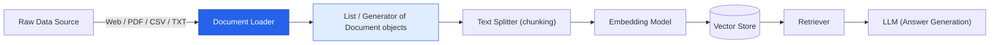
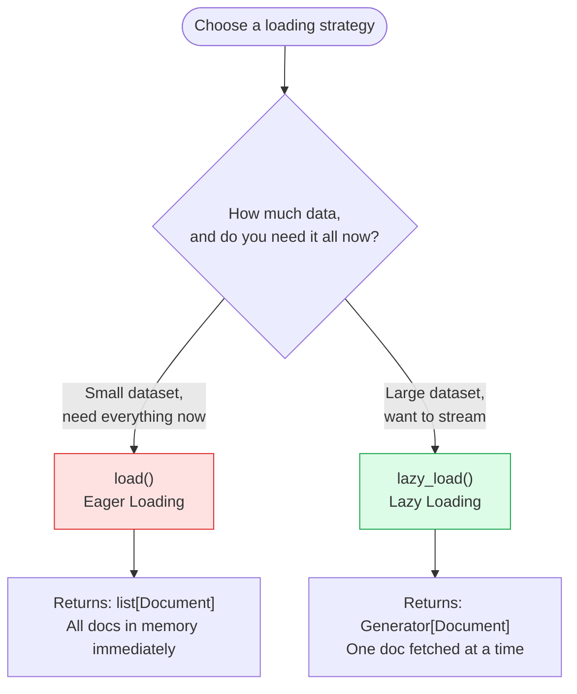
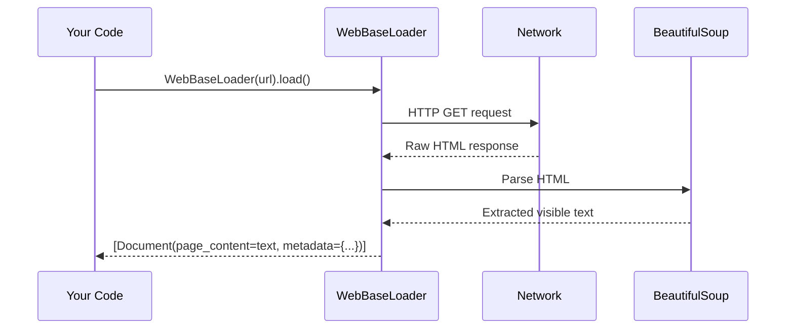
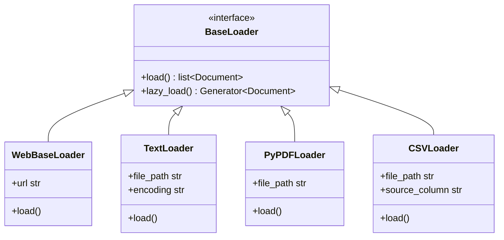

# 📄 Document Loaders in LangChain

> A complete, interview-ready reference on **Document Loaders** — the entry point of every RAG (Retrieval-Augmented Generation) pipeline.

<p align="left">
  
  
  
</p>

---

## 📝 Learning Summary

**Document Loaders** are the first stage of any Retrieval-Augmented Generation (RAG) pipeline. Their job is simple but critical: take raw data — a webpage, a `.txt` file, a PDF, a CSV — and convert it into a standardized `Document` object that the rest of the LangChain ecosystem (splitters, embedders, vector stores) can work with.

This note covers:
- The two core loading strategies — `load()` vs. `lazy_load()`
- Four of the most commonly used loaders: `WebBaseLoader`, `TextLoader`, `PyPDFLoader`, `CSVLoader`
- How each loader maps its source data into `page_content` and `metadata`
- When to pick one loader over another in real projects

---

## 🎯 Learning Objectives

By the end of this note, you will be able to:

- [x] Explain what a Document Loader is and why RAG pipelines need one
- [x] Describe the `Document` object's two core fields: `page_content` and `metadata`
- [x] Differentiate `load()` (eager) from `lazy_load()` (lazy/generator-based)
- [x] Choose the correct loader for web pages, text files, PDFs, and CSVs
- [x] Recognize the common pitfalls (encoding issues, JS-rendered pages, scanned PDFs)
- [x] Answer common interview questions about document loading in LangChain

---

## 📋 Prerequisites

> 💡 **Tip**: You don't need deep LangChain experience to follow this note, but the following will help.

- Basic Python (functions, generators, objects)
- A high-level idea of what RAG (Retrieval-Augmented Generation) is
- LangChain installed in your environment:

```bash
pip install langchain langchain-community pypdf beautifulsoup4
```

---

## 📚 Table of Contents

- [📄 Document Loaders in LangChain](#-document-loaders-in-langchain)
  - [📝 Learning Summary](#-learning-summary)
  - [🎯 Learning Objectives](#-learning-objectives)
  - [📋 Prerequisites](#-prerequisites)
  - [🧠 What Is a Document Loader?](#-what-is-a-document-loader)
  - [🏗️ Architecture: Where Loaders Fit in a RAG Pipeline](#️-architecture-where-loaders-fit-in-a-rag-pipeline)
  - [⚖️ `load()` vs. `lazy_load()`](#️-load-vs-lazy_load)
  - [🌐 WebBaseLoader](#-webbaseloader)
  - [📃 TextLoader](#-textloader)
  - [📕 PyPDFLoader](#-pypdfloader)
  - [📊 CSVLoader](#-csvloader)
  - [🔍 Side-by-Side Comparison](#-side-by-side-comparison)
  - [🌍 Real-World Use Cases](#-real-world-use-cases)
  - [✅ Advantages](#-advantages)
  - [❌ Disadvantages](#-disadvantages)
  - [🚀 Best Practices](#-best-practices)
  - [⚠️ Common Mistakes](#️-common-mistakes)
  - [🎤 Interview Questions](#-interview-questions)
  - [⚡ Cheat Sheet](#-cheat-sheet)
  - [🔗 Useful Links](#-useful-links)
  - [🏁 Summary](#-summary)

---

## 🧠 What Is a Document Loader?

A **Document Loader** is a LangChain component that reads data from a source (a file, a URL, a database, an API) and converts it into one or more `Document` objects.

> 📌 **Important**: Every `Document` object has exactly two fields:
>
> | Field | Type | Description |
> |---|---|---|
> | `page_content` | `str` | The actual text content extracted from the source |
> | `metadata` | `dict` | Contextual info about the content — source path, page number, row index, author, etc. |

```python
from langchain_core.documents import Document

doc = Document(
    page_content="LangChain makes it easy to build LLM applications.",
    metadata={"source": "intro.txt"}
)
```

This standardized shape is what lets a `TextLoader`, a `PyPDFLoader`, and a `CSVLoader` all plug into the **same** downstream pipeline — text splitters, embedding models, and vector stores don't care where the data came from, only that it's a `Document`.

---

## 🏗️ Architecture: Where Loaders Fit in a RAG Pipeline



Document Loaders sit at the **very start** of the pipeline. A mistake here (bad encoding, missing metadata, wrong chunking unit) propagates through every later stage — which is why choosing the right loader matters more than it first appears.

---

## ⚖️ `load()` vs. `lazy_load()`

Every LangChain document loader implements both a `load()` and a `lazy_load()` method, inherited from the `BaseLoader` interface.



### 1️⃣ `load()`

- **Eager Loading** — loads everything at once.
- **Returns:** a `list` of `Document` objects.
- Loads **all** documents immediately into memory.
- ✅ Best when:
  - The number of documents is small.
  - You want everything available upfront (e.g., for quick prototyping).

```python
from langchain_community.document_loaders import TextLoader

loader = TextLoader("notes.txt", encoding="utf-8")
docs = loader.load()          # list[Document], fully loaded
print(len(docs))              # e.g. 1
```

### 2️⃣ `lazy_load()`

- **Lazy Loading** — loads on demand.
- **Returns:** a **generator** of `Document` objects.
- Documents are **not** all loaded at once; they're fetched one at a time as needed.
- ✅ Best when:
  - You're dealing with large documents or lots of files.
  - You want to stream processing (chunking, embedding) without holding everything in memory.

```python
loader = TextLoader("large_dataset.txt", encoding="utf-8")

for doc in loader.lazy_load():   # generator — one Document at a time
    process(doc)                 # e.g. chunk + embed immediately
```

> 🚀 **Best Practice**: Default to `lazy_load()` in production pipelines processing many/large files — it keeps memory usage flat regardless of dataset size. Reach for `load()` only in notebooks, small scripts, or quick experiments.

| | `load()` | `lazy_load()` |
|---|---|---|
| **Strategy** | Eager | Lazy (on-demand) |
| **Return type** | `list[Document]` | `Generator[Document]` |
| **Memory usage** | Loads everything upfront | Streams one at a time |
| **Best for** | Small datasets, quick scripts | Large datasets, memory-constrained pipelines |

---

## 🌐 WebBaseLoader

`WebBaseLoader` is a document loader in LangChain used to load and extract text content from **web pages (URLs)**.

It uses **BeautifulSoup** under the hood to parse HTML and extract visible text.



```python
from langchain_community.document_loaders import WebBaseLoader

loader = WebBaseLoader("https://example.com/blog-post")
docs = loader.load()

print(docs[0].page_content[:200])   # extracted visible text
print(docs[0].metadata)             # {'source': 'https://...', 'title': '...', ...}
```

**When to use:**
- Blogs, news articles, or public websites where content is primarily **text-based and static**.

> ⚠️ **Warning — Limitations**
> - Doesn't handle **JavaScript-heavy** pages well — for those, use `SeleniumURLLoader` instead.
> - Loads only **static content** (what's in the initial HTML), not what renders after the page loads via JS.

---

## 📃 TextLoader

`TextLoader` is a simple document loader in LangChain used to load raw text files (`.txt`, `.md`, etc.) into a **single** `Document` object.

**When to use:**
- Plain text files, markdown files, code files, or logs.
- When the entire file should be treated as **one single document unit**.

```python
from langchain_community.document_loaders import TextLoader

loader = TextLoader("readme_notes.txt", encoding="utf-8")
docs = loader.load()

print(len(docs))               # 1 -> whole file = one Document
print(docs[0].page_content)    # full text of the file
print(docs[0].metadata)        # {'source': 'readme_notes.txt'}
```

### Key Features & Notes

- Loads the whole file into **one `Document` object** (1 file = 1 `Document`).
- `page_content` contains the **full text string** of the file.
- `metadata` contains `{'source': 'file_path'}`.
- Requires specifying `encoding` (e.g. `encoding='utf-8'`) if files contain non-ASCII characters.

> ⚠️ **Common Gotcha**: Skipping `encoding='utf-8'` on files with special characters (emojis, accented letters, non-English text) can raise a `UnicodeDecodeError` or silently mangle the text on some platforms.

---

## 📕 PyPDFLoader

`PyPDFLoader` is a document loader in LangChain used to extract text and metadata from **PDF files**, using the `pypdf` library under the hood.

**When to use:**
- Standard, clean PDF documents (articles, papers, reports).
- When text inside the PDF is **selectable/extractable** — not a scanned image.

```python
from langchain_community.document_loaders import PyPDFLoader

loader = PyPDFLoader("research_paper.pdf")
docs = loader.load()

print(len(docs))                # one Document per page
print(docs[0].page_content)     # text extracted from page 1
print(docs[0].metadata)
# {'source': 'research_paper.pdf', 'page': 0, 'total_pages': 12, 'title': '...', 'author': '...'}
```

### Key Features & Notes

- Loads **each page** of the PDF as a **separate `Document` object** (1 page = 1 `Document`).
- `page_content` contains the text extracted from that specific page.
- `metadata` includes `source`, `page` (0-indexed), `total_pages`, `title`, `author`, etc.

> ⚠️ **Warning**: `PyPDFLoader` cannot extract text from **scanned/image-based PDFs** — those need an OCR-based loader (e.g. one built on `pytesseract` or `unstructured`) instead.

---

## 📊 CSVLoader

`CSVLoader` is a document loader in LangChain used to load structured data from **CSV files**.

**When to use:**
- Tabular dataset files (`.csv`) where each row represents a distinct entity or record.

```python
from langchain_community.document_loaders import CSVLoader

loader = CSVLoader(file_path="products.csv", source_column="product_name")
docs = loader.load()

print(len(docs))                # one Document per row
print(docs[0].page_content)     # "product_name: Widget\nprice: 9.99\nstock: 120"
print(docs[0].metadata)         # {'source': 'Widget', 'row': 0}
```

### Key Features & Notes

- Loads **each row** in the CSV file as a **separate `Document` object** (1 row = 1 `Document`).
- `page_content` converts row key-value pairs into a formatted string (e.g. `"col1: val1\ncol2: val2"`).
- `metadata` contains `{'source': 'file_path', 'row': row_index}`.
- Supports specifying `source_column` to set a specific CSV column as the document's `source` in metadata.

---

## 🔍 Side-by-Side Comparison

| Loader | Source Type | 1 Document = | `page_content` | Key `metadata` fields |
|---|---|---|---|---|
| **WebBaseLoader** | Web page (URL) | 1 whole page (usually) | Visible page text | `source`, `title` |
| **TextLoader** | `.txt`, `.md` files | 1 whole file | Full file text | `source` |
| **PyPDFLoader** | `.pdf` files | 1 page | Text of that page | `source`, `page`, `total_pages` |
| **CSVLoader** | `.csv` files | 1 row | Formatted key: value string | `source`, `row` |



---

## 🌍 Real-World Use Cases

- **Customer support RAG bot** → `WebBaseLoader` over a company's public help-center articles.
- **Internal knowledge base** → `TextLoader` over a folder of markdown runbooks and engineering docs.
- **Legal / research assistant** → `PyPDFLoader` over contracts, whitepapers, or academic papers.
- **Product catalog Q&A** → `CSVLoader` over a product/inventory export, with `source_column="product_name"`.

---

## ✅ Advantages

- Unified `Document` interface means every downstream component (splitter, embedder, vector store) works the same way regardless of source.
- Loaders abstract away format-specific parsing (HTML, PDF binary structure, CSV parsing).
- `lazy_load()` enables memory-efficient processing of very large corpora.
- Rich `metadata` (page numbers, row indices, source URLs) enables precise citations in RAG answers.

## ❌ Disadvantages

- `WebBaseLoader` cannot render JavaScript — many modern sites need a browser-based loader instead.
- `PyPDFLoader` fails silently (returns empty text) on scanned/image PDFs without OCR.
- `CSVLoader` treats every row independently — it doesn't capture relationships across rows.
- `TextLoader` has no built-in structure awareness — a 500-page text file still becomes **one** giant `Document` unless you split it afterward.

---

## 🚀 Best Practices

- Always pass `encoding='utf-8'` to `TextLoader` unless you have a specific reason not to.
- Use `lazy_load()` by default for any pipeline that might scale beyond a handful of files.
- Check `metadata` after loading — verify `source`, `page`, and `row` fields are populated as expected before moving to the text-splitting stage.
- For CSVs, always set `source_column` explicitly if you want clean, human-readable citations later.
- Pair `PyPDFLoader` with a fallback OCR loader for pipelines that may receive scanned documents.

## ⚠️ Common Mistakes

- [ ] Forgetting `encoding='utf-8'` on `TextLoader`, causing decode errors on non-ASCII files.
- [ ] Using `WebBaseLoader` on a JavaScript-rendered single-page app and getting empty/near-empty `page_content`.
- [ ] Assuming `PyPDFLoader` works on scanned PDFs (it doesn't — there's no OCR step).
- [ ] Calling `load()` on a directory of thousands of large files and running out of memory instead of using `lazy_load()`.
- [ ] Not checking `metadata["row"]` / `metadata["page"]` when debugging why a citation points to the wrong place.

---

## 🎤 Interview Questions

<details>
<summary><b>Q1. What is the difference between <code>load()</code> and <code>lazy_load()</code>?</b></summary>

<br>

`load()` is eager — it loads all documents into memory immediately and returns a `list[Document]`. `lazy_load()` is lazy — it returns a generator, fetching and yielding one `Document` at a time, which is far more memory-efficient for large datasets or streaming pipelines.
</details>

<details>
<summary><b>Q2. What two fields does every <code>Document</code> object have?</b></summary>

<br>

`page_content` (the extracted text, a string) and `metadata` (a dictionary of contextual information such as source, page number, or row index).
</details>

<details>
<summary><b>Q3. Why can't <code>WebBaseLoader</code> handle every website?</b></summary>

<br>

`WebBaseLoader` uses BeautifulSoup to parse the raw HTML returned by an HTTP GET request — it does not execute JavaScript. Sites that render their content client-side (SPAs) will return little to no usable text. `SeleniumURLLoader` (or a similar browser-based loader) is needed for those.
</details>

<details>
<summary><b>Q4. How does <code>PyPDFLoader</code> split a PDF into <code>Document</code> objects?</b></summary>

<br>

One `Document` per page — `page_content` holds that page's extracted text, and `metadata` includes the 0-indexed `page` number along with `total_pages`, `source`, and other PDF metadata like `title`/`author`.
</details>

<details>
<summary><b>Q5. What does <code>source_column</code> do in <code>CSVLoader</code>?</b></summary>

<br>

It lets you designate a specific CSV column's value as the `source` field in each row's `metadata`, instead of the default file path — useful for producing human-readable citations (e.g. a product name instead of `products.csv`).
</details>

<details>
<summary><b>Q6. Why would you choose <code>lazy_load()</code> in a production RAG pipeline?</b></summary>

<br>

Because production pipelines often process many or very large files. `lazy_load()` streams one `Document` at a time, so memory usage stays flat and constant regardless of how many total documents exist — critical for ingestion pipelines that run on limited-memory workers.
</details>

---

## ⚡ Cheat Sheet

```bash
pip install langchain langchain-community pypdf beautifulsoup4
```

| Task | Snippet |
|---|---|
| Load a text file | `TextLoader("file.txt", encoding="utf-8").load()` |
| Load a webpage | `WebBaseLoader("https://...").load()` |
| Load a PDF | `PyPDFLoader("file.pdf").load()` |
| Load a CSV | `CSVLoader("file.csv", source_column="name").load()` |
| Stream large files | `for doc in loader.lazy_load(): ...` |
| Inspect a Document | `doc.page_content`, `doc.metadata` |

> 📌 **Rule of thumb**: 1 file → 1 `Document` (`TextLoader`) · 1 page → 1 `Document` (`PyPDFLoader`) · 1 row → 1 `Document` (`CSVLoader`) · 1 page (usually) → 1 `Document` (`WebBaseLoader`).

---

## 🔗 Useful Links

- [LangChain — Document Loaders Overview](https://python.langchain.com/docs/concepts/document_loaders/)
- [LangChain — `WebBaseLoader` Reference](https://python.langchain.com/docs/integrations/document_loaders/web_base/)
- [LangChain — `PyPDFLoader` Reference](https://python.langchain.com/docs/integrations/document_loaders/pypdfloader/)
- [LangChain — `CSVLoader` Reference](https://python.langchain.com/docs/integrations/document_loaders/csv/)
- [pypdf Documentation](https://pypdf.readthedocs.io/)
- [BeautifulSoup Documentation](https://www.crummy.com/software/BeautifulSoup/bs4/doc/)

---

## 🏁 Summary

> Document Loaders are the **entry gate** of a RAG pipeline — they turn messy, real-world sources (webpages, text, PDFs, CSVs) into a single, predictable `Document` shape (`page_content` + `metadata`) that every later pipeline stage can rely on.

- Use **`load()`** for small, one-shot jobs; use **`lazy_load()`** for anything large or production-grade.
- Pick the loader that matches your **source format**: `WebBaseLoader` (web), `TextLoader` (plain text), `PyPDFLoader` (PDF), `CSVLoader` (tabular).
- Always inspect `metadata` early — it's what makes citations and debugging possible later in the pipeline.

---

<p align="center"><i>Compiled as part of personal RAG / LangChain study notes — July 2026.</i></p>
