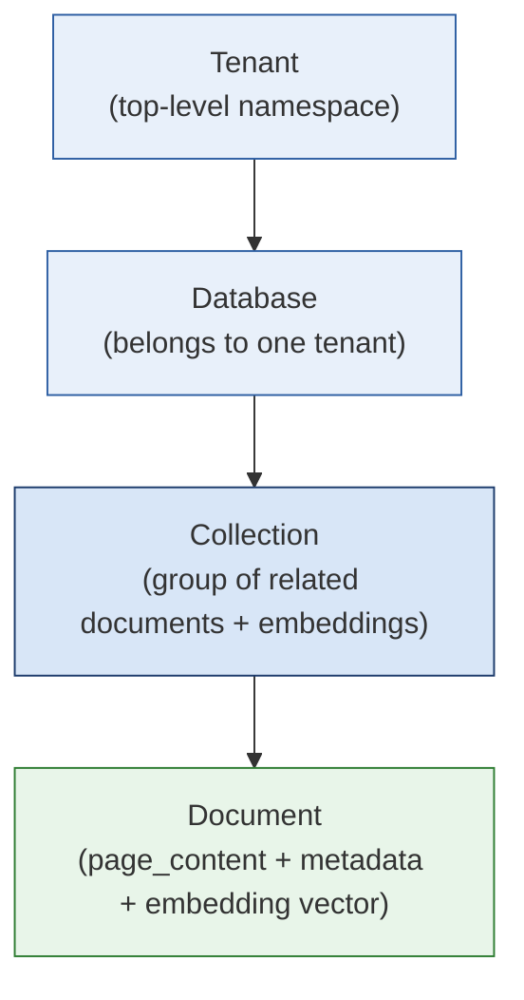
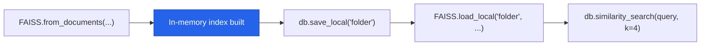
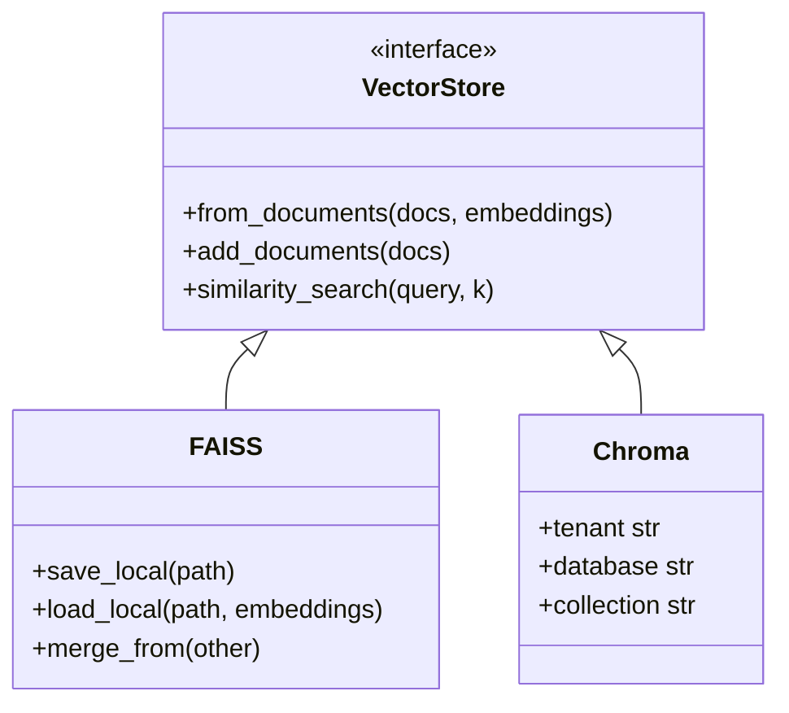

# 🗄️ Vector Stores in RAG

> A complete, interview-ready reference on **Vector Stores** — where embeddings live and where similarity search happens in every RAG (Retrieval-Augmented Generation) pipeline.

<p align="left">
  
  
  
</p>

---

## 📝 Learning Summary

Once text has been [loaded](../Document%20loaders), [split into chunks](../Text%20Splitter), and embedded into numerical vectors, those vectors need somewhere to live — and a fast way to be searched. That's the job of a **vector store**: a system designed to store and retrieve data represented as numerical vectors.

This note covers:
- The four core capabilities every vector store provides: storage, similarity search, indexing, and CRUD
- **Vector Store vs. Vector Database** — a distinction that comes up constantly in interviews
- How LangChain provides a **common interface** across many vector store backends
- Two backends in depth: **Chroma** (tenancy hierarchy) and **FAISS** (in-memory, file-persisted)

---

## 🎯 Learning Objectives

By the end of this note, you will be able to:

- [x] Define a vector store and list its four key capabilities
- [x] Explain the difference between a vector store and a vector database
- [x] Use LangChain's common vector store API (`from_documents`, `add_documents`, `similarity_search`)
- [x] Describe Chroma's Tenant → Database → Collection → Document hierarchy
- [x] Build, save, load, and query a FAISS index in LangChain
- [x] Compare FAISS and Chroma and choose the right one for a given use case
- [x] Answer common interview questions about vector stores

---

## 📋 Prerequisites

> 💡 **Tip**: Understanding [Document Loaders](../Document%20loaders) and [Text Splitters](../Text%20Splitter) helps, since vector stores hold the chunked, embedded output of those earlier RAG stages.

- Basic Python
- A high-level idea of embeddings (numerical vector representations of text)
- LangChain installed in your environment:

```bash
pip install langchain langchain-community faiss-cpu chromadb
```

---

## 📚 Table of Contents

- [Learning Summary](#learning-summary)
- [Learning Objectives](#learning-objectives)
- [Prerequisites](#prerequisites)
- [What Is a Vector Store?](#what-is-a-vector-store)
- [Architecture: Where It Fits in a RAG Pipeline](#architecture-where-it-fits-in-a-rag-pipeline)
- [Key Features](#key-features)
- [Use Cases](#use-cases)
- [Vector Store vs. Vector Database](#vector-store-vs-vector-database)
- [Vector Stores in LangChain](#vector-stores-in-langchain)
- [Chroma Vector Store](#chroma-vector-store)
- [FAISS Vector Store](#faiss-vector-store)
- [FAISS vs. Chroma](#faiss-vs-chroma)
- [Advantages](#advantages)
- [Disadvantages](#disadvantages)
- [Best Practices](#best-practices)
- [Common Mistakes](#common-mistakes)
- [Interview Questions](#interview-questions)
- [Cheat Sheet](#cheat-sheet)
- [Useful Links](#useful-links)
- [Summary](#summary)

---

## 🧠 What Is a Vector Store?

> 📌 **Important**: A vector store is a system designed to store and retrieve data represented as numerical vectors.

Once text is embedded, each chunk becomes a high-dimensional vector — often 768, 1024, or 1536 numbers. A vector store's job is to hold millions of these vectors and, given a new query vector, quickly find the ones that are most similar.


---

## 🏗️ Architecture: Where It Fits in a RAG Pipeline


The vector store sits right after embedding and right before retrieval — it's the persistent (or in-memory) home for every chunk's vector representation, and the engine that makes semantic search fast even across millions of chunks.

---

## ⚙️ Key Features

| Feature | What It Does |
|---|---|
| **Storage** | Ensures that vectors and their associated metadata are retained, whether in-memory for quick lookups or on-disk for durability and large-scale use |
| **Similarity Search** | Helps retrieve the vectors most similar to a query vector |
| **Indexing** | Provides a data structure or method that enables fast similarity searches on high-dimensional vectors (e.g., approximate nearest neighbor lookups) |
| **CRUD Operations** | Manages the lifecycle of data — adding new vectors, reading them, updating existing entries, removing outdated vectors |

---

## 🌍 Use Cases

- **Semantic Search** — finding results by meaning, not just keyword overlap
- **RAG (Retrieval-Augmented Generation)** — supplying an LLM with relevant retrieved context
- **Recommender Systems** — finding items similar to what a user already likes
- **Image / Multimedia Search** — searching by visual or audio similarity via embeddings

---

## ⚖️ Vector Store vs. Vector Database

> 📌 **Important**: This distinction is one of the most commonly asked interview questions in the RAG/embeddings space.

| | Vector Store | Vector Database |
|---|---|---|
| **Definition** | A lightweight library or service focused on storing vectors and performing similarity search | A full-fledged database system designed to store and query vectors |
| **Database features** | May lack transactions, rich query languages, or role-based access control | Distributed architecture, durability (replication/backup), rich metadata handling, near-ACID guarantees, auth/security |
| **Best for** | Prototyping, smaller-scale applications | Production environments with significant scale, large datasets |
| **Examples** | FAISS | Milvus, Qdrant, Weaviate, Pinecone |

> 💡 **Tip**: A vector database is effectively a vector store **with extra database features** — clustering, scaling, security, metadata filtering, and durability layered on top of the same core similarity-search capability.

---

## 🔌 Vector Stores in LangChain

LangChain integrates with many vector store backends — **FAISS, Pinecone, Chroma, Qdrant, Weaviate,** and more — giving you flexibility in scale, features, and deployment.

**Common Interface**: A uniform Vector Store API lets you swap one backend (e.g., FAISS) for another (e.g., Pinecone) with minimal code changes.

```python
# The same shape works across almost every LangChain vector store backend:
db = VectorStoreClass.from_documents(documents, embedding_model)
db.add_documents(more_documents)
results = db.similarity_search(query, k=4)
```

| Method | Purpose |
|---|---|
| `from_documents(...)` / `from_texts(...)` | Build a new store from `Document` objects or raw text |
| `add_documents(...)` / `add_texts(...)` | Add more vectors to an existing store |
| `similarity_search(query, k=...)` | Retrieve the `k` most similar chunks to a query |

**Metadata Handling**: Most vector stores in LangChain let you attach metadata (timestamps, authors, source, etc.) to each document, enabling **metadata-based filtering** during retrieval.

---

## 🎨 Chroma Vector Store

Chroma is a **lightweight, open-source vector database** that is especially friendly for local development and small-to-medium-scale production needs.

### Tenancy & DB Hierarchy



Every Chroma document ultimately belongs to one **Collection**, which belongs to one **Database**, which belongs to one **Tenant** — a structure similar to how a cloud provider organizes accounts → projects → resources.

---

## ⚡ FAISS Vector Store

**FAISS (Facebook AI Similarity Search)**, developed by Meta AI, is an open-source, highly efficient library for fast dense vector similarity search and clustering.

- **In-Memory Performance**: Operates in RAM/GPU, enabling sub-millisecond search across millions of high-dimensional vectors.
- **Indexing Structures**: Supports exact search (`IndexFlatL2`, `IndexFlatIP`) as well as Approximate Nearest Neighbor (ANN) structures (`IVF`, `HNSW`, `PQ`) to trade accuracy for speed.
- **File-Based Persistence**: Saves vector indices to local files (`index.faiss` and `index.pkl`) instead of running as a client-server database.
- **Lightweight & Self-Contained**: No background server process required.



### LangChain Integration

```python
from langchain_community.vectorstores import FAISS
from langchain_openai import OpenAIEmbeddings

# Creating a store from documents or texts
db = FAISS.from_documents(documents, OpenAIEmbeddings())
db = FAISS.from_texts(texts, OpenAIEmbeddings(), metadatas=[...])

# Saving to disk
db.save_local("faiss_index_folder")

# Loading from disk
db = FAISS.load_local(
    "faiss_index_folder",
    OpenAIEmbeddings(),
    allow_dangerous_deserialization=True,
)

# Similarity search
results = db.similarity_search(query="...", k=4)

# Similarity search with score
results_with_score = db.similarity_search_with_score(query="...", k=4)

# Merging two indices
db1.merge_from(db2)
```

> ⚠️ **Warning**: `allow_dangerous_deserialization=True` is required because loading a FAISS index involves unpickling — only load index files from sources you trust.

---

## 🔍 FAISS vs. Chroma

| | FAISS | Chroma |
|---|---|---|
| **Persistence** | Serializes into local `.faiss` / `.pkl` files | Uses a SQLite/DuckDB-backed store with collections |
| **Speed** | Often faster for pure in-memory vector indexing and search | Slightly more overhead due to richer feature set |
| **Query Features** | Focuses primarily on high-speed vector retrieval | Rich built-in metadata filtering out-of-the-box |
| **Architecture** | Library — no server process | Can run embedded or as a lightweight server |
| **Best for** | Pure speed, in-memory / file-based workloads | Local dev + small-to-medium production with metadata-heavy filtering |



---

## ✅ Advantages

- A shared LangChain interface means switching vector store backends usually takes minimal code changes.
- FAISS delivers extremely fast, in-memory similarity search with no server to manage.
- Chroma offers rich metadata filtering and a friendly local-dev experience out of the box.
- Vector databases (Milvus, Qdrant, Weaviate, Pinecone) add production-grade durability, scaling, and security on top of the same core capability.

## ❌ Disadvantages

- Lightweight vector stores (like FAISS) typically lack transactions, rich query languages, and access control.
- FAISS persistence is file-based — you're responsible for backup, versioning, and scaling yourself.
- Production vector databases add operational complexity (hosting, auth, distributed scaling) compared to an embedded library.
- Approximate Nearest Neighbor (ANN) indexes trade some accuracy for speed — the "wrong" tuning can silently hurt retrieval quality.

---

## 🚀 Best Practices

- Start with FAISS or Chroma for prototyping; graduate to a managed vector database (Pinecone, Qdrant, Weaviate, Milvus) as scale and reliability needs grow.
- Always attach meaningful metadata (source, page, timestamp) to documents at insert time — retrofitting metadata later is painful.
- Use `similarity_search_with_score` during development to sanity-check retrieval quality, not just `similarity_search`.
- Version and back up FAISS index files (`index.faiss` / `index.pkl`) the same way you'd version any other production artifact.
- Only set `allow_dangerous_deserialization=True` for FAISS index files you created or fully trust.

## ⚠️ Common Mistakes

- [ ] Treating a lightweight vector store like FAISS as if it has full database guarantees (transactions, ACID, auth).
- [ ] Forgetting to call `save_local()` after building a FAISS index, then losing it when the process exits.
- [ ] Not attaching metadata to documents, making later filtering or citation impossible.
- [ ] Choosing an ANN index (HNSW/IVF/PQ) without understanding its accuracy/speed trade-off for your use case.
- [ ] Loading untrusted FAISS index files with `allow_dangerous_deserialization=True`.

---

## 🎤 Interview Questions

<details>
<summary><b>Q1. What is a vector store, in one sentence?</b></summary>

<br>

A system designed to store numerical vector representations of data (embeddings) and their metadata, and to retrieve the vectors most similar to a given query vector.
</details>

<details>
<summary><b>Q2. What's the difference between a vector store and a vector database?</b></summary>

<br>

A vector store is a lightweight library or service focused mainly on storing vectors and performing similarity search (e.g., FAISS). A vector database is a full-fledged database system that adds distributed scaling, durability, rich metadata handling, and security on top of that same core capability (e.g., Milvus, Qdrant, Weaviate, Pinecone).
</details>

<details>
<summary><b>Q3. What are the four key capabilities every vector store provides?</b></summary>

<br>

Storage, Similarity Search, Indexing, and CRUD Operations.
</details>

<details>
<summary><b>Q4. How does LangChain let you swap vector store backends easily?</b></summary>

<br>

Through a common Vector Store API — methods like `from_documents`, `add_documents`, and `similarity_search` behave consistently across backends (FAISS, Pinecone, Chroma, Qdrant, Weaviate, etc.), so swapping one for another usually only changes the import and constructor call.
</details>

<details>
<summary><b>Q5. Describe Chroma's tenancy hierarchy.</b></summary>

<br>

Tenant → Database → Collection → Document. Every document belongs to a collection, every collection belongs to a database, and every database belongs to a tenant — similar to how cloud providers structure accounts, projects, and resources.
</details>

<details>
<summary><b>Q6. Why might you choose FAISS over Chroma, or vice versa?</b></summary>

<br>

Choose FAISS when you want maximum in-memory search speed with no server process and are comfortable handling persistence/scaling yourself. Choose Chroma when you want built-in metadata filtering, a friendlier local-development experience, and a bit more "database-like" structure without standing up a separate production vector database.
</details>

---

## ⚡ Cheat Sheet

```bash
pip install langchain langchain-community faiss-cpu chromadb
```

| Task | Snippet |
|---|---|
| Build store from documents | `VectorStoreClass.from_documents(documents, embeddings)` |
| Add more vectors | `db.add_documents(more_documents)` |
| Similarity search | `db.similarity_search(query, k=4)` |
| Similarity search with score | `db.similarity_search_with_score(query, k=4)` |
| FAISS: save to disk | `db.save_local("faiss_index_folder")` |
| FAISS: load from disk | `FAISS.load_local("faiss_index_folder", embeddings, allow_dangerous_deserialization=True)` |
| FAISS: merge two indices | `db1.merge_from(db2)` |

> 📌 **Rule of thumb**: Prototyping / pure speed → **FAISS** · Local dev + metadata filtering → **Chroma** · Production scale + durability + security → **Vector Database** (Milvus, Qdrant, Weaviate, Pinecone).

---

## 🔗 Useful Links

- [LangChain — Vector Stores Overview](https://python.langchain.com/docs/concepts/vectorstores/)
- [LangChain — FAISS Integration](https://python.langchain.com/docs/integrations/vectorstores/faiss/)
- [LangChain — Chroma Integration](https://python.langchain.com/docs/integrations/vectorstores/chroma/)
- [FAISS GitHub (Meta AI)](https://github.com/facebookresearch/faiss)
- [Chroma Documentation](https://docs.trychroma.com/)
- [LangChain — Text Splitters (previous stage)](../Text%20Splitter)

---

## 🏁 Summary

> Vector stores are where embeddings live and where semantic retrieval actually happens — everything upstream (loading, splitting, embedding) exists to feed this stage, and everything downstream (retrieval, generation) depends on it working fast and accurately.

- A vector store provides **storage, similarity search, indexing,** and **CRUD** over embeddings.
- A **vector database** is a vector store plus production-grade scaling, durability, and security.
- LangChain's **common interface** (`from_documents`, `add_documents`, `similarity_search`) makes backends largely interchangeable.
- **FAISS** = fastest in-memory option, file-based persistence, no server. **Chroma** = friendlier local dev, richer metadata filtering, tenancy hierarchy.

---

<p align="center"><i>Compiled as part of personal RAG / LangChain study notes — July 2026.</i></p>
